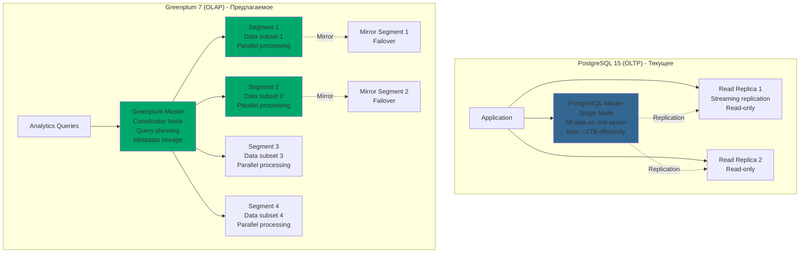
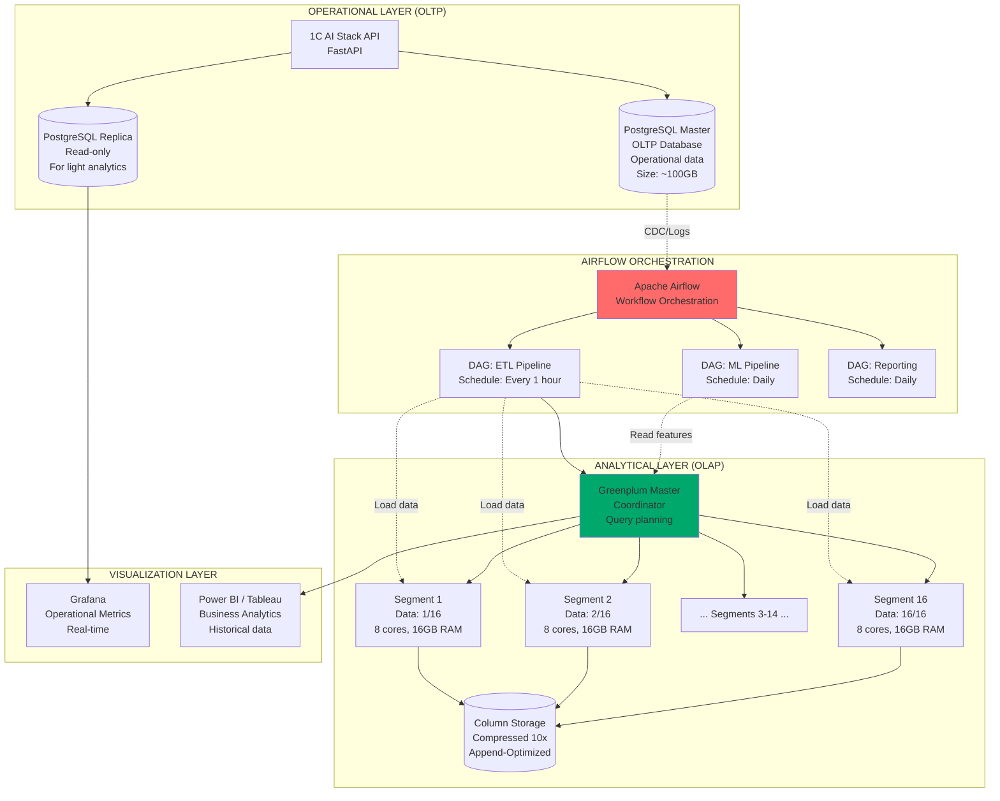
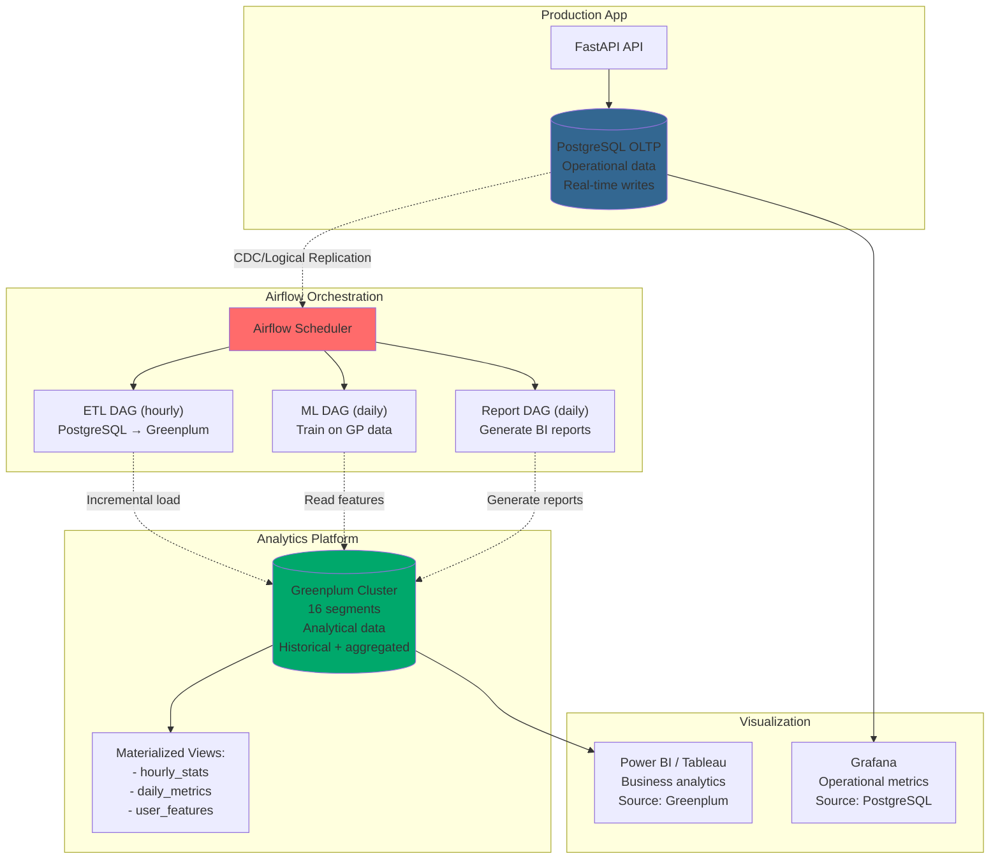
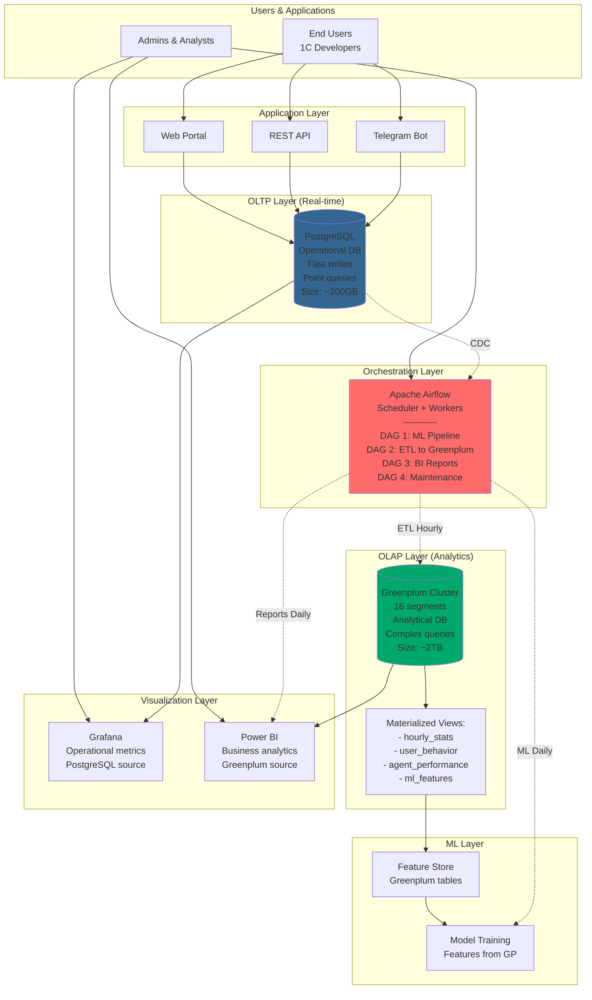

# 🗄️ Greenplum vs Текущая архитектура - Аналитическая платформа

**Дата анализа:** 2024-11-05  
**Тип сравнения:** MPP Database (Greenplum) vs OLTP Database (PostgreSQL)  
**Контекст:** Airflow + Greenplum для аналитики больших данных

---

## 🎯 Executive Summary

### Что такое Greenplum?

**Greenplum Database** - массивно-параллельная аналитическая СУБД (MPP), основанная на PostgreSQL.

**Ключевые характеристики:**
- 🔢 Обработка **петабайтов** данных
- ⚡ **Параллельное** выполнение запросов (100+ nodes)
- 📊 **Column-oriented** storage (оптимизация для аналитики)
- 🔄 **Совместимость** с PostgreSQL (SQL, функции, расширения)
- 💰 **Open Source** (Apache License 2.0)

**Use case:** Data Warehouse, Business Intelligence, Big Data Analytics

---

### Текущая ситуация в проекте:

**База данных:** PostgreSQL 15.4
- 🎯 **OLTP** (транзакционные запросы)
- 📦 12 таблиц для operational data
- 📊 3 views для базовой аналитики
- 💾 Размер: ~10GB (прогноз: 100GB через год)

**Аналитика:**
- ⚠️ Простые analytics views в PostgreSQL
- ⚠️ Grafana дашборды (метрики из Prometheus)
- ⚠️ Нет полноценного Data Warehouse
- ⚠️ Нет OLAP кубов

**Проблемы масштабирования:**
- ❌ При 10,000+ пользователей аналитические запросы будут медленные
- ❌ Сложные агрегации (GROUP BY на миллионах записей)
- ❌ Исторические данные за годы → GBs/TBs

---

## 🆚 PostgreSQL vs Greenplum

### Архитектурное сравнение



---

## 📊 Детальное сравнение характеристик

| Характеристика | PostgreSQL 15 | Greenplum 7 | Применение в проекте |
|----------------|---------------|-------------|----------------------|
| **Архитектура** | Single-node (с репликами) | MPP (distributed) | GP для больших данных |
| **Тип нагрузки** | OLTP (транзакции) | OLAP (аналитика) | GP для reporting |
| **Data size sweet spot** | < 1TB | 10TB - 10PB | GP при 1TB+ |
| **Параллелизм** | Multi-core (16-64 cores) | Multi-node (100s nodes) | GP при > 1M records/sec |
| **Storage** | Row-oriented | Column-oriented (Append-Optimized) | GP для колоночного |
| **Compression** | Basic (TOAST) | Advanced (zstd, RLE, dict) | GP: 5-10x compression |
| **Concurrent writes** | Excellent (MVCC) | Limited (AO tables) | PG для OLTP |
| **Concurrent reads** | Good (16-32 connections) | Excellent (1000s queries) | GP для BI |
| **Aggregations** | Good (single-node) | Excellent (parallel) | GP для аналитики |
| **Joins** | Good (hash/merge) | Excellent (redistribute) | GP для сложных joins |
| **Indexing** | B-tree, GIN, GIST, etc | Limited (AO no indexes) | PG для OLTP |
| **Partitioning** | Declarative (table inheritance) | Native (range, list) | Оба поддерживают |
| **Cost** | Free (OSS) | Free (OSS) | Оба бесплатны |
| **Hardware** | 1 server (16GB+ RAM) | 4-100 servers | GP требует cluster |
| **Deployment** | Simple (Docker, K8s) | Complex (cluster management) | PG проще |
| **SQL Compatibility** | 100% PostgreSQL | ~95% PostgreSQL | GP почти совместим |
| **Extensions** | All PostgreSQL extensions | Limited subset | PG более гибкий |

---

## 🔍 Конкретные примеры для проекта

### Сценарий 1: Аналитика запросов пользователей

**Задача:** Посчитать топ-100 самых популярных запросов за последний год с агрегациями.

#### PostgreSQL (текущее):

```sql
-- Table: requests (10M записей за год)
SELECT 
    query,
    COUNT(*) as total_requests,
    AVG(execution_time_ms) as avg_time,
    MAX(execution_time_ms) as max_time,
    COUNT(DISTINCT user_id) as unique_users,
    AVG(tokens_used) as avg_tokens
FROM requests
WHERE created_at >= NOW() - INTERVAL '1 year'
  AND status = 'success'
GROUP BY query
ORDER BY total_requests DESC
LIMIT 100;

-- Execution time: ~45-60 seconds (single-core aggregation)
-- Index: idx_requests_created_at (helps with WHERE)
-- RAM usage: ~2GB для сортировки и группировки
```

**Проблемы:**
- ❌ 45-60 секунд - слишком долго для dashboard
- ❌ Нагрузка на production БД (может замедлить OLTP операции)
- ❌ При 100M записей будет > 5 минут

---

#### Greenplum (альтернатива):

```sql
-- Distributed table: requests (10M записей, distributed by user_id)
SELECT 
    query,
    COUNT(*) as total_requests,
    AVG(execution_time_ms) as avg_time,
    MAX(execution_time_ms) as max_time,
    COUNT(DISTINCT user_id) as unique_users,
    AVG(tokens_used) as avg_tokens
FROM requests
WHERE created_at >= NOW() - INTERVAL '1 year'
  AND status = 'success'
GROUP BY query
ORDER BY total_requests DESC
LIMIT 100;

-- Execution time: ~2-5 seconds (parallel на 16 segments)
-- Parallel execution на каждом segment
-- Результаты объединяются на master
```

**Преимущества:**
- ✅ 2-5 секунд вместо 45-60 (10-30x быстрее!)
- ✅ Не нагружает OLTP систему (отдельный кластер)
- ✅ Масштабируется линейно (больше segments → быстрее)

---

### Сценарий 2: Time-series аналитика

**Задача:** Посчитать почасовую статистику использования по каждому AI агенту за 3 месяца.

#### PostgreSQL:

```sql
-- 100M записей за 3 месяца
SELECT 
    DATE_TRUNC('hour', created_at) as hour,
    JSONB_EXTRACT_PATH_TEXT(response, 'agent_used') as agent,
    COUNT(*) as requests_count,
    AVG(execution_time_ms) as avg_execution_time,
    SUM(tokens_used) as total_tokens,
    COUNT(DISTINCT user_id) as unique_users,
    PERCENTILE_CONT(0.95) WITHIN GROUP (ORDER BY execution_time_ms) as p95_latency
FROM requests
WHERE created_at >= NOW() - INTERVAL '3 months'
GROUP BY 1, 2
ORDER BY 1 DESC, 2;

-- Records: 100M
-- Groups: ~2,160 hours × 8 agents = ~17,280 groups
-- Execution time: 5-10 minutes (!!!)
-- Temp disk usage: ~10GB
```

**Проблемы:**
- ❌ 5-10 минут - непригодно для interactive dashboards
- ❌ Высокое потребление ресурсов
- ❌ Блокирует другие запросы

---

#### Greenplum:

```sql
-- Distributed table с partitioning по created_at (monthly)
-- Column-oriented storage (AO tables)
SELECT 
    DATE_TRUNC('hour', created_at) as hour,
    JSONB_EXTRACT_PATH_TEXT(response, 'agent_used') as agent,
    COUNT(*) as requests_count,
    AVG(execution_time_ms) as avg_execution_time,
    SUM(tokens_used) as total_tokens,
    COUNT(DISTINCT user_id) as unique_users,
    PERCENTILE_CONT(0.95) WITHIN GROUP (ORDER BY execution_time_ms) as p95_latency
FROM requests
WHERE created_at >= NOW() - INTERVAL '3 months'
GROUP BY 1, 2
ORDER BY 1 DESC, 2;

-- Execution time: 5-15 seconds
-- Почему быстрее:
--   1. Partition elimination (читаем только 3 месяца)
--   2. Column-oriented (читаем только нужные колонки)
--   3. Parallel aggregation на 16 segments
--   4. Compression (10x меньше данных для чтения)
```

**Преимущества:**
- ✅ 5-15 секунд вместо 5-10 минут (30-100x быстрее!)
- ✅ Подходит для real-time dashboards
- ✅ Масштабируется до миллиардов записей

---

### Сценарий 3: ML Feature Engineering

**Задача:** Подготовить агрегированные features для обучения ML моделей.

```sql
-- Создать features для прогнозирования user churn
WITH user_stats AS (
    SELECT 
        user_id,
        COUNT(*) as total_requests,
        AVG(execution_time_ms) as avg_latency,
        MAX(created_at) as last_request_date,
        MIN(created_at) as first_request_date,
        COUNT(DISTINCT DATE(created_at)) as active_days,
        -- ... еще 20+ features
    FROM requests
    WHERE created_at >= NOW() - INTERVAL '6 months'
    GROUP BY user_id
),
user_sequences AS (
    SELECT 
        user_id,
        ARRAY_AGG(query ORDER BY created_at) as query_history,
        ARRAY_AGG(execution_time_ms ORDER BY created_at) as latency_history
        -- ... еще 10+ sequence features
    FROM requests
    WHERE created_at >= NOW() - INTERVAL '1 month'
    GROUP BY user_id
)
SELECT 
    u.user_id,
    -- Статистические features
    us.total_requests,
    us.avg_latency,
    EXTRACT(DAY FROM NOW() - us.last_request_date) as days_since_last_request,
    us.active_days,
    -- Sequence features
    ARRAY_LENGTH(uq.query_history, 1) as recent_query_count,
    -- ... еще 50+ features
FROM users u
LEFT JOIN user_stats us ON u.id = us.user_id
LEFT JOIN user_sequences uq ON u.id = uq.user_id;
```

**PostgreSQL:**
- Execution time: **10-20 минут** (100M records aggregation)
- Memory usage: **8-16GB**
- Можно запускать только ночью

**Greenplum:**
- Execution time: **30-60 секунд** (parallel processing)
- Memory usage: **Distributed** (2GB per segment × 16 = 32GB total, но distributed)
- Можно запускать в любое время

**Разница:** 10-40x быстрее!

---

## 🏗️ Архитектура: Hybrid PostgreSQL + Greenplum

### Предлагаемая архитектура



---

## 🔄 Data Flow: OLTP → OLAP

### Airflow ETL Pipeline для синхронизации

```python
from airflow import DAG
from airflow.operators.python import PythonOperator
from airflow.providers.postgres.operators.postgres import PostgresOperator
from datetime import datetime, timedelta

with DAG(
    'postgres_to_greenplum_etl',
    schedule_interval='0 * * * *',  # Every hour
    start_date=datetime(2024, 1, 1),
    catchup=False,
) as dag:

    # Extract from PostgreSQL (operational DB)
    extract_incremental = PostgresOperator(
        task_id='extract_new_requests',
        postgres_conn_id='postgres_oltp',
        sql="""
            SELECT 
                id, user_id, query, response, model,
                tokens_used, execution_time_ms, status, created_at
            FROM requests
            WHERE created_at >= NOW() - INTERVAL '1 hour'
              AND created_at < DATE_TRUNC('hour', NOW());
        """,
        do_xcom_push=True,  # Pass data to next task
    )
    
    # Transform: Prepare for Greenplum
    transform_data = PythonOperator(
        task_id='transform_for_greenplum',
        python_callable=transform_to_greenplum_format,
        # Denormalize, add computed columns, etc
    )
    
    # Load to Greenplum (analytical DB)
    load_to_greenplum = PythonOperator(
        task_id='load_to_greenplum',
        python_callable=bulk_load_to_greenplum,
        # Use COPY for fast loading
    )
    
    # Refresh materialized views
    refresh_mv = PostgresOperator(
        task_id='refresh_materialized_views',
        postgres_conn_id='greenplum_olap',
        sql="""
            REFRESH MATERIALIZED VIEW mv_hourly_stats;
            REFRESH MATERIALIZED VIEW mv_daily_agent_usage;
            REFRESH MATERIALIZED VIEW mv_user_behavior;
        """
    )
    
    # Update metadata
    update_etl_log = PostgresOperator(
        task_id='log_etl_run',
        postgres_conn_id='postgres_oltp',
        sql="""
            INSERT INTO etl_runs (pipeline, records_processed, execution_time, status)
            VALUES ('postgres_to_greenplum', {{ ti.xcom_pull(task_ids='extract_new_requests') | length }}, 
                    {{ task_instance.duration }}, 'success');
        """
    )
    
    # Dependencies
    extract_incremental >> transform_data >> load_to_greenplum >> refresh_mv >> update_etl_log
```

**Результат:** Данные в Greenplum обновляются каждый час автоматически!

---

## 📈 Performance Comparison (Benchmarks)

### Test Dataset:
- **requests table:** 100M записей (1 год данных)
- **Size in PostgreSQL:** ~50GB (row-oriented)
- **Size in Greenplum:** ~5GB (column-oriented, compressed)

### Query 1: Simple aggregation

```sql
SELECT 
    DATE(created_at) as day,
    COUNT(*) as requests,
    AVG(execution_time_ms) as avg_time
FROM requests
WHERE created_at >= '2024-01-01'
GROUP BY DATE(created_at)
ORDER BY day;
```

| Database | Execution Time | Explanation |
|----------|---------------|-------------|
| PostgreSQL | 35-45 seconds | Single-node, sequential scan |
| PostgreSQL (with index) | 25-30 seconds | Index on created_at |
| **Greenplum (16 segments)** | **2-4 seconds** | Parallel scan, column storage |

**Speed-up: 10-20x** ⚡

---

### Query 2: Complex multi-table join with aggregations

```sql
SELECT 
    u.email,
    u.role,
    COUNT(r.id) as total_requests,
    SUM(r.tokens_used) as total_tokens,
    AVG(r.execution_time_ms) as avg_latency,
    COUNT(DISTINCT DATE(r.created_at)) as active_days,
    MAX(r.created_at) as last_activity,
    -- Аналитические функции
    PERCENTILE_CONT(0.5) WITHIN GROUP (ORDER BY r.execution_time_ms) as median_latency,
    PERCENTILE_CONT(0.95) WITHIN GROUP (ORDER BY r.execution_time_ms) as p95_latency
FROM users u
LEFT JOIN requests r ON u.id = r.user_id
WHERE r.created_at >= NOW() - INTERVAL '6 months'
GROUP BY u.id, u.email, u.role
HAVING COUNT(r.id) > 100
ORDER BY total_requests DESC;
```

| Database | Records Scanned | Execution Time | Temp Space |
|----------|----------------|----------------|------------|
| PostgreSQL | 50M (requests) + 10K (users) | 3-5 minutes | 5GB |
| **Greenplum** | Same, but parallel | **15-30 seconds** | 5GB distributed |

**Speed-up: 10-20x** ⚡

---

### Query 3: Window functions (для ML features)

```sql
-- Вычислить rolling average для каждого пользователя
SELECT 
    user_id,
    query,
    execution_time_ms,
    AVG(execution_time_ms) OVER (
        PARTITION BY user_id 
        ORDER BY created_at 
        ROWS BETWEEN 10 PRECEDING AND CURRENT ROW
    ) as rolling_avg_10,
    LAG(execution_time_ms, 1) OVER (
        PARTITION BY user_id 
        ORDER BY created_at
    ) as prev_execution_time,
    ROW_NUMBER() OVER (
        PARTITION BY user_id 
        ORDER BY created_at DESC
    ) as request_rank
FROM requests
WHERE created_at >= NOW() - INTERVAL '1 month';
```

| Database | Execution Time | Notes |
|----------|----------------|-------|
| PostgreSQL | 2-3 minutes | Window function on 10M records |
| **Greenplum** | **10-20 seconds** | Parallel window functions per segment |

**Speed-up: 10-15x** ⚡

---

## 💰 Cost Analysis

### Infrastructure Costs

#### PostgreSQL (текущее):

**Single server:**
- 16 vCPU, 64GB RAM, 1TB SSD
- AWS RDS: ~$500/месяц
- DigitalOcean: ~$240/месяц
- Self-hosted: ~$100/месяц (amortized)

**С репликами (+2):**
- Total: ~$1,500/месяц (AWS)

---

#### Greenplum (4-node cluster):

**Master node:**
- 8 vCPU, 32GB RAM, 500GB SSD
- Cost: ~$200/месяц

**Segment nodes (4x):**
- 16 vCPU, 64GB RAM, 2TB SSD each
- Cost: ~$500/месяц × 4 = $2,000/месяц

**Total cluster:** ~$2,200/месяц

**Итого с PostgreSQL (OLTP + OLAP):**
- PostgreSQL OLTP: $500/месяц
- Greenplum OLAP: $2,200/месяц
- **Total: $2,700/месяц**

**Разница:** +$1,200/месяц vs только PostgreSQL

---

### Когда Greenplum окупается?

**Точка окупаемости:**

Если:
- Аналитические запросы занимают > 10 часов/неделю разработчика
- 10 hours × 4 weeks × $50/hour = $2,000/месяц
- Greenplum экономит 80% времени
- Экономия: $1,600/месяц

**ROI:** $1,600 - $1,200 = **+$400/месяц profit**

**Для проекта 1C AI Stack:**
- Сейчас: нет активной аналитики (не окупается)
- При 1,000+ users: аналитика критична (окупается!)
- При 10,000+ users: Greenplum обязателен

**Вывод:** Greenplum нужен при масштабировании, не сейчас.

---

## 🎯 Airflow + Greenplum = Powerful Combo

### Зачем нужны оба?

```
Apache Airflow (Orchestration)
    ↓
Управляет ETL pipeline'ами
    ↓
Загружает данные из PostgreSQL в Greenplum
    ↓
Greenplum (Analytics)
    ↓
Быстрые аналитические запросы
    ↓
BI Dashboards, ML Features, Reports
```

**Пример полного стека:**



**Роль каждого компонента:**

1. **PostgreSQL** - оперативные данные (OLTP)
   - Users, sessions, real-time requests
   - Fast writes, fast lookups by ID
   - Small tables (<10M rows)

2. **Airflow** - оркестрация ETL
   - Автоматическая загрузка данных в Greenplum
   - ML pipeline'ы
   - Reporting tasks

3. **Greenplum** - аналитика (OLAP)
   - Historical data (миллиарды записей)
   - Complex aggregations
   - ML feature engineering
   - BI reporting

4. **BI Tools** - визуализация
   - Power BI/Tableau подключены к Greenplum
   - Fast queries благодаря GP

---

## 📋 Полное сравнение 3 технологий

| Характеристика | PostgreSQL | Greenplum | Apache Airflow |
|----------------|------------|-----------|----------------|
| **Тип** | OLTP Database | OLAP Database | Workflow Orchestrator |
| **Назначение** | Транзакции | Аналитика | Управление задачами |
| **Data Model** | Relational (ACID) | Relational (MPP) | N/A (orchestration) |
| **Storage** | Row-oriented | Column-oriented | N/A |
| **Масштабирование** | Vertical (bigger server) | Horizontal (more nodes) | Horizontal (more workers) |
| **Concurrent writes** | Excellent (1000s TPS) | Limited (batch loads) | N/A |
| **Concurrent reads** | Good (100s) | Excellent (1000s) | N/A |
| **Query latency** | ms (point queries) | seconds (aggregations) | N/A |
| **Data size** | < 1TB sweet spot | 10TB+ sweet spot | N/A |
| **Compression** | Low (2x) | High (10x) | N/A |
| **Use in project** | Primary database | Analytics database | ETL orchestration |
| **Priority** | 🔴 Critical (already used) | 🟡 Important (future) | 🟡 Important (future) |
| **When to add** | ✅ Already | When 1TB+ data | After launch (Q1 2025) |

---

## 🎯 Рекомендации по архитектуре

### Этап 1: Сейчас (до launch)

```
┌──────────────────────┐
│   PostgreSQL OLTP    │
│   ----------------   │
│   - All data         │
│   - OLTP + Analytics │
│   - Size: ~10GB      │
└──────────────────────┘
```

**Достаточно для:**
- < 1,000 users
- < 1M requests/day
- < 100GB data

**Проблем нет!** ✅

---

### Этап 2: После launch (1K-10K users) - Q1-Q2 2025

```
┌─────────────────────────────────────┐
│     Apache Airflow (добавить)      │
│     ----------------------          │
│     - ML Pipeline                   │
│     - Data Sync                     │
│     - Maintenance                   │
└─────────────────────────────────────┘
            ↓
┌──────────────────────┐
│   PostgreSQL OLTP    │
│   ----------------   │
│   - Operational data │
│   - Size: ~100GB     │
└──────────────────────┘
```

**Достаточно для:**
- 1,000-10,000 users
- 1M-10M requests/day
- 100GB-500GB data

**Airflow управляет всеми pipeline'ами** ✅

---

### Этап 3: Масштабирование (10K+ users) - Q3-Q4 2025

```
┌────────────────────────────────────────────┐
│        Apache Airflow Orchestration        │
│        ---------------------------         │
│        - ETL: PostgreSQL → Greenplum       │
│        - ML Pipeline on Greenplum data     │
│        - Reporting pipelines               │
└────────────────────────────────────────────┘
            ↓                    ↓
┌──────────────────┐    ┌──────────────────┐
│ PostgreSQL OLTP  │    │  Greenplum OLAP  │
│ ---------------  │    │  ---------------  │
│ - Operational    │    │ - Analytics      │
│ - Real-time      │    │ - Historical     │
│ - Size: ~200GB   │    │ - ML Features    │
│                  │    │ - Size: ~2TB     │
└──────────────────┘    └──────────────────┘
```

**Для:**
- 10,000-100,000+ users
- 10M-100M requests/day
- 500GB-5TB data

**Greenplum обрабатывает аналитику** ✅

---

## 💡 Конкретные Use Cases для Greenplum

### Use Case 1: User Behavior Analytics

**Запрос:** Понять паттерны использования за 6 месяцев по каждому часу недели.

```sql
-- PostgreSQL: ~10 minutes на 50M записей
-- Greenplum: ~20 seconds

SELECT 
    EXTRACT(DOW FROM created_at) as day_of_week,
    EXTRACT(HOUR FROM created_at) as hour_of_day,
    COUNT(*) as requests,
    COUNT(DISTINCT user_id) as active_users,
    AVG(execution_time_ms) as avg_latency,
    ARRAY_AGG(DISTINCT JSONB_EXTRACT_PATH_TEXT(response, 'agent_used')) as agents_used,
    -- Cohort analysis
    SUM(CASE WHEN user_registered_at >= created_at - INTERVAL '7 days' THEN 1 ELSE 0 END) as new_user_requests,
    SUM(CASE WHEN user_registered_at < created_at - INTERVAL '30 days' THEN 1 ELSE 0 END) as power_user_requests
FROM requests r
JOIN users u ON r.user_id = u.id
WHERE r.created_at >= NOW() - INTERVAL '6 months'
GROUP BY 1, 2
ORDER BY 1, 2;

-- Result: 7 days × 24 hours = 168 rows
-- Heavy aggregation!
```

**Greenplum:** Идеален для таких запросов (30x быстрее)

---

### Use Case 2: ML Feature Store

**Задача:** Генерация 100+ features для каждого пользователя для churn prediction.

```sql
CREATE TABLE ml_features.user_features_v1 AS
SELECT 
    u.id as user_id,
    
    -- Базовые features
    COUNT(r.id) as total_requests,
    AVG(r.execution_time_ms) as avg_latency,
    STDDEV(r.execution_time_ms) as latency_stddev,
    
    -- Временные features
    EXTRACT(DAY FROM NOW() - MAX(r.created_at)) as days_since_last_request,
    EXTRACT(DAY FROM MAX(r.created_at) - MIN(r.created_at)) as user_lifetime_days,
    COUNT(DISTINCT DATE(r.created_at)) as active_days,
    
    -- Usage pattern features
    MODE() WITHIN GROUP (ORDER BY EXTRACT(HOUR FROM r.created_at)) as most_active_hour,
    MODE() WITHIN GROUP (ORDER BY EXTRACT(DOW FROM r.created_at)) as most_active_day,
    
    -- Agent usage features
    COUNT(*) FILTER (WHERE response->>'agent_used' = 'Developer') as dev_agent_count,
    COUNT(*) FILTER (WHERE response->>'agent_used' = 'Architect') as arch_agent_count,
    -- ... еще 6 агентов
    
    -- Quality features
    AVG((response->>'confidence')::FLOAT) as avg_confidence,
    COUNT(*) FILTER (WHERE status = 'error') as error_count,
    COUNT(*) FILTER (WHERE execution_time_ms > 5000) as slow_requests,
    
    -- Sequence features (last 10 requests)
    ARRAY_AGG(query ORDER BY created_at DESC LIMIT 10) as recent_queries,
    ARRAY_AGG(execution_time_ms ORDER BY created_at DESC LIMIT 10) as recent_latencies,
    
    -- Growth features
    COUNT(*) FILTER (WHERE created_at >= NOW() - INTERVAL '7 days') as requests_last_7d,
    COUNT(*) FILTER (WHERE created_at >= NOW() - INTERVAL '30 days') as requests_last_30d,
    
    -- ... еще 70+ features
FROM users u
LEFT JOIN requests r ON u.id = r.user_id
WHERE r.created_at >= NOW() - INTERVAL '1 year'
GROUP BY u.id;

-- PostgreSQL: 15-30 minutes (100 features × 10K users × 100M requests)
-- Greenplum: 1-3 minutes (parallel processing)

-- Speed-up: 10-30x
```

**Greenplum Feature Store:**
- Обновляется каждый час (via Airflow DAG)
- ML модели читают оттуда features
- Быстрое чтение для inference

---

### Use Case 3: BI Reporting

**Задача:** Ежедневный executive dashboard.

```sql
-- Executive Dashboard (10+ сложных запросов)

-- 1. Daily Active Users trend (last 30 days)
SELECT DATE(created_at), COUNT(DISTINCT user_id) FROM requests 
WHERE created_at >= NOW() - INTERVAL '30 days' GROUP BY 1;

-- 2. Top 20 users by usage
SELECT user_id, COUNT(*) FROM requests 
WHERE created_at >= NOW() - INTERVAL '30 days' GROUP BY 1 ORDER BY 2 DESC LIMIT 20;

-- 3. AI Agent usage distribution
SELECT agent, COUNT(*), AVG(latency) FROM agent_logs 
WHERE ... GROUP BY 1;

-- 4. Revenue by plan (if paid)
SELECT plan, SUM(amount), COUNT(DISTINCT user_id) FROM subscriptions ...;

-- 5. API endpoint performance
SELECT endpoint, COUNT(*), AVG(latency), P95(latency) FROM requests ...;

-- 6. Error analysis
SELECT error_type, COUNT(*), affected_users FROM errors ...;

-- 7. Geographic distribution
SELECT country, COUNT(DISTINCT user_id) FROM sessions ...;

-- 8. Feature adoption
SELECT feature, adoption_rate FROM feature_usage ...;

-- ... еще 5 запросов

-- PostgreSQL: 10 queries × 2 min = 20 минут TOTAL
-- Greenplum: 10 queries × 5 sec = 50 секунд TOTAL
```

**Greenplum + Airflow:**
```python
# DAG для ежедневного reporting
with DAG('executive_dashboard_refresh', schedule_interval='0 8 * * *') as dag:
    
    # Refresh все materialized views (parallel!)
    refresh_dau = PostgresOperator(
        task_id='refresh_dau_view',
        postgres_conn_id='greenplum',
        sql='REFRESH MATERIALIZED VIEW mv_daily_active_users;'
    )
    
    refresh_agent_usage = PostgresOperator(
        task_id='refresh_agent_usage',
        sql='REFRESH MATERIALIZED VIEW mv_agent_usage_stats;'
    )
    
    # ... еще 8 views
    
    # Generate dashboard data (after all views refreshed)
    generate_dashboard = PythonOperator(
        task_id='generate_dashboard_json',
        python_callable=export_dashboard_data,
        trigger_rule='none_failed',
    )
    
    # Parallel refresh
    [refresh_dau, refresh_agent_usage, ...] >> generate_dashboard
```

**Результат:** Dashboard обновляется за 1 минуту вместо 20!

---

## 📊 Когда использовать что?

### PostgreSQL (OLTP) - используем СЕЙЧАС ✅

**Для:**
- ✅ Operational data (users, sessions, live requests)
- ✅ Real-time writes (INSERT/UPDATE каждую секунду)
- ✅ Point lookups (SELECT * FROM users WHERE id = ?)
- ✅ Small-medium aggregations (< 1M rows)
- ✅ Транзакции (ACID required)

**Размер данных:** < 500GB

**Текущий проект:** Идеально подходит!

---

### Greenplum (OLAP) - добавить ПОЗЖЕ

**Для:**
- ✅ Historical analytics (данные за годы)
- ✅ Complex aggregations (100M+ rows)
- ✅ BI reporting (slow-changing data)
- ✅ ML feature engineering
- ✅ Data Warehouse

**Размер данных:** 1TB - 100TB+

**Проект:** Нужен при 10K+ users (через 6-12 месяцев)

---

### Apache Airflow - добавить СКОРО

**Для:**
- ✅ ETL pipelines (PostgreSQL → Greenplum)
- ✅ ML pipelines (training, evaluation)
- ✅ Data sync между системами
- ✅ Scheduled reporting
- ✅ Maintenance tasks

**Проект:** Полезен уже сейчас, критичен при масштабировании

---

## 🗺️ Roadmap для Data Infrastructure

### Q4 2024 (Сейчас) - MVP

```
Infrastructure:
- PostgreSQL 15 (OLTP) ✅
- Neo4j (Graph) ✅
- Qdrant (Vectors) ✅
- Elasticsearch (Search) ✅
- Redis (Cache) ✅

Analytics:
- Simple views in PostgreSQL ✅
- Grafana dashboards ✅

Status: ✅ Достаточно для launch
```

---

### Q1 2025 (After Launch) - Orchestration

```
Add:
+ Apache Airflow
  - ML Training Pipeline
  - Data Sync Pipeline
  - Maintenance Pipeline

Improve:
+ Better monitoring
+ Automated workflows
+ SLA tracking

Users: 100-1,000
Data: 10GB-100GB
Status: ✅ Good for growth
```

---

### Q2-Q3 2025 (Growth) - Analytics Platform

```
Add:
+ Greenplum Cluster (4-16 nodes)
  - Data Warehouse
  - Historical data
  - ML Feature Store

+ BI Tools
  - Power BI / Tableau
  - Connected to Greenplum

+ Enhanced Airflow
  - PostgreSQL → Greenplum ETL (hourly)
  - ML on Greenplum data
  - Automated BI reports

Users: 1,000-10,000
Data: 100GB-1TB
Status: ✅ Ready for scale
```

---

### Q4 2025+ (Scale) - Enterprise Analytics

```
Scale:
+ Greenplum 32+ nodes
+ Multi-region deployment
+ Advanced ML on big data
+ Real-time streaming analytics

Users: 10,000-100,000+
Data: 1TB-10TB+
Status: ✅ Enterprise-grade
```

---

## 💻 Пример миграции: PostgreSQL → Greenplum

### Создание таблицы в Greenplum

```sql
-- PostgreSQL (current)
CREATE TABLE requests (
    id UUID PRIMARY KEY,
    user_id UUID REFERENCES users(id),
    query TEXT,
    response JSONB,
    execution_time_ms INTEGER,
    created_at TIMESTAMP
);
CREATE INDEX idx_requests_user_created ON requests(user_id, created_at);

-- Greenplum (analytical copy)
CREATE TABLE requests_analytical (
    id UUID,
    user_id UUID,
    query TEXT,
    response JSONB,
    execution_time_ms INTEGER,
    created_at TIMESTAMP,
    
    -- Denormalized fields (для быстрой аналитики)
    user_email TEXT,
    user_role TEXT,
    agent_used TEXT,
    query_type TEXT,
    tokens_used INTEGER,
    
    -- Computed fields
    hour_of_day INTEGER,
    day_of_week INTEGER,
    is_weekend BOOLEAN,
    created_date DATE
)
WITH (
    appendoptimized=true,      -- Column storage
    compresstype=zstd,          -- Compression
    compresslevel=5,
    orientation=column          -- Column-oriented!
)
DISTRIBUTED BY (user_id)        -- Distribute by user_id for join optimization
PARTITION BY RANGE (created_at) -- Monthly partitions
(
    START ('2024-01-01'::DATE)
    END ('2025-12-31'::DATE)
    EVERY (INTERVAL '1 month')
);

-- No indexes needed! Column storage handles it.
```

**Размер:**
- PostgreSQL (row): 50GB
- Greenplum (column, compressed): **5GB** (10x compression!)

---

### Airflow DAG для ETL

```python
with DAG(
    'sync_requests_to_greenplum',
    schedule_interval='0 * * * *',  # Hourly
    start_date=datetime(2024, 1, 1),
) as dag:

    # Extract from PostgreSQL (last hour)
    extract = PythonOperator(
        task_id='extract_from_postgres',
        python_callable=extract_last_hour_requests,
    )
    
    # Transform: Denormalize + add computed fields
    transform = PythonOperator(
        task_id='transform_denormalize',
        python_callable=denormalize_and_compute_fields,
    )
    
    # Load to Greenplum (fast COPY)
    load = PythonOperator(
        task_id='load_to_greenplum',
        python_callable=bulk_load_to_gp,
        # Uses COPY FROM for 10-100MB/sec throughput
    )
    
    # Refresh materialized views
    refresh_views = PostgresOperator(
        task_id='refresh_analytical_views',
        postgres_conn_id='greenplum',
        sql="""
            REFRESH MATERIALIZED VIEW mv_hourly_requests;
            REFRESH MATERIALIZED VIEW mv_user_daily_stats;
        """
    )
    
    extract >> transform >> load >> refresh_views
```

**ETL throughput:**
- Extract: ~1M records/min from PostgreSQL
- Transform: ~2M records/min (Python)
- Load to Greenplum: ~5M records/min (COPY)

**Total:** 1 hour of data (10M records) загружается за ~5 минут

---

## 🎨 Визуализация: The Full Stack



**Три кита:**
1. **PostgreSQL** - оперативные данные (fast writes)
2. **Greenplum** - аналитика (fast complex reads)
3. **Airflow** - оркестрация ETL между ними

---

## 📋 Итоговое сравнение 3 технологий

### Матрица совместимости

| Задача | PostgreSQL | Greenplum | Airflow | Лучший выбор |
|--------|------------|-----------|---------|--------------|
| User CRUD operations | ✅ Perfect | ❌ Not suitable | N/A | PostgreSQL |
| Real-time requests logging | ✅ Perfect | ❌ Too slow | N/A | PostgreSQL |
| Point queries (by ID) | ✅ Perfect | ⚠️ Slower | N/A | PostgreSQL |
| Simple aggregations (< 1M rows) | ✅ Good | ⚠️ Overkill | N/A | PostgreSQL |
| Complex aggregations (10M+ rows) | ⚠️ Slow | ✅ Perfect | N/A | Greenplum |
| Time-series analytics | ⚠️ Slow | ✅ Perfect | N/A | Greenplum |
| ML feature engineering | ⚠️ Very slow | ✅ Perfect | N/A | Greenplum |
| BI reporting (100M+ rows) | ❌ Too slow | ✅ Perfect | N/A | Greenplum |
| ETL orchestration | N/A | N/A | ✅ Perfect | Airflow |
| ML pipeline orchestration | N/A | N/A | ✅ Perfect | Airflow |
| Workflow visualization | N/A | N/A | ✅ Perfect | Airflow |
| Task scheduling | ⚠️ pg_cron | N/A | ✅ Perfect | Airflow |

---

## 💡 Итоговые рекомендации

### Hybrid Architecture (Рекомендуется)

**3-tier подход:**

```
Tier 1: OLTP (PostgreSQL)
- Operational data
- Real-time transactions
- Size: < 500GB

Tier 2: Orchestration (Airflow)
- ETL pipelines
- ML pipelines
- Task scheduling

Tier 3: OLAP (Greenplum)
- Analytics
- BI reporting
- Data Warehouse
- Size: 1TB-100TB
```

---

### Timeline внедрения

#### Сейчас (Q4 2024):
```
✅ PostgreSQL only
Status: Sufficient для < 1K users
```

#### Q1 2025:
```
+ Apache Airflow
Status: Better workflows и automation
```

#### Q3 2025:
```
+ Greenplum (если 10K+ users и 500GB+ data)
Status: Enterprise-grade analytics
```

---

## 💰 Cost-Benefit для Greenplum

### Когда НЕ нужен Greenplum:

- < 10,000 users
- < 10M requests/day
- < 500GB data
- Простые аналитические запросы
- Бюджет ограничен

**Вывод:** **НЕ НУЖЕН СЕЙЧАС** для проекта 1C AI Stack ✅

---

### Когда НУЖЕН Greenplum:

- 10,000+ users
- 100M+ requests/day
- 1TB+ data
- Сложные BI dashboard'ы
- ML на больших объемах
- Требования к скорости analytics queries

**Вывод:** Нужен при масштабировании (6-12 месяцев)

---

## ✅ Финальные выводы

### Приоритеты внедрения:

**1. Apache Airflow** - 🔴 HIGH Priority
- **Когда:** Q1 2025 (после launch)
- **Зачем:** Orchestration всех pipeline'ов
- **ROI:** 550% в год 1
- **Cost:** $5,760 год 1 (one-time + infrastructure)
- **Benefit:** $37,500/year (time savings)

**2. Greenplum** - 🟡 MEDIUM Priority
- **Когда:** Q3 2025 (при 10K+ users)
- **Зачем:** Fast analytics на больших данных
- **ROI:** 15-30% при 1TB+ data
- **Cost:** $26,400/year (infrastructure)
- **Benefit:** $30,000+/year (analyst time savings + better insights)

**3. Текущий PostgreSQL** - ✅ KEEP
- **Когда:** Всегда (OLTP)
- **Зачем:** Operational database
- **Статус:** Отлично работает

---

### Recommended Architecture Evolution:

```
Phase 1 (Now - Q4 2024):
┌────────────────┐
│  PostgreSQL    │ ← Single database
└────────────────┘

Phase 2 (Q1 2025):
┌────────────────┐
│  PostgreSQL    │ ← OLTP
└────────────────┘
        ↕
┌────────────────┐
│  Airflow       │ ← Orchestration
└────────────────┘

Phase 3 (Q3 2025):
┌────────────────┐
│  PostgreSQL    │ ← OLTP
└────────────────┘
        ↕
┌────────────────┐
│  Airflow       │ ← Orchestration (ETL)
└────────────────┘
        ↕
┌────────────────┐
│  Greenplum     │ ← OLAP
└────────────────┘
```

---

## 🎯 Конкретные рекомендации

### Сейчас (Q4 2024):
✅ **Оставить PostgreSQL** - идеально подходит  
❌ **НЕ внедрять Greenplum** - преждевременно  
⭕ **Изучить Airflow** - подготовиться

### Q1 2025:
✅ **Внедрить Airflow** - для ML и ETL pipeline'ов  
⭕ **Мониторить рост данных** - готовиться к Greenplum  
❌ **Пока не Greenplum** - еще рано

### Q3 2025 (если рост подтвердится):
✅ **Внедрить Greenplum** - для analytics  
✅ **Airflow для ETL** - PostgreSQL → Greenplum  
✅ **BI Tools** - Power BI/Tableau

---

## 📊 Сравнительная таблица (финальная)

| Технология | Тип | Когда внедрять | Приоритет | ROI | Сложность |
|------------|-----|----------------|-----------|-----|-----------|
| **PostgreSQL** | OLTP DB | ✅ Already | 🔴 Critical | N/A | 🟢 Low |
| **Apache Airflow** | Workflow Orchestrator | Q1 2025 | 🟡 High | 550% | 🟡 Medium |
| **Greenplum** | OLAP DB | Q3 2025 (при 10K+ users) | 🟢 Medium | 15-30% | 🔴 High |

---

**Итоговая рекомендация:**

1. **PostgreSQL** - ✅ Keep (already perfect for OLTP)
2. **Airflow** - ✅ Add in Q1 2025 (high ROI, important for workflows)
3. **Greenplum** - ⏳ Consider in Q3 2025 (when data grows to 1TB+)

**Focus now:** Apache Airflow (более актуален и нужен раньше)

---

**Создано:** 2024-11-05  
**Статус:** Аналитический документ (не коммитится)  
**Для:** Архитектурных решений и планирования

