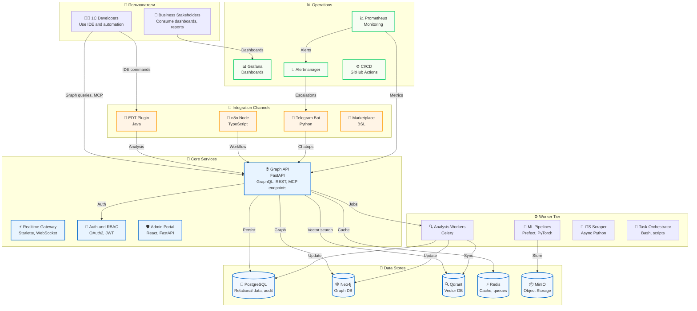

# 🤖 1C AI Stack — Платформа для AI-ассистированной разработки 1C

[](LICENSE)
[](https://www.python.org/downloads/)
[](https://www.docker.com/)
[](https://kubernetes.io/)
[](CHANGELOG.md)
[](docs/README.md)
[](docs/architecture/STANDARDS_INDEX.md)

> **🎯 Платформа** для AI-ассистированной разработки на 1C:Предприятие с **160 формализованными спецификациями**, покрывающими все аспекты платформы.
>
> Платформа, которая собирает DevOps-, AI- и эксплуатационные практики вокруг 1C:Enterprise в одну управляемую систему: разбор конфигураций, MCP-инструменты, CI/CD, безопасность и наблюдаемость.
> Внутри — рабочие сервисы, make-таргеты и документация, которые мы используем каждый день для реальных 1С-ландшафтов.
>
> **🏆 Уникальность:** 95-100% — единственная платформа в экосистеме 1C с таким уровнем формализации.
>
> **📚 Полная документация:**
> - [`docs/architecture/STANDARDS_INDEX.md`](docs/architecture/STANDARDS_INDEX.md) — каталог всех 160 стандартов
> - [`docs/DE_FACTO_STANDARD.md`](docs/DE_FACTO_STANDARD.md) — раздел про стандарты платформы
> - [`docs/architecture/01-high-level-design.md`](docs/architecture/01-high-level-design.md) — архитектура со схемами
> - [`docs/architecture/uml/`](docs/architecture/uml/) — UML диаграммы (C4, последовательности, данные)
>
> **С чего начать:**
> - [`Makefile`](Makefile) — сценарии запуска инфраструктуры, MCP и тестов;
> - [`docs/architecture/uml/`](docs/architecture/uml/) — PNG-диаграммы, обновляемые скриптами (`make render-uml`, [`scripts/docs/render_uml.py`](scripts/docs/render_uml.py));
> - [`docs/research/constitution.md`](docs/research/constitution.md) — правила проверки и стандарты разработки.

**Кому полезно:** DevOps-командам 1С, архитекторам платформы и ML/аналитикам, которым нужно быстрее внедрять изменения в продуктивные 1С-ландшафты.

---

## 🏆 Стандарты платформы

**1C AI Stack** предоставляет **формализованные стандарты** для AI-ассистированной разработки на 1C:Предприятие:

- ✅ **160 формализованных спецификаций** покрывают все аспекты платформы
- ✅ **Открытые стандарты** с JSON Schema для валидации
- ✅ **100% уникальность** для BSL-specific компонентов
- ✅ **Производственная готовность** — все стандарты проверены в реальных проектах

**Полная информация:** [`docs/DE_FACTO_STANDARD.md`](docs/DE_FACTO_STANDARD.md) | [`docs/architecture/STANDARDS_INDEX.md`](docs/architecture/STANDARDS_INDEX.md) | **[Standards Hub](docs/standards/index.md)** — центральная точка входа

---

## 📐 Архитектура

### High-Level Design

Полная архитектура платформы со схемами:

- **HLD документ:** [`docs/architecture/01-high-level-design.md`](docs/architecture/01-high-level-design.md)
- **C4 диаграммы:** [`docs/architecture/uml/c4/`](docs/architecture/uml/c4/)
- **UML диаграммы:** [`docs/architecture/uml/`](docs/architecture/uml/)
  - **Динамика:** [`docs/architecture/uml/dynamics/`](docs/architecture/uml/dynamics/) — последовательности, процессы
  - **Данные:** [`docs/architecture/uml/data/`](docs/architecture/uml/data/) — жизненный цикл данных
  - **Интеграции:** [`docs/architecture/uml/integrations/`](docs/architecture/uml/integrations/) — внешние системы
  - **Операции:** [`docs/architecture/uml/operations/`](docs/architecture/uml/operations/) — развертывание, мониторинг
  - **Производительность:** [`docs/architecture/uml/performance/`](docs/architecture/uml/performance/) — метрики производительности
  - **Безопасность:** [`docs/architecture/uml/security/`](docs/architecture/uml/security/) — модель угроз

### Ключевые компоненты

- **AI Orchestrator** — интеллектуальная маршрутизация запросов к AI-сервисам
- **Scenario Hub** — протокол-независимый слой для выполнения сценариев
- **Unified Change Graph** — автоматическое построение графа из BSL кода
- **LLM Provider Abstraction** — унификация работы с разными LLM провайдерами
- **Multi-Role AI Agents** — 8 AI агентов для разных ролей
- **BSL Code Graph Builder** — автоматическое построение графа из 1C конфигураций

**Детали:** [`docs/architecture/01-high-level-design.md`](docs/architecture/01-high-level-design.md)

---

## FAQ / Частые вопросы

- **Зачем уходить от MCP-центричного подхода к сценариям и ToolRegistry?**  
  MCP остаётся важным интерфейсом для IDE и интерактивной работы, но основное выполнение сценариев (BA→Dev→QA, DR rehearsal, security-audit) перенесено в протокол-независимый слой: Scenario Hub + ToolRegistry + YAML-плейбуки + HTTP/CLI.  
  Это уменьшает зависимость рантайма от MCP/LLM, даёт явное описание риска и уровней автономности, а те же сценарии становятся доступны из CI, CLI и GitOps. Подробно: [`docs/architecture/MCP_FREE_TRANSITION.md`](docs/architecture/MCP_FREE_TRANSITION.md).

---

### Что уже работает
- **Многослойный анализ конфигураций.** Парсер EDT, `bsl-language-server` и диагностические скрипты из [`src/`](src/) и [`scripts/analysis/`](scripts/analysis/) превращают 1C-конфигурации в метаданные, отчёты и графы зависимостей (см. [`docs/06-features/EDT_PARSER_GUIDE.md`](docs/06-features/EDT_PARSER_GUIDE.md)).
- **Автоматизация и MCP-инструменты.** [`src/ai/mcp_server.py`](src/ai/mcp_server.py), spec-driven workflow и готовые CLI помогают создавать задачи, генерировать код и запускать тесты из IDE или CI (см. [`docs/06-features/MCP_SERVER_GUIDE.md`](docs/06-features/MCP_SERVER_GUIDE.md)).
- **Промышленный контур.** Helm charts, Argo CD, Linkerd, Vault и Terraform-модули в [`infrastructure/`](infrastructure/) + регламенты в [`docs/ops/`](docs/ops/README.md) позволяют разворачивать и поддерживать стек в облаке без ручных «магических» шагов.
- **Блок бизнес-аналитики.** Агент BA с расширенными интеграциями (Jira/Confluence/PowerBI/Docflow) и собственным API лежит в [`src/ai/agents/business_analyst_agent_extended.py`](src/ai/agents/business_analyst_agent_extended.py), сервисы — в [`src/api/ba_sessions.py`](src/api/ba_sessions.py) и [`src/services/ba_session_manager.py`](src/services/ba_session_manager.py); документация и сценарии — в [`docs/06-features/BUSINESS_ANALYST_GUIDE.md`](docs/06-features/BUSINESS_ANALYST_GUIDE.md), [`docs/07-integrations/BA_INTEGRATION_PLAN.md`](docs/07-integrations/BA_INTEGRATION_PLAN.md), [`docs/08-e2e-tests/BA_E2E_MATRIX.md`](docs/08-e2e-tests/BA_E2E_MATRIX.md).
- **Защита от отключения интернета и LLM-блокировок.** Конфигурация LLM Gateway, fallback-провайдеры и тестовые сценарии находятся в [`src/services/llm_gateway.py`](src/services/llm_gateway.py), [`config/llm_gateway_simulation.yaml`](config/llm_gateway_simulation.yaml) и [`scripts/tests/llm_smoke.py`](scripts/tests/llm_smoke.py); регламент и отчёты — в [`analysis/llm_blocking_resilience_plan.md`](analysis/llm_blocking_resilience_plan.md) и [`docs/templates/offline_incident_report.md`](docs/templates/offline_incident_report.md).
- **Graph & Hybrid Search.** MATCH-запросы, семантический и гибридный поиск описаны в [`docs/06-features/GRAPH_SEARCH_GUIDE.md`](docs/06-features/GRAPH_SEARCH_GUIDE.md), покрывают `src/api/graph_api.py`, `src/services/hybrid_search.py`.
- **Marketplace & плагины.** Полный поток upload/moderation задокументирован в [`docs/06-features/MARKETPLACE_GUIDE.md`](docs/06-features/MARKETPLACE_GUIDE.md).
- **CursorExt / IDE telemetry.** Установка и синхронизация описаны в [`docs/06-features/CURSOR_EXT_GUIDE.md`](docs/06-features/CURSOR_EXT_GUIDE.md).
- **Observability.** Пошаговое руководство по Prometheus/Grafana находится в [`docs/06-features/OBSERVABILITY_GUIDE.md`](docs/06-features/OBSERVABILITY_GUIDE.md).
- **Feature Flags / Progressive Rollouts.** Управление включением функционала для пользователей или доли трафика — см. [`docs/06-features/FEATURE_FLAGS_GUIDE.md`](docs/06-features/FEATURE_FLAGS_GUIDE.md) и `src/services/feature_flags.py`.
- **Scenario Hub & Unified Change Graph.** Протокол-независимый слой для определения и выполнения сценариев (BA→Dev→QA, Code Review, DR Rehearsal) с автоматическим построением графа изменений из кода 1С, рекомендациями сценариев и анализом влияния изменений. См. [`docs/architecture/AI_SCENARIO_HUB_REFERENCE.md`](docs/architecture/AI_SCENARIO_HUB_REFERENCE.md), [`docs/06-features/UNIFIED_CHANGE_GRAPH_GUIDE.md`](docs/06-features/UNIFIED_CHANGE_GRAPH_GUIDE.md), [`docs/06-features/1C_CODE_GRAPH_BUILDER_GUIDE.md`](docs/06-features/1C_CODE_GRAPH_BUILDER_GUIDE.md).
- **LLM Provider Abstraction.** Унифицированный уровень абстракции для работы с разными LLM провайдерами (Kimi, Qwen, GigaChat, YandexGPT) с автоматическим выбором на основе типа запроса, рисков, стоимости и compliance требований. См. `src/ai/llm_provider_abstraction.py`.
- **Intelligent Cache.** Интеллектуальное кэширование с TTL на основе типа запроса, инвалидацией по тегам и типу запроса, LRU eviction и метриками производительности. См. `src/ai/intelligent_cache.py`.
- **Unified CLI Tool.** Командная строка для работы с платформой (Orchestrator, Scenario Hub, Unified Change Graph, LLM провайдеры, кэш). См. [`docs/01-getting-started/CLI_GUIDE.md`](docs/01-getting-started/CLI_GUIDE.md), `scripts/cli/1cai_cli.py`.
- **Performance Benchmarks.** Комплексные benchmarks для новых компонентов с целевыми показателями производительности (p95 < 50ms для Scenario Recommender на малом графе, p95 < 1ms для cache hit). См. [`docs/05-development/PERFORMANCE_BENCHMARKS.md`](docs/05-development/PERFORMANCE_BENCHMARKS.md), `tests/performance/test_new_components_performance.py`.
- **🚀 Revolutionary Components.** Прорывные технологии для AI-разработки: Event-Driven Architecture (замена Celery), Self-Evolving AI (автоматическое улучшение), Self-Healing Code (автоматическое исправление багов), Distributed Agent Network (P2P координация), Code DNA (эволюционное улучшение), Predictive Generation (проактивная разработка). См. [`docs/06-features/REVOLUTIONARY_TECHNOLOGIES_GUIDE.md`](docs/06-features/REVOLUTIONARY_TECHNOLOGIES_GUIDE.md), [`docs/06-features/INTEGRATION_WITH_EXISTING_SYSTEM.md`](docs/06-features/INTEGRATION_WITH_EXISTING_SYSTEM.md), [`analysis/REVOLUTIONARY_TECHNOLOGY_ROADMAP.md`](analysis/REVOLUTIONARY_TECHNOLOGY_ROADMAP.md).

### 🚀 Последние улучшения

Журнал **последних 7 релизов** (новые сверху). Детали по каждому релизу см. в `docs/05-development/CHANGELOG.md`.

#### 2025‑11‑17 — Performance, Observability, CLI

- **Performance Benchmarks & Prometheus Metrics**
  - Код/тесты: `tests/performance/test_new_components_performance.py` - benchmarks для Scenario Recommender, Impact Analyzer, LLM Provider Selection, Intelligent Cache с целевыми метриками (p95 < 50ms для малого графа, p95 < 1ms для cache hit).
  - Метрики: расширены Prometheus метрики в `src/monitoring/prometheus_metrics.py` для всех новых компонентов (scenario_recommender_*, impact_analyzer_*, llm_provider_*, intelligent_cache_*).
  - Интеграция: добавлены вызовы track_* функций в ScenarioRecommender, ImpactAnalyzer, LLMProviderAbstraction, IntelligentCache для автоматической отправки метрик.
  - Документация: `docs/05-development/PERFORMANCE_BENCHMARKS.md` с описанием всех benchmarks и метрик.
- **E2E Tests**
  - Код/тесты: `tests/system/test_e2e_scenario_hub_graph.py`, `tests/system/test_e2e_llm_provider_abstraction.py`, `tests/system/test_e2e_intelligent_cache.py`, `tests/system/test_e2e_cli_tool.py`, `tests/system/test_e2e_ba_with_graph.py` - полное покрытие новых компонентов E2E тестами.
- **CLI Tool**
  - Код: `scripts/cli/1cai_cli.py` - унифицированный CLI для работы с платформой (query, scenarios, recommend, impact, health, cache, llm-providers).
  - Документация: `docs/01-getting-started/CLI_GUIDE.md` с примерами использования.

#### 2025‑11‑16 — AI агенты, тесты, безопасность, DevEx

- **AI Agents & E2E**
  - Код/тесты: `tests/system/test_e2e_ba_dev_qa.py`, `tests/unit/test_business_analyst_integrations.py`, `tests/unit/test_sql_optimizer*.py`, тесты TechLogAnalyzer/RAS Monitor/Issue Classifier.  
  - Документация: `docs/08-e2e-tests/BA_DEV_QA_E2E.md`, BA‑гайды BA‑03…BA‑07 (`docs/06-features/*BA_*_GUIDE.md`).  
- **Orchestrator & Performance**
  - Код/тесты: `tests/unit/test_ai_orchestrator_basic.py`, `tests/unit/test_query_classifier.py`, `scripts/testing/orchestrator_latency_smoke.py`, `scripts/testing/kimi_benchmark.py`.  
  - Документация: `docs/06-features/AI_PERFORMANCE_GUIDE.md`.  
- **Security & Audit**
  - Код/скрипты: `scripts/audit/check_hidden_dirs.py`, `scripts/audit/check_secrets.py`, `scripts/audit/check_git_safety.py`, make‑таргет `security-audit`, `scripts/windows/security-audit.ps1`.  
  - Документация/политики: `SECURITY_IMPROVEMENTS.md`, `docs/research/constitution.md`.  
- **BA & Documentation / DevEx**
  - Документация: BA‑гайды BA‑03…BA‑07, обновлён `docs/research/alkoleft_todo.md`, Usage Cookbook (`docs/01-getting-started/cookbook.md`), Windows Quickstart (`docs/01-getting-started/windows_quickstart.md`), шаблон DORA weekly summary (`docs/status/weekly_summary_template.md`).  
- **DR / Resilience**
  - Скрипты/артефакты: `scripts/runbooks/generate_dr_postmortem.py`, `docs/runbooks/postmortems/*`, DR‑план `docs/runbooks/dr_rehearsal_plan.md`.  
  - Плейбуки: `playbooks/ba_dev_qa_example.yaml`, `playbooks/dr_vault_example.yaml`, dry‑run исполнитель (`src/ai/playbook_executor.py`, `scripts/runbooks/run_playbook.py`).  
- **Scenario Hub & Tool Registry (experimental)**
  - Слой типов: `src/ai/scenario_hub.py`, `src/ai/scenario_policy.py`, `src/ai/tool_registry.py`, `src/ai/scenario_examples.py`, `src/ai/tool_registry_examples.py`.  
  - API: `/api/scenarios/examples` (поддержка уровней автономности и policy_decisions) и `/api/tools/registry/examples` в `src/ai/orchestrator.py`.  
  - Документация/UX: `docs/architecture/AI_SCENARIO_HUB_REFERENCE.md`, `docs/architecture/TOOL_REGISTRY_REFERENCE.md`, рецепты в `docs/01-getting-started/cookbook.md`.

#### 2025‑11‑15 — Orchestrator & AI‑контур

- **AI Orchestrator**: базовые unit‑тесты (`tests/unit/test_ai_orchestrator_basic.py`, `tests/unit/test_query_classifier.py`) для классификации запросов, кэша и offline‑режима.  
- **AI Agents**: дополнительные unit‑тесты для TechLogAnalyzer, RAS Monitor, Issue Classifier (ML/rule‑based).  
- **LLM Diagnostics**: `scripts/diagnostics/check_llm_endpoints.py` + юнит‑тесты, DevOps offline‑гайд обновлён под новые проверки.

#### 2025‑11‑14 — Security & Audit

- **Secret Scanning**: `scripts/audit/check_secrets.py` + отчёт `analysis/secret_scan_report.json`.  
- **Hidden Dirs / Git Safety**: `scripts/audit/check_hidden_dirs.py`, `check_git_safety.py`, интеграция в `make security-audit`.  
- **Security Docs**: обновлены `SECURITY_IMPROVEMENTS.md`, раздел Security в `CHANGELOG`, зафиксирован риск по CVE FastAPI/Starlette/urllib3.  
- **Windows Security**: `scripts/windows/security-audit.ps1` как единая точка входа для аудита в PowerShell.

#### 2025‑11‑13 — Агентские гайды и E2E

- **Developer AI Secure**: `docs/06-features/DEVELOPER_AGENT_GUIDE.md` + unit‑тесты approve‑флоу.  
- **QA Engineer AI**: `docs/06-features/QA_ENGINEER_GUIDE.md`, system‑тесты маршрутизатора ролей (`tests/system/test_role_based_routing.py`).  
- **Business Analyst**: интеграционные тесты Jira/Confluence/PowerBI/Docflow (`tests/unit/test_business_analyst_integrations.py`).  
- **SQL Optimizer**: гайд `SQL_OPTIMIZER_GUIDE.md` и unit‑тесты secure‑режима.

#### 2025‑11‑12 — DevEx, Windows и Cookbook

- **Windows Quickstart**: `docs/01-getting-started/windows_quickstart.md` с пошаговым запуском без GNU Make.  
- **Usage Cookbook**: `docs/01-getting-started/cookbook.md` (частые сценарии: тесты, security-audit, BA→Dev→QA, Orchestrator latency, DR rehearsal).  
- **Runtime Checks**: `scripts/setup/check_runtime.py` + обновлённая `docs/research/constitution.md` (проверки Python 3.11, make, docker).

#### 2025‑11‑11 — BA‑подсистема и DR

- **BA Guides**: `BA_PROCESS_MODELLING_GUIDE`, `BA_ANALYTICS_KPI_GUIDE`, `BA_TRACEABILITY_COMPLIANCE_GUIDE`, `BA_INTEGRATIONS_COLLAB_GUIDE`, `BA_ENABLEMENT_GUIDE` + индексы в `docs/06-features/README.md`.  
- **DR / Resilience**: план `docs/runbooks/dr_rehearsal_plan.md`, интеграция DR rehearsal в общий процесс.  
- **DORA / Status**: `docs/status/weekly_summary_template.md` и обновлённый `docs/status/README.md`.

#### 2025‑11‑10 — Архитектура, Feature Flags и README

- **Feature Flags**: `docs/06-features/FEATURE_FLAGS_GUIDE.md`, ссылки в `docs/06-features/README.md` и `README`.  
- **Architecture / UML**: диаграмма CursorExt (`docs/architecture/uml/integrations/cursorext-overview.puml`) и артефакт PNG в `docs/architecture/images/`.  
- **README & Usage**: очищен от merge‑конфликтов, добавлен раздел Usage, таблица статусов подсистем и ссылки на основные гайды.  
- **Приватный push‑процесс**: документация в `docs/05-development/README.md` и `docs/01-getting-started/CONTRIBUTING.md`.

## Архитектура платформы



> **Подробная версия:** [Полная интерактивная карта](docs/architecture/interactive-architecture.html) с фильтрами и поиском

> 📐 **Стандарты (Scenario DSL / Autonomy Policy / Unified Change Graph):**  
> Если вы хотите использовать наши сценарии и политику в своей системе, см.  
> `docs/architecture/SCENARIO_DSL_SPEC.md`, `docs/architecture/AUTONOMY_POLICY_SPEC.md`,  
> `docs/architecture/CODE_GRAPH_REFERENCE.md` и короткий гид по внедрению  
> `docs/architecture/STANDARDS_ADOPTION_GUIDE.md`. Для быстрой самопроверки можно:
> - локально: `make validate-standards` (валидация Scenario DSL / Autonomy Policy / Code Graph против JSON Schema);
> - вручную: пройти чеклист `docs/architecture/STANDARDS_CONFORMANCE_CHECKLIST.md`.

## Usage / Быстрый старт

1. Установить Python 3.11, Docker и Docker Compose — подробности в [`docs/setup/python_311.md`](docs/setup/python_311.md).
2. Проверить окружение: `make check-runtime` (использует [`scripts/setup/check_runtime.py`](scripts/setup/check_runtime.py)).
3. Запустить минимальный стенд:
   ```bash
   make docker-up      # инфраструктура: БД, брокеры, Neo4j, Qdrant
   make migrate        # первичная миграция данных
   make servers        # Graph API + MCP server
   open http://localhost:6001/mcp
   ```
   > Для Windows есть аналоги в [`scripts/windows/`](scripts/windows/) и упрощённый сценарий в [`docs/01-getting-started/windows_quickstart.md`](docs/01-getting-started/windows_quickstart.md). После запуска доступен живой MCP endpoint, логи сервисов и тестовые данные — можно сразу проверять сценарии.

## Сценарии использования

| Роль | Первое действие | Ключевые материалы |
| ---- | ---------------- | ------------------ |
| DevOps / SRE | Пройти `make gitops-apply`, подключить Vault/Linkerd | [`docs/ops/devops_platform.md`](docs/ops/devops_platform.md), [`docs/ops/gitops.md`](docs/ops/gitops.md), [`docs/ops/service_mesh.md`](docs/ops/service_mesh.md), [`infrastructure/helm/`](infrastructure/helm/) |
| 1С-разработчик / архитектор | Разобрать конфигурацию и получить документацию | [`docs/06-features/EDT_PARSER_GUIDE.md`](docs/06-features/EDT_PARSER_GUIDE.md), [`scripts/analysis/generate_documentation.py`](scripts/analysis/generate_documentation.py), [`docs/architecture/README.md`](docs/architecture/README.md) |
| ML / аналитика | Сформировать датасет и прогнать проверки качества | [`docs/06-features/ML_DATASET_GENERATOR_GUIDE.md`](docs/06-features/ML_DATASET_GENERATOR_GUIDE.md), [`docs/06-features/TESTING_GUIDE.md`](docs/06-features/TESTING_GUIDE.md), [`scripts/analysis/`](scripts/analysis/) |
| Операционный менеджер / on-call | Подготовить регламенты и тренировки | [`docs/runbooks/dr_rehearsal_plan.md`](docs/runbooks/dr_rehearsal_plan.md), [`docs/process/oncall_rotations.md`](docs/process/oncall_rotations.md), [`docs/observability/SLO.md`](docs/observability/SLO.md) |

## Ключевые блоки платформы

| Направление | Что включено | Ссылки |
|-------------|--------------|--------|
| **MCP & AI tooling** | Генерация кода, анализ AST, MCP-инструменты | [`docs/06-features/AST_TOOLING_BSL_LANGUAGE_SERVER.md`](docs/06-features/AST_TOOLING_BSL_LANGUAGE_SERVER.md), [`docs/06-features/MCP_SERVER_GUIDE.md`](docs/06-features/MCP_SERVER_GUIDE.md) |
| **Инфраструктура** | Helm charts, Terraform, Argo CD, Linkerd, Vault | [`docs/ops/devops_platform.md`](docs/ops/devops_platform.md), [`docs/ops/gitops.md`](docs/ops/gitops.md), [`docs/ops/service_mesh.md`](docs/ops/service_mesh.md) |
| **Надёжность и наблюдаемость** | Runbooks, DR, DORA, Prometheus, Alertmanager | [`docs/runbooks/dr_rehearsal_plan.md`](docs/runbooks/dr_rehearsal_plan.md), [`docs/process/oncall_rotations.md`](docs/process/oncall_rotations.md), [`docs/observability/SLO.md`](docs/observability/SLO.md) |
| **Бизнес-аналитика** | BA агент, сессии, шаблоны, интеграции | [`docs/06-features/BUSINESS_ANALYST_GUIDE.md`](docs/06-features/BUSINESS_ANALYST_GUIDE.md), [`docs/07-integrations/BA_INTEGRATION_PLAN.md`](docs/07-integrations/BA_INTEGRATION_PLAN.md) |
| **LLM resiliency / офлайн режим** | LLM Gateway, fallback-провайдеры, план устойчивости | [`analysis/llm_blocking_resilience_plan.md`](analysis/llm_blocking_resilience_plan.md), [`config/llm_gateway_simulation.yaml`](config/llm_gateway_simulation.yaml), [`docs/templates/offline_incident_report.md`](docs/templates/offline_incident_report.md) |
| **Graph & Hybrid Search** | MATCH, semantic и комбинированный поиск | [`docs/06-features/GRAPH_SEARCH_GUIDE.md`](docs/06-features/GRAPH_SEARCH_GUIDE.md) |
| **Marketplace** | Загрузка/модерация плагинов | [`docs/06-features/MARKETPLACE_GUIDE.md`](docs/06-features/MARKETPLACE_GUIDE.md) |
| **CursorExt / IDE** | Сбор и синхронизация событий | [`docs/06-features/CURSOR_EXT_GUIDE.md`](docs/06-features/CURSOR_EXT_GUIDE.md) |
| **Observability** | Prometheus, Grafana, алерты | [`docs/06-features/OBSERVABILITY_GUIDE.md`](docs/06-features/OBSERVABILITY_GUIDE.md) |
| **Feature Flags** | Progressive rollout, beta, percentage | [`docs/06-features/FEATURE_FLAGS_GUIDE.md`](docs/06-features/FEATURE_FLAGS_GUIDE.md) |
| **Developer AI Secure** | Rule-of-Two кодогенерация | [`docs/06-features/DEVELOPER_AGENT_GUIDE.md`](docs/06-features/DEVELOPER_AGENT_GUIDE.md) |
| **QA Engineer AI** | Генерация тестов, coverage | [`docs/06-features/QA_ENGINEER_GUIDE.md`](docs/06-features/QA_ENGINEER_GUIDE.md) |
| **SQL Optimizer** | Оптимизация запросов и сервера | [`docs/06-features/SQL_OPTIMIZER_GUIDE.md`](docs/06-features/SQL_OPTIMIZER_GUIDE.md) |
| **Безопасность и FinOps** | Политики, проверки, отчёты, FinOps-скрипты | [`docs/security/policy_as_code.md`](docs/security/policy_as_code.md), [`docs/ops/finops.md`](docs/ops/finops.md) |

## Статусы подсистем

| Компонент | Статус | Документация |
|-----------|--------|--------------|
| Security Agent Framework | 🟡 MVP (sandbox в доработке) | [`docs/06-features/README.md`](docs/06-features/README.md#-security-agent-framework) |
| Voice Queries | ✅ Production | [`docs/06-features/VOICE_QUERIES.md`](docs/06-features/VOICE_QUERIES.md) |
| OCR Integration | ✅ Beta | [`docs/06-features/OCR_INTEGRATION.md`](docs/06-features/OCR_INTEGRATION.md) |
| Feature Flags | ✅ Production | [`docs/06-features/FEATURE_FLAGS_GUIDE.md`](docs/06-features/FEATURE_FLAGS_GUIDE.md) |
| Developer AI Secure | ✅ Production | [`docs/06-features/DEVELOPER_AGENT_GUIDE.md`](docs/06-features/DEVELOPER_AGENT_GUIDE.md) |
| QA Engineer AI | ✅ Production | [`docs/06-features/QA_ENGINEER_GUIDE.md`](docs/06-features/QA_ENGINEER_GUIDE.md) |
| SQL Optimizer | ✅ Production | [`docs/06-features/SQL_OPTIMIZER_GUIDE.md`](docs/06-features/SQL_OPTIMIZER_GUIDE.md) |
| Marketplace Hardening | 🟡 Beta | [`docs/06-features/MARKETPLACE_GUIDE.md`](docs/06-features/MARKETPLACE_GUIDE.md) |
| ITIL/ITSM Support | 📋 Planned | [`docs/07-itil-analysis/README.md`](docs/07-itil-analysis/README.md) |

> ⚠️ Все Planned/MVP элементы явно помечены; при ссылке на них в README обязательно уточняем статус.

---

## 🤖 AI Tooling & Automation
- **bsl-language-server**: сервис AST, make-таргеты `bsl-ls-*`, health-check, fallback в `BSLASTParser`.
  - План интеграции: [`docs/research/bsl_language_server_plan.md`](docs/research/bsl_language_server_plan.md).
  - Детальный гайд: [`docs/06-features/AST_TOOLING_BSL_LANGUAGE_SERVER.md`](docs/06-features/AST_TOOLING_BSL_LANGUAGE_SERVER.md).
- **Spec-driven development** (по мотивам [github/spec-kit](https://github.com/github/spec-kit)):
  - Анализ и предложения: [`docs/research/spec_kit_analysis.md`](docs/research/spec_kit_analysis.md).
  - Конституция правил проверки: [`docs/research/constitution.md`](docs/research/constitution.md).
  - Шаблоны и CLI: `templates/`, `scripts/research/init_feature.py`, make-таргеты `feature-init` и `feature-validate`.
- **MCP инструменты**: поиск метаданных, генерация кода, запуск тестов (IDE и интерактив).
- **Scenario Hub & MCP-free runtime**: сценарии BA→Dev→QA, DR rehearsal и security-audit описываются через Scenario Hub, ToolRegistry и YAML-плейбуки; MCP остаётся одним из фронтов (IDE), а основное выполнение сценариев выносится в HTTP/CLI/playbooks (см. [`docs/architecture/MCP_FREE_TRANSITION.md`](docs/architecture/MCP_FREE_TRANSITION.md)).
- **Open Standards (Scenario DSL / Autonomy Policy / Unified Change Graph)**: описания сценариев, уровней автономии и графа изменений формализованы как открытые спецификации и JSON Schema (`SCENARIO_DSL_SPEC.md`, `AUTONOMY_POLICY_SPEC.md`, `CODE_GRAPH_REFERENCE.md`), с примерами, CLI (`print_scenario_decisions.py`) и чеклистом соответствия; внешний оркестратор может использовать их без переноса кода стека (см. [`docs/architecture/STANDARDS_ADOPTION_GUIDE.md`](docs/architecture/STANDARDS_ADOPTION_GUIDE.md)).
- **Automation scripts**: [`scripts/context/export_platform_context.py`](scripts/context/export_platform_context.py), [`scripts/context/generate_docs.py`](scripts/context/generate_docs.py), [`scripts/docs/create_adr.py`](scripts/docs/create_adr.py).
- **Monitoring automation**: [`scripts/monitoring/github_monitor.py`](scripts/monitoring/github_monitor.py) + workflow [`.github/workflows/github-monitor.yml`](.github/workflows/github-monitor.yml) — ежедневный snapshot зависимостей.
- **Release automation**: [`scripts/release/create_release.py`](scripts/release/create_release.py), make `release-*`, workflow [`.github/workflows/release.yml`](.github/workflows/release.yml) — генерация заметок, тегов, публикация релизов.
- **Quality metrics**: [`scripts/metrics/collect_dora.py`](scripts/metrics/collect_dora.py), workflow [`.github/workflows/dora-metrics.yml`](.github/workflows/dora-metrics.yml) — еженедельные DORA-показатели.

---

## 🏛 Architecture & Documentation
- **High-Level Design**: [`docs/architecture/01-high-level-design.md`](docs/architecture/01-high-level-design.md)
- **Structurizr DSL**: [`docs/architecture/c4/workspace.dsl`](docs/architecture/c4/workspace.dsl)
- **Диаграммы (PNG)**: [`docs/architecture/uml/`](docs/architecture/uml/) (C4, data, dynamics, operations, security)
- **ADR**: [`docs/architecture/adr/`](docs/architecture/adr/), см. `ADR-0001… ADR-0005`
- **Automated render**: `make render-uml`, workflow [`.github/workflows/uml-render-check.yml`](.github/workflows/uml-render-check.yml)

---

## ✅ Testing & Quality
- **YAxUnit + EDT runner** (в планах расширения через репозитории BIA: yaxunit, edt-test-runner).
- `make test-bsl` (см. [`scripts/tests/run_bsl_tests.py`](scripts/tests/run_bsl_tests.py)).
- Статический анализ, best practices, проверка зависимостей.
- Сторожевые скрипты: [`scripts/audit/`](scripts/audit/), [`scripts/analysis/`](scripts/analysis/).
- Справочник по тестам: [`docs/06-features/TESTING_GUIDE.md`](docs/06-features/TESTING_GUIDE.md).

- Smoke проверки: `make smoke-tests`, CI job `smoke-tests`, артефакты pytest — см. [`output/tests`](output/tests/).
- Наблюдаемость: `/metrics` (Prometheus), SLO/Runbooks (`docs/observability/SLO.md`, `docs/runbooks/alert_slo_runbook.md`), автоматические отчёты DORA.
- **Secret scanning & Security**
  - Workflows [`.github/workflows/secret-scan.yml`](.github/workflows/secret-scan.yml) (Gitleaks) и [`.github/workflows/trufflehog.yml`](.github/workflows/trufflehog.yml) — регулярное сканирование репозитория на утечки токенов.
  - Policy-as-code: [`policy/`](policy/) (Rego) + [`scripts/security/run_policy_checks.sh`](scripts/security/run_policy_checks.sh) (Conftest Kubernetes + Terraform, Semgrep, Checkov/Trivy) → `make policy-check` / CI стадии.
  - Infrastructure scanners: [`scripts/security/run_checkov.sh`](scripts/security/run_checkov.sh) (Checkov + Trivy) подключён в Jenkins/GitLab/Azure pipeline.
  - GitOps: [`infrastructure/argocd/`](infrastructure/argocd/), [`scripts/gitops/`](scripts/gitops/), make `gitops-apply`, `gitops-sync`.
  - Cloud readiness: [`infrastructure/terraform/aws-eks/`](infrastructure/terraform/aws-eks/), [`infrastructure/terraform/azure-aks/`](infrastructure/terraform/azure-aks/), Ansible bootstrap ([`infrastructure/ansible/`](infrastructure/ansible/)).
  - Secrets: [`scripts/secrets/aws_sync_to_vault.py`](scripts/secrets/aws_sync_to_vault.py), [`scripts/secrets/azure_sync_to_vault.py`](scripts/secrets/azure_sync_to_vault.py), [`scripts/secrets/apply_vault_csi.sh`](scripts/secrets/apply_vault_csi.sh).
  - Self-control: [`scripts/checklists/preflight.sh`](scripts/checklists/preflight.sh), make `preflight`.
- **FinOps**
  - Скрипты [`scripts/finops/aws_cost_*`](scripts/finops/), [`scripts/finops/azure_cost_to_slack.py`](scripts/finops/azure_cost_to_slack.py), [`scripts/finops/aws_budget_check.py`](scripts/finops/aws_budget_check.py), [`scripts/finops/azure_budget_check.py`](scripts/finops/azure_budget_check.py), [`scripts/finops/teams_notify.py`](scripts/finops/teams_notify.py) — отчёты, бюджеты и Slack/Teams уведомления; дашборд [`observability/grafana/dashboards/finops_cost.json`](observability/grafana/dashboards/finops_cost.json).
  - Workflow [`.github/workflows/finops-report.yml`](.github/workflows/finops-report.yml) — ежедневный отчёт.
  - DR rehearsal: [`docs/runbooks/dr_rehearsal_plan.md`](docs/runbooks/dr_rehearsal_plan.md), скрипт [`scripts/runbooks/dr_rehearsal_runner.py`](scripts/runbooks/dr_rehearsal_runner.py), workflow [`.github/workflows/dr-rehearsal.yml`](.github/workflows/dr-rehearsal.yml).

---

## 🔗 Integrations
- **IDE**: MCP сервер (Cursor/VS Code), EDT плагин ([`edt-plugin/`](edt-plugin/)).
- **Внешние инструменты**: alkoleft платформенные сервисы, yaxunit, GitHub Spec Kit (в работе).
- **ITS Scraper**: асинхронный сбор статей, версионирование ([`integrations/its_scraper`](integrations/its_scraper)).
- **Telegram / n8n / OCR**: дополнительные модули в [`src/`](src/) и [`integrations/`](integrations/).

---

## 📚 Documentation Hub

Полный индекс: [`docs/README.md`](docs/README.md). Ключевые разделы:
- **Setup & Runtime**
  - [`docs/setup/python_311.md`](docs/setup/python_311.md) — установка Python 3.11 и проверка среды.
  - [`scripts/setup/check_runtime.py`](scripts/setup/check_runtime.py) + `make check-runtime` — автоматическая проверка версии Python.
  - [`docs/01-getting-started/windows_quickstart.md`](docs/01-getting-started/windows_quickstart.md) — быстрый старт на Windows.
  - [`docs/01-getting-started/cookbook.md`](docs/01-getting-started/cookbook.md) — готовые «рецепты» (тесты, security-audit, E2E, DR rehearsal).
- **Infrastructure & DevOps**
  - [`docs/ops/devops_platform.md`](docs/ops/devops_platform.md) — стратегия DevOps-платформы.
  - [`docs/ops/gitops.md`](docs/ops/gitops.md) — GitOps с Argo CD.
  - [`docs/ops/ansible.md`](docs/ops/ansible.md) — bootstrap инфраструктуры Ansible.
  - [`docs/ops/service_mesh.md`](docs/ops/service_mesh.md) — Istio blueprint.
  - [`infrastructure/service-mesh/linkerd`](infrastructure/service-mesh/linkerd) — альтернативный service mesh.
  - [`docs/ops/chaos_engineering.md`](docs/ops/chaos_engineering.md) — Litmus chaos сценарии.
  - [`docs/ops/vault.md`](docs/ops/vault.md) — Vault & secret management.
  - [`docs/ops/azure_devops.md`](docs/ops/azure_devops.md) — Azure DevOps pipeline.
  - [`docs/ops/finops.md`](docs/ops/finops.md) — FinOps и контроль затрат (`make finops-slack`, workflow `finops-report.yml`).
  - [`docs/ops/self_control.md`](docs/ops/self_control.md) — самоконтроль инженера (`make preflight`).
  - [`infrastructure/kind/cluster.yaml`](infrastructure/kind/cluster.yaml) — локальный Kubernetes.
  - [`infrastructure/helm/1cai-stack`](infrastructure/helm/1cai-stack) — Helm chart приложения.
  - [`infrastructure/helm/observability-stack`](infrastructure/helm/observability-stack) — Prometheus/Loki/Tempo/Grafana/OTEL.
  - [`infrastructure/service-mesh/istio`](infrastructure/service-mesh/istio) — IstioOperator профиль.
  - [`infrastructure/chaos/litmus`](infrastructure/chaos/litmus) — Litmus Chaos эксперименты.
  - [`infrastructure/argocd/`](infrastructure/argocd/) — manifests для Argo CD (GitOps, Linkerd ApplicationSet).
  - [`infrastructure/terraform`](infrastructure/terraform) — Terraform конфигурация для Helm релиза.
  - [`infrastructure/terraform/aws-eks`](infrastructure/terraform/aws-eks) — Terraform модуль EKS (AWS).
  - [`infrastructure/terraform/azure-aks`](infrastructure/terraform/azure-aks) — Terraform модуль AKS (Azure).
  - [`infrastructure/terraform/azure-keyvault`](infrastructure/terraform/azure-keyvault) — Terraform модуль Key Vault.
  - [`scripts/service_mesh/linkerd/bootstrap_certs.sh`](scripts/service_mesh/linkerd/bootstrap_certs.sh) — генерация trust anchors/issuer.
  - [`scripts/service_mesh/linkerd/`](scripts/service_mesh/linkerd/) — bootstrap/rotate certs, managed identity, CI smoke ([`.github/workflows/linkerd-smoke.yml`](.github/workflows/linkerd-smoke.yml)).
  - Make: `linkerd-install`, `linkerd-rotate-certs`, `linkerd-smoke`.
  - [`infrastructure/azure/azure-pipelines.yml`](infrastructure/azure/azure-pipelines.yml) — Azure DevOps pipeline.
  - [`infrastructure/vault/`](infrastructure/vault/) — политики, скрипты, SecretProviderClass для Vault (`make vault-csi-apply`, sync скрипты).
  - [`scripts/secrets/aws_sync_to_vault.py`](scripts/secrets/aws_sync_to_vault.py) — синхронизация AWS Secrets Manager → Vault.
  - [`infrastructure/jenkins/Jenkinsfile`](infrastructure/jenkins/Jenkinsfile), [`infrastructure/gitlab/.gitlab-ci.yml`](infrastructure/gitlab/.gitlab-ci.yml) — многостадийные pipeline.
  - [`docs/security/policy_as_code.md`](docs/security/policy_as_code.md) — Rego-политики, Conftest, Semgrep.
- **Feature Guides**
  - [`docs/06-features/AST_TOOLING_BSL_LANGUAGE_SERVER.md`](docs/06-features/AST_TOOLING_BSL_LANGUAGE_SERVER.md) — запуск и диагностика bsl-language-server, fallback сценарии.
  - [`docs/06-features/MCP_SERVER_GUIDE.md`](docs/06-features/MCP_SERVER_GUIDE.md) — эндпоинты MCP, переменные окружения, troubleshooting.
  - [`docs/06-features/TESTING_GUIDE.md`](docs/06-features/TESTING_GUIDE.md) — матрица тестов, команды pytest/k6, CI-джобы.
  - [`docs/06-features/EDT_PARSER_GUIDE.md`](docs/06-features/EDT_PARSER_GUIDE.md) — разбор EDT XML, метрики и сценарии анализа.
  - [`docs/06-features/ML_DATASET_GENERATOR_GUIDE.md`](docs/06-features/ML_DATASET_GENERATOR_GUIDE.md) — подготовка ML датасетов и пайплайн обучения.
- **Operations & Tooling**
  - [`docs/scripts/README.md`](docs/scripts/README.md) — карта CLI/скриптов, spec-driven workflow, Windows альтернативы, release tooling.
- **Observability**
  - [`docs/observability/SLO.md`](docs/observability/SLO.md) — целевые показатели доступности и латентности.
  - [`docs/runbooks/alert_slo_runbook.md`](docs/runbooks/alert_slo_runbook.md) — действия при нарушении SLO.
  - [`docs/status/dora_history.md`](docs/status/dora_history.md) — автоматическая история DORA метрик (weekly).
  - Workflow [`.github/workflows/observability.yml`](.github/workflows/observability.yml) — напоминание об интеграции SLO/метрик.
  - `make observability-up` → локальный Prometheus/Grafana/Alertmanager стек (см. [`observability/docker-compose.observability.yml`](observability/docker-compose.observability.yml)), проверяется CI ([`.github/workflows/observability-test.yml`](.github/workflows/observability-test.yml)).
  - `make helm-observability` → установка Kubernetes-стека наблюдаемости (Prometheus + Loki + Tempo + Grafana + OTEL) из [`infrastructure/helm/observability-stack`](infrastructure/helm/observability-stack).
  - Alertmanager конфигурация: [`observability/alertmanager.yml`](observability/alertmanager.yml) + правила [`observability/alerts.yml`](observability/alerts.yml) (Telegram; требуются `TELEGRAM_BOT_TOKEN`, `TELEGRAM_CHAT_ID`).
  - Telegram оповещения: workflow [`.github/workflows/telegram-alert.yaml`](.github/workflows/telegram-alert.yaml) (требует `TELEGRAM_BOT_TOKEN`, `TELEGRAM_CHAT_ID`).
- **Architecture**
  - [`docs/architecture/README.md`](docs/architecture/README.md) — обзор C4, операции и ссылки на ADR.
  - [`docs/architecture/adr/`](docs/architecture/adr/) — реестр решений, статусы и история изменений.
  - [`docs/architecture/uml/`](docs/architecture/uml/) — PlantUML диаграммы (структура, потоки, безопасность).
- **Parsers & Documentation**
  - [`docs/06-features/EDT_PARSER_GUIDE.md`](docs/06-features/EDT_PARSER_GUIDE.md) — парсинг конфигураций, метаданные.
  - [`docs/06-features/ML_DATASET_GENERATOR_GUIDE.md`](docs/06-features/ML_DATASET_GENERATOR_GUIDE.md) — генерация обучающих наборов.
  - [`docs/06-features/ITS_SCRAPER.md`](docs/03-integrations/ITS_SCRAPER.md) — сбор данных ITS и обновление базы знаний.
- **Research & Plans**
  - [`docs/research/README_LOCAL.md`](docs/research/README_LOCAL.md) — ежедневные статусы и подготовка публикации.
  - [`docs/research/alkoleft_todo.md`](docs/research/alkoleft_todo.md) — roadmap и планы развития.
  - [`docs/research/constitution.md`](docs/research/constitution.md) — конституция правил проверки.

## Чего ждать дальше

- Расширение spec-driven практик и интеграции с GitHub Spec Kit — см. [`docs/research/spec_kit_analysis.md`](docs/research/spec_kit_analysis.md), [`docs/research/constitution.md`](docs/research/constitution.md).
- Новые тестовые раннеры (YAxUnit, edt-test-runner) и сценарии — слежение в [`docs/06-features/TESTING_GUIDE.md`](docs/06-features/TESTING_GUIDE.md), [`docs/research/alkoleft_todo.md`](docs/research/alkoleft_todo.md).
- UI/презентационный слой для быстрой навигации — наработки в [`docs/09-archive/ui-ux-backup/`](docs/09-archive/ui-ux-backup/).

## Документация и ресурсы

- Полный индекс: [`docs/README.md`](docs/README.md).
- Архитектура: [`docs/architecture/README.md`](docs/architecture/README.md), Structurizr DSL и PlantUML лежат в [`docs/architecture/c4/`](docs/architecture/c4/) и [`docs/architecture/uml/`](docs/architecture/uml/).
- Практики тестирования и качества: [`docs/06-features/TESTING_GUIDE.md`](docs/06-features/TESTING_GUIDE.md), тестовые сценарии — в [`scripts/tests/`](scripts/tests/).
- Политики безопасности: [`docs/security/policy_as_code.md`](docs/security/policy_as_code.md), workflows [`.github/workflows/secret-scan.yml`](.github/workflows/secret-scan.yml), [`.github/workflows/trufflehog.yml`](.github/workflows/trufflehog.yml).
- Наблюдаемость и метрики: [`observability/docker-compose.observability.yml`](observability/docker-compose.observability.yml), [`docs/observability/SLO.md`](docs/observability/SLO.md), [`docs/status/dora_history.md`](docs/status/dora_history.md).

## Как взаимодействовать

- Бэклог и актуальные задачи — [`docs/research/alkoleft_todo.md`](docs/research/alkoleft_todo.md).
- Issues и pull-requests приветствуются; ориентируйтесь на [recent commits](https://github.com/DmitrL-dev/1cai/commits/main) и [`docs/05-development/README.md`](docs/05-development/README.md) + [`docs/05-development/CHANGELOG.md`](docs/05-development/CHANGELOG.md).
- Перед изменением диаграмм обязательно запускайте `make render-uml` (workflow «PlantUML Render Check» использует те же скрипты).
- Для оперативных вопросов — внутренний канал команды (контакты описаны в приватной документации).