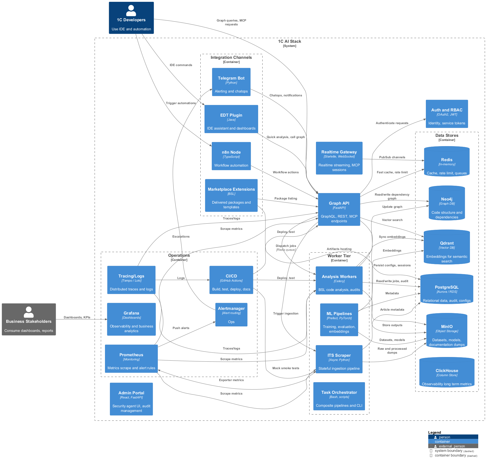

# 🤖 1C AI Stack

> Платформа, которая собирает DevOps-, AI- и эксплуатационные практики вокруг 1C:Enterprise в одну управляемую систему: разбор конфигураций, MCP-инструменты, CI/CD, безопасность и наблюдаемость.
> Внутри — рабочие сервисы, make-таргеты и документация, которые мы используем каждый день для реальных 1С-ландшафтов.
>
> **Если есть 30 секунд:**
> - загляните в [`makefile`](makefile) — увидите живые сценарии запуска инфраструктуры, MCP и тестов;
> - откройте каталог [`docs/architecture/uml/`](docs/architecture/uml/) — PNG-диаграммы обновляются скриптами и совпадают с текущей архитектурой;
> - чтобы убедиться, что схемы свежие, выполните `make render-uml` (под капотом `scripts/docs/render_uml.py`; используется тот же скрипт, что и в CI);
> - бегло посмотрите [`docs/research/constitution.md`](docs/research/constitution.md) — это правила проверки, которыми мы руководствуемся, чтобы платформа не превращалась в хаос.

**Кому полезно:** DevOps-командам 1С, архитекторам платформы и ML/аналитикам, которым нужно быстрее внедрять изменения в продуктивные 1С-ландшафты.

### Что уже работает
- **Многослойный анализ конфигураций.** Парсер EDT, `bsl-language-server` и диагностические скрипты из [`src/`](src/) и [`scripts/analysis/`](scripts/analysis/) превращают 1C-конфигурации в метаданные, отчёты и графы зависимостей (см. [`docs/06-features/EDT_PARSER_GUIDE.md`](docs/06-features/EDT_PARSER_GUIDE.md)).
- **Автоматизация и MCP-инструменты.** [`src/ai/mcp_server.py`](src/ai/mcp_server.py), spec-driven workflow и готовые CLI помогают создавать задачи, генерировать код и запускать тесты из IDE или CI (см. [`docs/06-features/MCP_SERVER_GUIDE.md`](docs/06-features/MCP_SERVER_GUIDE.md)).
- **Промышленный контур.** Helm charts, Argo CD, Linkerd, Vault и Terraform-модули в [`infrastructure/`](infrastructure/) + регламенты в [`docs/ops/`](docs/ops/README.md) позволяют разворачивать и поддерживать стек в облаке без ручных «магических» шагов.



## За 5 минут: пробный запуск
1. Установить Python 3.11, Docker и Docker Compose — подробности в [`docs/setup/python_311.md`](docs/setup/python_311.md).
2. Проверить окружение: `make check-runtime` (использует [`scripts/setup/check_runtime.py`](scripts/setup/check_runtime.py)).
3. Запустить минимальный стенд:
   ```bash
   make docker-up      # инфраструктура: БД, брокеры, Neo4j, Qdrant
   make migrate        # первичная миграция данных
   make servers        # Graph API + MCP server
   open http://localhost:6001/mcp
   ```
   > Для Windows есть аналоги в [`scripts/windows/`](scripts/windows/). После запуска доступен живой MCP endpoint, логи сервисов и тестовые данные — можно сразу проверять сценарии.

## Сценарии использования
| Роль | Первое действие | Ключевые материалы |
| ---- | ---------------- | ------------------ |
| DevOps / SRE | Пройти `make gitops-apply`, подключить Vault/Linkerd | [`docs/ops/devops_platform.md`](docs/ops/devops_platform.md), [`docs/ops/gitops.md`](docs/ops/gitops.md), [`docs/ops/service_mesh.md`](docs/ops/service_mesh.md), [`infrastructure/helm/1cai-stack`](infrastructure/helm/1cai-stack) |
| 1С-разработчик / архитектор | Разобрать конфигурацию и получить документацию | [`docs/06-features/EDT_PARSER_GUIDE.md`](docs/06-features/EDT_PARSER_GUIDE.md), [`scripts/analysis/generate_documentation.py`](scripts/analysis/generate_documentation.py), [`docs/architecture/README.md`](docs/architecture/README.md) |
| ML / аналитика | Сформировать датасет и прогнать проверки качества | [`docs/06-features/ML_DATASET_GENERATOR_GUIDE.md`](docs/06-features/ML_DATASET_GENERATOR_GUIDE.md), [`docs/06-features/TESTING_GUIDE.md`](docs/06-features/TESTING_GUIDE.md), [`scripts/analysis/`](scripts/analysis/) |
| Операционный менеджер / on-call | Подготовить регламенты и тренировки | [`docs/runbooks/dr_rehearsal_plan.md`](docs/runbooks/dr_rehearsal_plan.md), [`docs/process/oncall_rotations.md`](docs/process/oncall_rotations.md), [`docs/observability/SLO.md`](docs/observability/SLO.md) |

## Ключевые блоки платформы
| Направление | Что включено | Ссылки |
|-------------|--------------|--------|
| **MCP & AI tooling** | Генерация кода, анализ AST, MCP-инструменты | [`src/ai/`](src/ai/), [`docs/06-features/AST_TOOLING_BSL_LANGUAGE_SERVER.md`](docs/06-features/AST_TOOLING_BSL_LANGUAGE_SERVER.md), [`docs/06-features/MCP_SERVER_GUIDE.md`](docs/06-features/MCP_SERVER_GUIDE.md) |
| **Инфраструктура** | Helm charts, Terraform, Argo CD, Linkerd, Vault | [`infrastructure/helm/`](infrastructure/helm/), [`infrastructure/terraform/`](infrastructure/terraform/), [`infrastructure/argocd/`](infrastructure/argocd/), [`scripts/service_mesh/`](scripts/service_mesh/) |
| **Надёжность и наблюдаемость** | Runbooks, DR, DORA, Prometheus, Alertmanager | [`docs/runbooks/`](docs/runbooks/README.md), [`docs/process/`](docs/process/README.md), [`observability/`](observability/) |
| **Безопасность и FinOps** | Политики, проверки, отчёты, FinOps-скрипты | [`policy/`](policy/), [`scripts/security/`](scripts/security/), [`scripts/finops/`](scripts/finops/) |

## Чего ждать дальше
- Расширение spec-driven практик и интеграции с GitHub Spec Kit — см. [`docs/research/spec_kit_analysis.md`](docs/research/spec_kit_analysis.md), [`docs/research/constitution.md`](docs/research/constitution.md).
- Новые тестовые раннеры (YAxUnit, edt-test-runner) и сценарии — слежение в [`docs/06-features/TESTING_GUIDE.md`](docs/06-features/TESTING_GUIDE.md), [`docs/research/alkoleft_todo.md`](docs/research/alkoleft_todo.md).
- UI/презентационный слой для быстрой навигации — наработки в [`docs/09-archive/ui-ux-backup/`](docs/09-archive/ui-ux-backup/).

## Документация и ресурсы
- Полный индекс: [`docs/README.md`](docs/README.md).
- Архитектура: [`docs/architecture/README.md`](docs/architecture/README.md), Structurizr DSL и PlantUML лежат в [`docs/architecture/c4/`](docs/architecture/c4/) и [`docs/architecture/uml/`](docs/architecture/uml/).
- Практики тестирования и качества: [`docs/06-features/TESTING_GUIDE.md`](docs/06-features/TESTING_GUIDE.md), тестовые сценарии — в [`scripts/tests/`](scripts/tests/).
- Политики безопасности: [`docs/security/policy_as_code.md`](docs/security/policy_as_code.md), workflows [`.github/workflows/secret-scan.yml`](.github/workflows/secret-scan.yml), [`.github/workflows/trufflehog.yml`](.github/workflows/trufflehog.yml).
- Наблюдаемость и метрики: [`observability/docker-compose.observability.yml`](observability/docker-compose.observability.yml), [`docs/observability/SLO.md`](docs/observability/SLO.md), [`docs/status/dora_history.md`](docs/status/dora_history.md).

## Как взаимодействовать
- Бэклог и актуальные задачи — [`docs/research/alkoleft_todo.md`](docs/research/alkoleft_todo.md).
- Issues и pull-requests приветствуются; ориентируйтесь на [recent commits](https://github.com/DmitrL-dev/1cai/commits/main) и [`docs/05-development/README.md`](docs/05-development/README.md) + [`docs/05-development/CHANGELOG.md`](docs/05-development/CHANGELOG.md).
- Перед изменением диаграмм обязательно запускайте `make render-uml` (workflow «PlantUML Render Check» использует те же скрипты).
- Для оперативных вопросов — внутренний канал команды (контакты описаны в приватной документации).