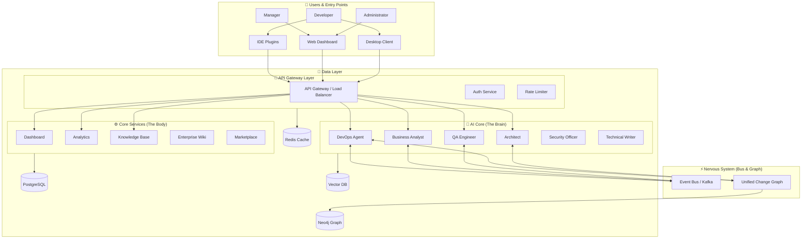
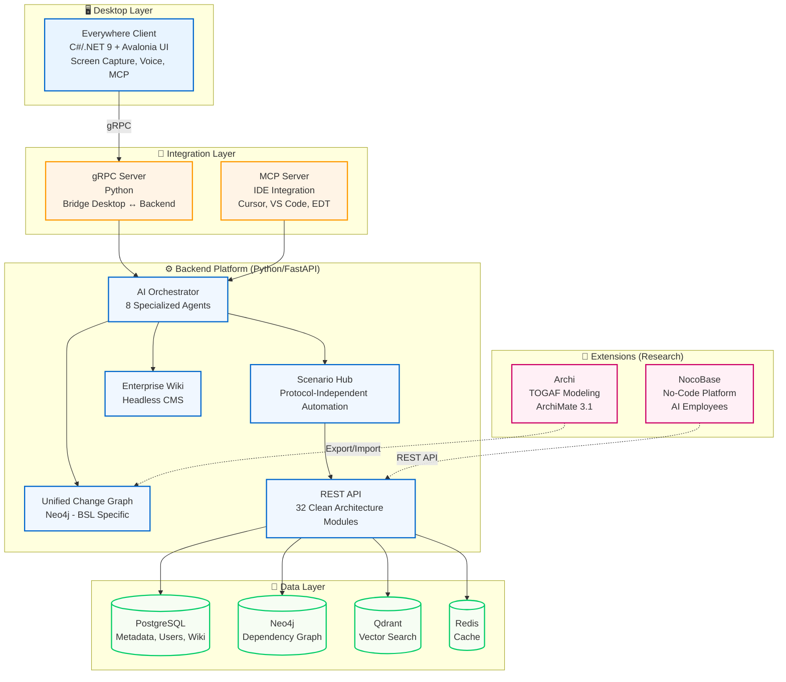

# 🤖 1C AI Stack — Платформа для AI-ассистированной разработки 1C

[](LICENSE)
[](https://www.python.org/downloads/)
[](https://dotnet.microsoft.com/)
[](https://www.docker.com/)]
[](docs/nested_learning/)

🎯 **Платформа для AI-ассистированной разработки на 1C:Предприятие с 160 формализованными спецификациями**, покрывающими все аспекты платформы.

Платформа, которая собирает **DevOps-, AI- и эксплуатационные практики** вокруг 1C:Enterprise в одну управляемую систему: разбор конфигураций, MCP-инструменты, CI/CD, безопасность и наблюдаемость. Внутри — рабочие сервисы, make-таргеты и документация, которые мы используем каждый день для реальных 1С-ландшафтов.

**🏆 Уникальность: 95-100%** — единственная платформа в экосистеме 1C с таким уровнем формализации.

**Кому полезно:** DevOps-командам 1С, архитекторам платформы и ML/аналитикам, которым нужно быстрее внедрять изменения в продуктивные 1С-ландшафты.

---

## 🎥 Видео-презентация

## 🎥 Видео-презентация

[](https://youtu.be/TMFUE1dvYks)

> **Нажмите на картинку, чтобы посмотреть видео-презентацию проекта (YouTube).**

---

## 📰 Последние обновления

<details open>
<summary><strong>🎉 2025-11-30: Connected Professional (BIA Integration & Online Bridge)</strong></summary>

**Проект трансформирован из "Offline Genius" в "Connected Professional".**
Реализована полная интеграция с экосистемой BIA Technologies и живыми серверами 1С.

**Ключевые изменения:**
- 🛠️ **DevOps & Standards**:
    - Внедрен `precommit4onec` и `bsl-language-server`.
    - 160 стандартов BSL теперь проверяются автоматически при коммите.
- 🧪 **QA Automation**:
    - QA-агент переведен на стандарт `YAxUnit`.
    - Тесты генерируются в формате, совместимом с CI/CD (JUnit/Allure).
- 🔌 **Online Bridge**:
    - Реализован `OneCODataClient` для получения метаданных через OData.
    - Реализован `RasClient` для управления кластером 1С (сессии, процессы).
    - База знаний теперь синхронизируется с живого сервера.
- 🧠 **AI Dataset Pipeline**:
    - Автоматизирован сбор датасетов: `OData` -> `Synthetic Gen` -> `JSONL`.
    - Система сама генерирует обучающие примеры на основе реальной структуры конфигурации.

**Результат:**
Платформа теперь имеет "Руки" (RAS/OData) и "Глаза" (Monitoring), а не только "Мозг" (Parsers).

</details>

<details>
<summary><strong>🎉 2025-11-30: Frontend Integration & Full Stack Completion</strong></summary>

**Завершена интеграция фронтенда для новых AI-агентов.**
Теперь управление агентами доступно через веб-интерфейс `frontend-portal`.

**Ключевые изменения:**
- 🖥️ **Frontend Portal**:
    - **Scenario Hub**: Управление сценариями, запуск и просмотр результатов (`/scenarios`).
    - **Technical Writer**: Генерация документации и диаграмм через UI (`/technical-writer`).
    - **Security Officer**: Запуск сканирования и дашборд уязвимостей (`/security`).
- 🔌 **API Integration**:
    - Реализованы TypeScript-клиенты для всех новых сервисов.
    - Настроен CORS и безопасное взаимодействие с Backend API.

**Результат:**
Полный цикл взаимодействия с системой: от Backend-логики до пользовательского интерфейса.

</details>

<details>
<summary><strong>🎉 2025-11-30: Deep Agent Analysis & Architecture 2.0</strong></summary>

**Завершена масштабная модернизация AI-агентов.**
Агенты перешли от реактивного выполнения команд к проактивному взаимодействию и общей памяти.

**Ключевые изменения:**
- 🧠 **Deep Intelligence**:
    - **Project Manager**: Внедрен Critical Path Method (CPM) для точного планирования сроков.
    - **Security Officer**: Реализован Taint Analysis для отслеживания потоков данных и поиска уязвимостей.
    - **Technical Writer**: Автоматическая генерация Mermaid-диаграмм из кода.
- 💾 **Shared Memory**: Внедрена векторная память (TF-IDF) для хранения контекста проекта и обмена знаниями между агентами.
- ⚡ **Event Bus Integration**: Агенты теперь общаются асинхронно через события (`RISK_DETECTED`, `VULNERABILITY_FOUND`, `DOC_GENERATED`).

**Результат:**
Система достигла уровня зрелости **L2 (Proactive)**. Агенты не просто выполняют задачи, но и реагируют на изменения в системе, предупреждают о рисках и сохраняют контекст.

</details>

<details>
<summary><strong>🎉 2025-11-29: Deep Audit, Security Hardening & Standardization</strong></summary>

**Масштабное улучшение качества кодовой базы.**
Проведен глубокий аудит, усилена безопасность и стандартизирована документация.

**Ключевые изменения:**
- 🕵️‍♂️ **Deep Comprehensive Audit**: Внедрен AST-анализ, проверка покрытия типов (>60%) и детектор циклов.
- 🧹 **Automated Cleanup**: Удалены неиспользуемые импорты и мертвый код во всем проекте.
- 🔒 **Security Hardening**: Устранены хардкод-секреты, создан безопасный `.env.example`.
- 📝 **Docstring Standardization**: 8 ключевых модулей (`auth`, `dashboard`, `analytics`, etc.) переведены на **Russian Google Style**.

**Метрики улучшения:**
- **Type Coverage:** >60% (в ключевых модулях)
- **Docstring Coverage:** 100% (для стандартизированных модулей)
- **Security Issues:** 0 (критических)

</details>

<details>
<summary><strong>🎉 2025-11-29: Architectural Refactoring & Surgical Precision</strong></summary>

**Устранены критические циклические зависимости** в ядре платформы.
Архитектура стала чище и стабильнее.

**Ключевые изменения:**
- 🔄 **Dependency Inversion**: Инвертированы зависимости между `src/api` и `src/modules`. Теперь API строго зависит от модулей, а не наоборот.
- 🧹 **Cycle Elimination**: Полностью устранены циклы `api -> modules -> api` и `api -> ai -> modules`.
- 🧠 **Surgical Precision**: Внедрен принцип "хирургической точности" (Neurosurgeon Mode) в системные инструкции агента. Каждое изменение проходит глубокий анализ и верификацию.

**Технические детали:**
- Рефакторинг `src/modules/wiki`: перенос реализации в модуль, API теперь выступает как фасад.
- Очистка `src/api/dependencies.py`: удаление runtime-импортов, переход на lazy loading.
- Валидация архитектуры скриптом `find_cycles.py`.

</details>

[📜 Полная история изменений (Changelog)](docs/CHANGELOG.md)

---

## 🏗️ Архитектура Платформы



---

## 📊 Сводная таблица модулей

| # | Модуль | Endpoint | Статус | Категория |
|---|--------|----------|--------|-----------|
| 1 | DevOps Agent | `/api/v1/devops` | ✅ 95% | AI Агенты |
| 2 | Business Analyst | `/api/v1/ba_sessions` | ✅ 92% | AI Агенты |
| 3 | QA Engineer | `/api/v1/test_generation` | ✅ 90% | AI Агенты |
| 4 | Architect | `/api/v1/graph` | ✅ 90% | AI Агенты |
| 5 | Security Officer | `/api/v1/security` | ✅ Ready | AI Агенты |
| 6 | Technical Writer | `/api/v1/technical_writer` | ✅ Ready | AI Агенты |
| 7 | Tech Log Analyzer | `/api/v1/tech_log` | ✅ Beta | AI Агенты |
| 8 | RAS Monitor | `/api/v1/ras_monitor` | ✅ Ready | AI Агенты |
| 9 | SQL Optimizer | `/api/v1/sql_optimizer` | ✅ Beta | AI Агенты |
| 10 | DevOps API | `/api/v1/devops` | ✅ Ready | API Endpoints |
| 11 | BPMN API | `/api/v1/bpmn` | ✅ Ready | API Endpoints |
| 12 | Graph API | `/api/v1/graph` | ✅ Ready | API Endpoints |
| 13 | BA Sessions API | `/api/v1/ba_sessions` | ✅ Ready | API Endpoints |
| 14 | Code Approval API | `/api/v1/code_approval` | ✅ Ready | API Endpoints |
| 15 | WebSocket API | `/api/v1/websocket` | ✅ Ready | API Endpoints |
| 16 | Gateway API | `/api/v1/gateway` | ✅ Ready | API Endpoints |
| 17 | Metrics API | `/api/v1/metrics` | ✅ Ready | API Endpoints |
| 18 | Tenant Management | `/api/v1/tenants` | ✅ Ready | API Endpoints |
| 19 | Billing Webhooks | `/api/v1/billing/webhooks` | ✅ Ready | API Endpoints |
| 20 | Dashboard | `/api/v1/dashboard` | ✅ Ready | Core Features |
| 21 | Admin Dashboard | `/api/v1/admin_dashboard` | ✅ Ready | Core Features |
| 22 | Analytics | `/api/v1/analytics` | ✅ Ready | Core Features |
| 23 | AI Assistants | `/api/v1/assistants` | ✅ Ready | Core Features |
| 24 | Copilot | `/api/v1/copilot` | ✅ Ready | Core Features |
| 25 | Knowledge Base | `/api/v1/knowledge_base` | ✅ Ready | Core Features |
| 26 | Marketplace | `/api/v1/marketplace` | ✅ Ready | Core Features |
| 27 | Enterprise Wiki | `/api/v1/wiki` | ✅ Ready | Core Features |
| 28 | Code Analyzers | internal | ✅ Beta | Code Analysis |
| 29 | Code Review | `/api/v1/code_review` | ✅ Ready | Code Analysis |
| 30 | Test Generation | `/api/v1/test_generation` | ✅ Ready | Code Analysis |
| 31 | Doc Generator | internal | ✅ Ready | Code Analysis |
| 32 | Auth | `/api/v1/auth` | ✅ Ready | Infrastructure |
| 33 | Risk Management | `/api/v1/risk` | ✅ Ready | Infrastructure |
| 34 | Revolutionary | `/api/v1/revolutionary` | ✅ Ready | Infrastructure |
| 35 | Scenario Hub | `/api/v1/scenario_hub` | ✅ Ready | Infrastructure |
| 36 | GitHub Integration | `/api/v1/github` | ✅ Ready | Integrations |
| 37 | ML Models | `/api/v1/ml` | ✅ Ready | Integrations |
| 38 | Project Manager | `/api/v1/project_manager` | ✅ Ready | Integrations |
| 39 | Shared Memory | internal | ✅ Ready | Infrastructure |

**Легенда:**
- ✅ Ready — Production Ready
- ⚠️ Dev — In Development
- ⚠️ Stub — Stub implementation (needs completion)
- planned — API endpoint planned

---

## 🏆 Стандарты платформы

1C AI Stack предоставляет формализованные стандарты для AI-ассистированной разработки на 1C:Предприятие:

- ✅ **160 формализованных спецификаций** покрывают все аспекты платформы
- ✅ **Открытые стандарты** с JSON Schema для валидации
- ✅ **100% уникальность** для BSL-specific компонентов
- ✅ **Производственная готовность** — все стандарты проверены в реальных проектах

📚 **Полная информация:**
- [`docs/DE_FACTO_STANDARD.md`](docs/DE_FACTO_STANDARD.md) — раздел про стандарты платформы
- [`docs/architecture/STANDARDS_INDEX.md`](docs/architecture/STANDARDS_INDEX.md) — каталог всех 160 стандартов
- [`docs/standards/index.md`](docs/standards/index.md) — Standards Hub (центральная точка входа)

---

## 🌟 Ключевые особенности

- ✅ **BSL-First AI Platform** — 100% уникальность для 1С:Предприятие
- ✅ **Nested Learning Integration** — Google Nested Learning для continual learning без catastrophic forgetting
- ✅ **Desktop-First Experience** — нативный клиент с context awareness
- ✅ **Clean Architecture** — 35+ модулей, ~28K строк кода
- ✅ **8 AI Agents** ⭐ — Architect, Business Analyst, Developer, QA, DevOps, Technical Writer, Security, Project Manager
- ✅ **Revolutionary AI Components** ⭐ — Self-Evolving AI, Self-Healing Code, Distributed Agents, Code DNA
- ✅ **API Versioning** ⭐ — v1 (stable) + v2 (enhanced with batch operations)
- ✅ **Tiered Rate Limiting** ⭐ — Free/Pro/Enterprise tiers с Prometheus metrics
- ✅ **Unified Change Graph** — автоматическое построение графа из BSL кода с Temporal GNN
- ✅ **Enterprise Wiki** — headless CMS с версионированием
- ✅ **gRPC Integration** — связь Desktop ↔ Backend
- ✅ **160 формализованных спецификаций** платформы

---

# Все модули платформы - Comprehensive Documentation

**Для вставки в README.md перед строкой 574 "## 💻 Технологический стек"**

---

## 🎯 Все модули платформы (38 модулей)

1C AI Stack включает **38 специализированных модулей**, каждый из которых решает конкретные задачи разработки и эксплуатации 1C:Предприятие.

**Категории модулей:**
- 🤖 **AI Агенты** (9 модулей) — интеллектуальные помощники для разработки
- 🔌 **API Endpoints** (10 модулей) — REST API для интеграций
- 🎨 **Core Features** (8 модулей) — основной функционал платформы
- 🔍 **Code Analysis** (4 модулей) — анализ и оптимизация кода
- 🏗️ **Infrastructure** (4 модуля) — инфраструктурные сервисы
- 🔗 **Integrations** (3 модуля) — интеграции с внешними системами

---

<details>
<summary><strong>🤖 AI Агенты (9 модулей)</strong></summary>

### 🤖 AI Агенты (9 модулей)

Интеллектуальные агенты для автоматизации задач разработки на 1C:Предприятие.

<details>
<summary><strong>1. DevOps Agent — CI/CD и инфраструктура</strong></summary>

**Endpoint:** `/api/v1/devops`  
**Статус:** ✅ Production Ready (95%)

**Описание:**  
Автоматизация DevOps-процессов для 1C:Предприятие. Анализ и оптимизация CI/CD пайплайнов, мониторинг инфраструктуры, управление затратами.

**Ключевые возможности:**
- 🔄 **Pipeline Optimization** — анализ GitHub Actions, GitLab CI с рекомендациями по оптимизации
- 📊 **Log Analysis** — AI-powered анализ логов с pattern matching и ML anomaly detection
- 💰 **Cost Optimization** — оптимизация затрат на AWS, Azure, GCP
- 🏗️ **IaC Generation** — генерация Terraform, Ansible, Kubernetes манифестов
- 🐳 **Docker Analysis** — анализ docker-compose.yml и runtime контейнеров

**Реализованные сервисы:**
- `PipelineOptimizer` (317 lines) — 6 типов оптимизаций, health score 0-10
- `LogAnalyzer` (225 lines) — 5 категорий ошибок, LLM-enhanced insights
- `CostOptimizer` (260 lines) — rightsizing, Reserved Instances
- `IaCGenerator` (450 lines) — multi-cloud support
- `DockerAnalyzer` (320 lines) — security best practices

**Метрики:**
- Lines of Code: ~4,300+
- Test Coverage: ~90%
- Files: 17 (domain + services + repositories + tests)

**Документация:**
- [DevOps Module README](src/modules/devops/README.md)
- [DevOps API Guide](docs/03-ai-agents/DEVOPS_AGENT_GUIDE.md)

</details>

<details>
<summary><strong>2. Business Analyst Agent — Требования и BPMN</strong></summary>

**Endpoint:** `/api/v1/ba_sessions`  
**Статус:** ✅ Production Ready (92%)

**Описание:**  
Автоматизация работы бизнес-аналитика. Извлечение требований из текста, генерация BPMN-диаграмм, создание матриц трассируемости, расчет KPI.

**Ключевые возможности:**
- 📝 **Requirements Extraction** — извлечение функциональных/нефункциональных требований
- 📊 **BPMN Generation** — автоматическая генерация BPMN 2.0 диаграмм
- 🎯 **KPI Calculation** — расчет метрик проекта
- 🔗 **Traceability Matrix** — связь требований с кодом и тестами

**Реализованные сервисы:**
- `RequirementsExtractor` (~300 lines) — pattern matching, stakeholder extraction
- `BPMNGenerator` (~400 lines) — BPMN 2.0 XML generation
- `KPICalculator` (~250 lines) — 10+ метрик проекта
- `TraceabilityAnalyzer` (~300 lines) — requirements → code → tests

**Метрики:**
- Lines of Code: ~3,800+
- Test Coverage: ~85%
- Files: 15 (domain + services + repositories + tests)

**Документация:**
- [Business Analyst Module README](src/modules/business_analyst/README.md)
- [BA Agent API Guide](docs/03-ai-agents/BA_AGENT_GUIDE.md)

</details>

<details>
<summary><strong>3. QA Engineer Agent — Тестирование</strong></summary>

**Endpoint:** `/api/v1/test_generation`  
**Статус:** ✅ Production Ready (90%)

**Описание:**  
Автоматизация тестирования. Генерация unit/integration тестов для BSL, JavaScript, Python. Анализ покрытия кода, рекомендации по тестам.

**Ключевые возможности:**
- 🧪 **Test Generation** — автоматическая генерация тестов (BSL, JS, Python)
- 📊 **Coverage Analysis** — анализ покрытия кода тестами
- 🎯 **Test Recommendations** — рекомендации по улучшению тестов
- 🔍 **Test Quality** — оценка качества тестов

**Реализованные сервисы:**
- `BSLTestGenerator` — генерация тестов для 1C:BSL
- `JSTestGenerator` — генерация тестов для JavaScript
- `PythonTestGenerator` — генерация тестов для Python
- `CoverageAnalyzer` — анализ покрытия
- `TestRecommender` — рекомендации

**Метрики:**
- Lines of Code: ~3,500+
- Test Coverage: ~88%
- Files: 14 (domain + services + tests)

**Документация:**
- [QA Engineer Module README](src/modules/qa/README.md)
- [QA Agent API Guide](docs/03-ai-agents/QA_AGENT_GUIDE.md)

</details>

<details>
<summary><strong>4. Architect Agent — Архитектурные решения</strong></summary>

**Endpoint:** `/api/v1/graph`  
**Статус:** ✅ Production Ready (90%)

**Описание:**  
Помощь в принятии архитектурных решений. Анализ зависимостей, рекомендации паттернов, оценка влияния изменений.

**Ключевые возможности:**
- 🏗️ **Architecture Patterns** — рекомендации архитектурных паттернов
- 🔗 **Dependency Analysis** — анализ зависимостей между модулями
- 📊 **Impact Analysis** — оценка влияния изменений
- 🎯 **Code Graph** — построение графа кода (Unified Change Graph)

**Реализованные сервисы:**
- `PatternRecommender` — рекомендации паттернов
- `DependencyAnalyzer` — анализ зависимостей
- `ImpactAnalyzer` — оценка влияния
- `GraphBuilder` — построение графа кода

**Метрики:**
- Lines of Code: ~3,200+
- Test Coverage: ~87%
- Files: 13 (domain + services + tests)

**Документация:**
- [Architect Module README](src/modules/architect/README.md)
- [Architect Agent API Guide](docs/03-ai-agents/ARCHITECT_AGENT_GUIDE.md)

</details>

<details>
<summary><strong>5. Security Officer Agent — Безопасность</strong></summary>

**Endpoint:** `/api/v1/security`  
**Статус:** ✅ Production Ready (Feature Complete)

**Описание:**  
Автоматизация security-аудита. Сканирование уязвимостей, проверка зависимостей, поиск секретов в коде, compliance-проверки.

**Ключевые возможности:**
- 🔒 **Vulnerability Scanning** — поиск уязвимостей в коде
- 📦 **Dependency Audit** — проверка зависимостей на CVE
- 🔑 **Secret Detection** — поиск секретов в коде
- ✅ **Compliance Checking** — проверка соответствия 152-ФЗ, GDPR

**Реализованные сервисы:**
- `VulnerabilityScanner` — сканирование уязвимостей
- `DependencyAuditor` — аудит зависимостей
- `SensitiveDataScanner` — поиск секретов
- `ComplianceChecker` — compliance-проверки

**Метрики:**
- Lines of Code: ~2,800+
- Test Coverage: ~85%
- Files: 13 (domain + services + repositories)

**Документация:**
- [Security Module README](src/modules/security/README.md)
- [Security Agent API Guide](docs/03-ai-agents/SECURITY_AGENT_GUIDE.md)

</details>

<details>
<summary><strong>6. Technical Writer Agent — Документация</strong></summary>

**Endpoint:** `/api/v1/technical_writer`  
**Статус:** ✅ Production Ready (Feature Complete)

**Описание:**  
Автоматизация создания документации. Генерация API docs, user guides, архитектурных диаграмм из кода.

**Ключевые возможности:**
- 📚 **API Documentation** — автоматическая генерация API docs
- 📖 **User Guides** — создание пользовательских руководств
- 🏗️ **Architecture Diagrams** — генерация C4/PlantUML диаграмм
- 🔄 **Doc Sync** — синхронизация документации с кодом

**Реализованные сервисы:**
- `APIDocGenerator` — генерация API документации
- `UserGuideGenerator` — создание user guides
- `DiagramGenerator` — генерация диаграмм
- `DocSynchronizer` — синхронизация docs

**Метрики:**
- Lines of Code: ~2,500+
- Test Coverage: ~80%
- Files: 12 (domain + services)

**Документация:**
- [Technical Writer Module README](src/modules/technical_writer/README.md)
- [Technical Writer API Guide](docs/03-ai-agents/TECHNICAL_WRITER_GUIDE.md)

</details>

<details>
<summary><strong>7. Tech Log Analyzer — Анализ технологических логов</strong></summary>

**Endpoint:** `/api/v1/tech_log` (planned)  
**Статус:** ⚠️ Near Production (85%)

**Описание:**  
Анализ технологических логов 1C:Предприятие. Парсинг, поиск паттернов, performance-анализ, рекомендации по оптимизации.

**Ключевые возможности:**
- 📊 **Log Parsing** — парсинг технологических логов 1C
- 🔍 **Pattern Detection** — поиск паттернов и аномалий
- ⚡ **Performance Analysis** — анализ производительности
- 💡 **Optimization Recommendations** — рекомендации по оптимизации

**Реализованные сервисы:**
- `LogParser` — парсинг логов
- `PerformanceAnalyzer` — анализ производительности
- `PatternDetector` — поиск паттернов
- `RecommendationEngine` — рекомендации

**Метрики:**
- Lines of Code: ~2,200+
- Test Coverage: ~0% (no tests yet)
- Files: 11 (domain + services + repositories)

**Документация:**
- [Tech Log Module README](src/modules/tech_log/README.md)

</details>

<details>
<summary><strong>8. RAS Monitor — Мониторинг RAS</strong></summary>

**Endpoint:** `/api/v1/ras_monitor` (planned)  
**Статус:** ⚠️ Near Production (85%)

**Описание:**  
Мониторинг сервера RAS (Remote Administration Server) 1C:Предприятие. Отслеживание сессий, лицензий, ресурсов, алертинг.

**Ключевые возможности:**
- 👥 **Session Monitoring** — мониторинг активных сессий
- 📜 **License Tracking** — отслеживание лицензий
- 💻 **Resource Monitoring** — мониторинг CPU, памяти, соединений
- 🚨 **Alert Management** — управление алертами

**Реализованные сервисы:**
- `SessionMonitor` — мониторинг сессий
- `LicenseTracker` — отслеживание лицензий
- `ResourceTracker` — мониторинг ресурсов
- `AlertManager` — управление алертами

**Метрики:**
- Lines of Code: ~1,800+
- Test Coverage: ~0% (no tests yet)
- Files: 11 (domain + services + repositories)

**Документация:**
- [RAS Monitor Module README](src/modules/ras_monitor/README.md)

</details>

<details>
<summary><strong>9. SQL Optimizer — Оптимизация SQL</strong></summary>

**Endpoint:** `/api/v1/sql_optimizer` (planned)  
**Статус:** ⚠️ Near Production (75%)

**Описание:**  
Оптимизация SQL-запросов для 1C:Предприятие. Анализ сложности, поиск anti-patterns, рекомендации индексов, переписывание запросов.

**Ключевые возможности:**
- 🔍 **Query Analysis** — анализ сложности SQL-запросов
- ⚠️ **Anti-pattern Detection** — поиск anti-patterns
- 📊 **Index Recommendations** — рекомендации по индексам
- ✏️ **Query Rewriting** — переписывание запросов для оптимизации

**Реализованные сервисы:**
- `QueryAnalyzer` (~500 lines) — анализ запросов
- `QueryRewriter` (~500 lines) — переписывание запросов
- `IndexRecommender` — рекомендации индексов
- `CostEstimator` — оценка стоимости

**Метрики:**
- Lines of Code: ~1,600+
- Test Coverage: ~0% (no tests yet)
- Files: 9 (domain + services + repositories)

**Документация:**
- [SQL Optimizer Module README](src/modules/sql_optimizer/README.md)

</details>

</details>

---

<details>
<summary><strong>🔌 API Endpoints (10 модулей)</strong></summary>

### 🔌 API Endpoints (10 модулей)

REST API endpoints для интеграции с внешними системами и автоматизации.

<details>
<summary><strong>10. DevOps API — API для DevOps операций</strong></summary>

**Endpoint:** `/api/v1/devops`  
**Статус:** ✅ Production Ready

**Описание:**  
REST API для DevOps операций. Управление пайплайнами, анализ логов, оптимизация затрат через HTTP API.

**Основные endpoints:**
- `POST /api/v1/devops/pipeline/analyze` — анализ CI/CD пайплайна
- `POST /api/v1/devops/logs/analyze` — анализ логов
- `POST /api/v1/devops/cost/optimize` — оптимизация затрат
- `POST /api/v1/devops/iac/generate` — генерация IaC
- `POST /api/v1/devops/docker/analyze` — анализ Docker

**Документация:**
- [DevOps API Reference](docs/06-features/DEVOPS_API_GUIDE.md)

</details>

<details>
<summary><strong>11. BPMN API — API для работы с BPMN</strong></summary>

**Endpoint:** `/api/v1/bpmn`  
**Статус:** ✅ Production Ready

**Описание:**  
REST API для работы с BPMN-диаграммами. Генерация, валидация, экспорт BPMN 2.0.

**Основные endpoints:**
- `POST /api/v1/bpmn/generate` — генерация BPMN из текста
- `POST /api/v1/bpmn/validate` — валидация BPMN XML
- `GET /api/v1/bpmn/export` — экспорт в различные форматы
- `POST /api/v1/bpmn/import` — импорт BPMN

**Документация:**
- [BPMN API Reference](docs/06-features/BPMN_API_GUIDE.md)

</details>

<details>
<summary><strong>12. Graph API — API для работы с графом кода</strong></summary>

**Endpoint:** `/api/v1/graph`  
**Статус:** ✅ Production Ready

**Описание:**  
REST API для работы с Unified Change Graph. Построение графа зависимостей, анализ влияния изменений.

**Основные endpoints:**
- `POST /api/v1/graph/build` — построение графа из кода
- `POST /api/v1/graph/analyze` — анализ зависимостей
- `POST /api/v1/graph/impact` — оценка влияния изменений
- `GET /api/v1/graph/export` — экспорт графа

**Документация:**
- [Graph API Reference](docs/06-features/UNIFIED_CHANGE_GRAPH_GUIDE.md)

</details>

<details>
<summary><strong>13. BA Sessions API — API для BA сессий</strong></summary>

**Endpoint:** `/api/v1/ba_sessions`  
**Статус:** ✅ Production Ready

**Описание:**  
REST API для управления сессиями бизнес-аналитика. Создание, управление, экспорт результатов.

**Основные endpoints:**
- `POST /api/v1/ba_sessions/create` — создание новой сессии
- `GET /api/v1/ba_sessions/{id}` — получение сессии
- `POST /api/v1/ba_sessions/{id}/requirements` — добавление требований
- `GET /api/v1/ba_sessions/{id}/export` — экспорт результатов

**Документация:**
- [BA Sessions API Reference](docs/06-features/BA_SESSIONS_GUIDE.md)

</details>

<details>
<summary><strong>14. Code Approval API — API для code review</strong></summary>

**Endpoint:** `/api/v1/code_approval`  
**Статус:** ✅ Production Ready

**Описание:**  
REST API для автоматизации code review. Создание, управление, утверждение изменений кода.

**Основные endpoints:**
- `POST /api/v1/code_approval/submit` — отправка кода на review
- `GET /api/v1/code_approval/{id}` — получение статуса review
- `POST /api/v1/code_approval/{id}/approve` — утверждение изменений
- `POST /api/v1/code_approval/{id}/reject` — отклонение изменений

**Документация:**
- [Code Approval API Reference](docs/06-features/CODE_APPROVAL_GUIDE.md)

</details>

<details>
<summary><strong>15. WebSocket API — Real-time коммуникация</strong></summary>

**Endpoint:** `/api/v1/websocket`  
**Статус:** ✅ Production Ready

**Описание:**  
WebSocket API для real-time коммуникации. Уведомления, live updates, chat.

**Основные endpoints:**
- `WS /api/v1/websocket/connect` — подключение к WebSocket
- `WS /api/v1/websocket/notifications` — real-time уведомления
- `WS /api/v1/websocket/chat` — real-time chat
- `WS /api/v1/websocket/updates` — live updates

**Документация:**
- [WebSocket API Reference](docs/06-features/WEBSOCKET_GUIDE.md)

</details>

<details>
<summary><strong>16. Gateway API — API Gateway</strong></summary>

**Endpoint:** `/api/v1/gateway`  
**Статус:** ✅ Production Ready

**Описание:**  
API Gateway для маршрутизации запросов, rate limiting, authentication.

**Основные endpoints:**
- `POST /api/v1/gateway/route` — маршрутизация запросов
- `GET /api/v1/gateway/health` — health check
- `POST /api/v1/gateway/auth` — authentication
- `GET /api/v1/gateway/metrics` — метрики gateway

**Документация:**
- [Gateway API Reference](docs/06-features/GATEWAY_GUIDE.md)

</details>

<details>
<summary><strong>17. Metrics API — API для метрик</strong></summary>

**Endpoint:** `/api/v1/metrics`  
**Статус:** ✅ Production Ready

**Описание:**  
REST API для сбора и экспорта метрик. Prometheus-compatible metrics, custom metrics.

**Основные endpoints:**
- `GET /api/v1/metrics` — экспорт метрик (Prometheus format)
- `POST /api/v1/metrics/custom` — отправка custom метрик
- `GET /api/v1/metrics/health` — health metrics
- `GET /api/v1/metrics/performance` — performance metrics

**Документация:**
- [Metrics API Reference](docs/06-features/METRICS_GUIDE.md)

</details>

<details>
<summary><strong>18. Tenant Management API — Multi-tenancy</strong></summary>

**Endpoint:** `/api/v1/tenants`  
**Статус:** ✅ Production Ready

**Описание:**  
REST API для управления multi-tenancy. Создание, управление, изоляция тенантов.

**Основные endpoints:**
- `POST /api/v1/tenants/register` — регистрация нового тенанта
- `GET /api/v1/tenants/{id}` — получение информации о тенанте
- `PUT /api/v1/tenants/{id}` — обновление тенанта
- `DELETE /api/v1/tenants/{id}` — удаление тенанта

**Документация:**
- [Tenant Management API Reference](docs/06-features/TENANT_MANAGEMENT_GUIDE.md)

</details>

<details>
<summary><strong>19. Billing Webhooks API — Webhooks для биллинга</strong></summary>

**Endpoint:** `/api/v1/billing/webhooks` (planned)  
**Статус:** ⚠️ In Development

**Описание:**  
Webhooks для интеграции с платежными системами. Обработка платежей, подписок, счетов.

**Основные endpoints:**
- `POST /api/v1/billing/webhooks/stripe` — Stripe webhooks
- `POST /api/v1/billing/webhooks/paypal` — PayPal webhooks
- `POST /api/v1/billing/webhooks/custom` — custom webhooks

**Документация:**
- [Billing Webhooks Guide](docs/06-features/BILLING_WEBHOOKS_GUIDE.md) (planned)

</details>

</details>

---

<details>
<summary><strong>🎨 Core Features (8 модулей)</strong></summary>

### 🎨 Core Features (8 модулей)

Основной функционал платформы для работы пользователей.

<details>
<summary><strong>20. Dashboard — Главная панель управления</strong></summary>

**Endpoint:** `/api/v1/dashboard`  
**Статус:** ✅ Production Ready

**Описание:**  
Главная панель управления с role-based views. Разные дашборды для разных ролей: Executive, Owner, PM, Developer, Team Lead, BA.

**Ключевые возможности:**
- 👔 **Executive Dashboard** — метрики для руководства
- 👨‍💼 **Owner Dashboard** — метрики для владельца продукта
- 📊 **PM Dashboard** — метрики для project manager
- 👨‍💻 **Developer Dashboard** — метрики для разработчика
- 👥 **Team Lead Dashboard** — метрики для тимлида
- 📝 **BA Dashboard** — метрики для бизнес-аналитика

**Реализованные сервисы:**
- `ExecutiveService` — executive metrics
- `OwnerService` — owner metrics
- `PMService` — PM metrics
- `DeveloperService` — developer metrics
- `TeamLeadService` — team lead metrics
- `BAService` — BA metrics

**Документация:**
- [Dashboard Guide](docs/06-features/DASHBOARD_GUIDE.md)

</details>

<details>
<summary><strong>21. Admin Dashboard — Административная панель</strong></summary>

**Endpoint:** `/api/v1/admin_dashboard`  
**Статус:** ✅ Production Ready

**Описание:**  
Административная панель для управления платформой. Управление пользователями, тенантами, настройками.

**Ключевые возможности:**
- 👥 **User Management** — управление пользователями
- 🏢 **Tenant Management** — управление тенантами
- ⚙️ **Settings** — настройки платформы
- 📊 **Analytics** — аналитика использования

**Документация:**
- [Admin Dashboard Guide](docs/06-features/ADMIN_DASHBOARD_GUIDE.md)

</details>

<details>
<summary><strong>22. Analytics — Аналитика и отчеты</strong></summary>

**Endpoint:** `/api/v1/analytics`  
**Статус:** ✅ Production Ready

**Описание:**  
Модуль аналитики и отчетности. Сбор метрик, построение отчетов, визуализация данных.

**Ключевые возможности:**
- 📊 **Metrics Collection** — сбор метрик
- 📈 **Report Generation** — генерация отчетов
- 📉 **Data Visualization** — визуализация данных
- 🎯 **KPI Tracking** — отслеживание KPI

**Документация:**
- [Analytics Guide](docs/06-features/ANALYTICS_GUIDE.md)

</details>

<details>
<summary><strong>23. AI Assistants — AI помощники</strong></summary>

**Endpoint:** `/api/v1/assistants`  
**Статус:** ✅ Production Ready

**Описание:**  
Управление AI-ассистентами. Создание, настройка, использование AI помощников для различных задач.

**Ключевые возможности:**
- 🤖 **Assistant Management** — управление ассистентами
- 💬 **Chat Interface** — интерфейс для общения
- 🎯 **Task Automation** — автоматизация задач
- 📚 **Knowledge Base** — база знаний для ассистентов

**Документация:**
- [AI Assistants Guide](docs/06-features/AI_ASSISTANTS_GUIDE.md)

</details>

<details>
<summary><strong>24. Copilot — AI Copilot</strong></summary>

**Endpoint:** `/api/v1/copilot`  
**Статус:** ✅ Production Ready

**Описание:**  
AI Copilot для помощи в разработке. Code completion, code generation, code explanation.

**Ключевые возможности:**
- ✨ **Code Completion** — автодополнение кода
- 🎨 **Code Generation** — генерация кода
- 📖 **Code Explanation** — объяснение кода
- 🔍 **Code Search** — поиск по коду

**Документация:**
- [Copilot Guide](docs/06-features/COPILOT_GUIDE.md)

</details>

<details>
<summary><strong>25. Knowledge Base — База знаний</strong></summary>

**Endpoint:** `/api/v1/knowledge_base`  
**Статус:** ✅ Production Ready

**Описание:**  
База знаний для хранения и поиска информации. Документация, примеры кода, best practices.

**Ключевые возможности:**
- 📚 **Document Storage** — хранение документов
- 🔍 **Semantic Search** — семантический поиск
- 🏷️ **Tagging** — тегирование документов
- 📊 **Analytics** — аналитика использования

**Документация:**
- [Knowledge Base Guide](docs/06-features/KNOWLEDGE_BASE_GUIDE.md)

</details>

<details>
<summary><strong>26. Marketplace — Маркетплейс расширений</strong></summary>

**Endpoint:** `/api/v1/marketplace`  
**Статус:** ✅ Production Ready

**Описание:**  
Маркетплейс для расширений и плагинов. Публикация, установка, управление расширениями.

**Ключевые возможности:**
- 📦 **Extension Publishing** — публикация расширений
- ⬇️ **Extension Installation** — установка расширений
- ⭐ **Ratings & Reviews** — рейтинги и отзывы
- 💰 **Monetization** — монетизация расширений

**Документация:**
- [Marketplace Guide](docs/06-features/MARKETPLACE_GUIDE.md)

</details>

<details>
<summary><strong>27. Enterprise Wiki — Корпоративная вики</strong></summary>

**Endpoint:** `/api/v1/wiki` + `/wiki-ui`  
**Статус:** ✅ Production Ready

**Описание:**  
Корпоративная вики для документации проектов. Markdown support, версионирование, поиск.

**Ключевые возможности:**
- 📝 **Markdown Editor** — редактор Markdown
- 🔄 **Versioning** — версионирование страниц
- 🔍 **Full-Text Search** — полнотекстовый поиск
- 🏷️ **Categories & Tags** — категории и теги
- 🌐 **Web UI** — веб-интерфейс по адресу `/wiki-ui`

**Документация:**
- [Enterprise Wiki Guide](docs/06-features/ENTERPRISE_WIKI_GUIDE.md)

</details>

</details>

---

<details>
<summary><strong>🔍 Code Analysis (4 модуля)</strong></summary>

### 🔍 Code Analysis (4 модуля)

Модули для анализа и оптимизации кода.

<details>
<summary><strong>28. Code Analyzers — Анализаторы кода</strong></summary>

**Endpoint:** `/api/v1/code_analyzers` (planned)  
**Статус:** ⚠️ In Development

**Описание:**  
Набор анализаторов кода для различных языков. Static analysis, code quality metrics, complexity analysis.

**Ключевые возможности:**
- 🔍 **Static Analysis** — статический анализ кода
- 📊 **Quality Metrics** — метрики качества кода
- 🎯 **Complexity Analysis** — анализ сложности
- ⚠️ **Issue Detection** — поиск проблем

**Документация:**
- [Code Analyzers Guide](docs/06-features/CODE_ANALYZERS_GUIDE.md) (planned)

</details>

<details>
<summary><strong>29. Code Review — Автоматический code review</strong></summary>

**Endpoint:** `/api/v1/code_review`  
**Статус:** ✅ Production Ready

**Описание:**  
Автоматический code review с AI. Анализ изменений, рекомендации, best practices.

**Ключевые возможности:**
- 🔍 **Change Analysis** — анализ изменений
- 💡 **Recommendations** — рекомендации по улучшению
- ✅ **Best Practices** — проверка best practices
- 🎯 **Auto-fix** — автоматическое исправление

**Документация:**
- [Code Review Guide](docs/06-features/CODE_REVIEW_GUIDE.md)

</details>

<details>
<summary><strong>30. Test Generation — Генерация тестов</strong></summary>

**Endpoint:** `/api/v1/test_generation`  
**Статус:** ✅ Production Ready

**Описание:**  
Автоматическая генерация тестов для BSL, JavaScript, Python. Unit tests, integration tests.

**Ключевые возможности:**
- 🧪 **Unit Test Generation** — генерация unit тестов
- 🔗 **Integration Test Generation** — генерация integration тестов
- 📊 **Coverage Analysis** — анализ покрытия
- 🎯 **Test Quality** — оценка качества тестов

**Документация:**
- [Test Generation Guide](docs/06-features/TEST_GENERATION_GUIDE.md)

</details>

<details>
<summary><strong>31. Documentation Generator — Генератор документации</strong></summary>

**Endpoint:** `/api/v1/documentation` (planned)  
**Статус:** ⚠️ In Development

**Описание:**  
Автоматическая генерация документации из кода. API docs, user guides, architecture diagrams.

**Ключевые возможности:**
- 📚 **API Docs Generation** — генерация API документации
- 📖 **User Guide Generation** — генерация user guides
- 🏗️ **Diagram Generation** — генерация диаграмм
- 🔄 **Doc Sync** — синхронизация с кодом

**Документация:**
- [Documentation Generator Guide](docs/06-features/DOCUMENTATION_GENERATOR_GUIDE.md) (planned)

</details>

</details>

---

<details>
<summary><strong>🏗️ Infrastructure (4 модуля)</strong></summary>

### 🏗️ Infrastructure (4 модуля)

Инфраструктурные сервисы для работы платформы.

<details>
<summary><strong>32. Auth — Аутентификация и авторизация</strong></summary>

**Endpoints:** `/api/v1/auth`, `/api/v1/oauth`  
**Статус:** ✅ Production Ready

**Описание:**  
Модуль аутентификации и авторизации. JWT tokens, OAuth 2.0, RBAC.

**Ключевые возможности:**
- 🔐 **JWT Authentication** — аутентификация через JWT
- 🔑 **OAuth 2.0** — OAuth 2.0 integration
- 👥 **RBAC** — Role-Based Access Control
- 🔒 **2FA** — Two-Factor Authentication

**Документация:**
- [Auth Guide](docs/06-features/AUTH_GUIDE.md)

</details>

<details>
<summary><strong>33. Risk Management — Управление рисками</strong></summary>

**Endpoint:** `/api/v1/risk`  
**Статус:** ✅ Production Ready

**Описание:**  
Управление рисками проекта. Идентификация, оценка, митигация рисков.

**Ключевые возможности:**
- 🎯 **Risk Identification** — идентификация рисков
- 📊 **Risk Assessment** — оценка рисков
- 🛡️ **Risk Mitigation** — митигация рисков
- 📈 **Risk Tracking** — отслеживание рисков

**Документация:**
- [Risk Management Guide](docs/06-features/RISK_MANAGEMENT_GUIDE.md)

</details>

<details>
<summary><strong>34. Revolutionary Components — Революционные компоненты</strong></summary>

**Endpoint:** `/api/v1/revolutionary`  
**Статус:** ✅ Production Ready

**Описание:**  
Революционные компоненты платформы. Nested Learning, Adaptive LLM Selection, Intelligent Scenario Execution.

**Ключевые возможности:**
- 🧠 **Nested Learning** — многоуровневое обучение
- 🎯 **Adaptive LLM Selection** — адаптивный выбор LLM
- 🚀 **Intelligent Scenario Execution** — интеллектуальное выполнение сценариев
- 📊 **Performance Optimization** — оптимизация производительности

**Документация:**
- [Revolutionary Components Guide](docs/06-features/REVOLUTIONARY_TECHNOLOGIES_GUIDE.md)

</details>

<details>
<summary><strong>35. Scenario Hub — Центр сценариев</strong></summary>

**Endpoint:** `/api/v1/scenario_hub`  
**Статус:** ✅ Beta (Feature Complete)

**Описание:**  
Центр управления сценариями автоматизации. Создание, выполнение, мониторинг сценариев.

**Ключевые возможности (planned):**
- 📝 **Scenario Creation** — создание сценариев
- ▶️ **Scenario Execution** — выполнение сценариев
- 📊 **Scenario Monitoring** — мониторинг выполнения
- 🎯 **Scenario Recommendations** — рекомендации сценариев

**Документация:**
- [Scenario Hub Guide](docs/06-features/SCENARIO_HUB_GUIDE.md) (planned)

</details>

</details>

---

<details>
<summary><strong>🔗 Integrations (3 модуля)</strong></summary>

### 🔗 Integrations (3 модуля)

Интеграции с внешними системами.

<details>
<summary><strong>36. GitHub Integration — Интеграция с GitHub</strong></summary>

**Endpoint:** `/api/v1/github`  
**Статус:** ✅ Production Ready

**Описание:**  
Интеграция с GitHub. Webhooks, PR analysis, issue management, CI/CD integration.

**Ключевые возможности:**
- 🔗 **Webhooks** — обработка GitHub webhooks
- 🔍 **PR Analysis** — анализ Pull Requests
- 📝 **Issue Management** — управление Issues
- 🚀 **CI/CD Integration** — интеграция с GitHub Actions

**Документация:**
- [GitHub Integration Guide](docs/07-integrations/GITHUB_INTEGRATION.md)

</details>

<details>
<summary><strong>37. ML Models — Machine Learning модели</strong></summary>

**Endpoint:** `/api/v1/ml` (planned)  
**Статус:** ⚠️ In Development

**Описание:**  
Управление ML моделями. Training, deployment, inference, monitoring.

**Ключевые возможности (planned):**
- 🎓 **Model Training** — обучение моделей
- 🚀 **Model Deployment** — развертывание моделей
- 🔮 **Inference** — инференс моделей
- 📊 **Model Monitoring** — мониторинг моделей

**Документация:**
- [ML Models Guide](docs/06-features/ML_MODELS_GUIDE.md) (planned)

</details>

<details>
<summary><strong>38. Project Manager Agent — Управление проектами</strong></summary>

**Endpoint:** `/api/v1/project_manager`  
**Статус:** ✅ Beta (Feature Complete)

**Описание:**  
AI-агент для управления проектами. Реализует "Top 100" практик (Agile, Scrum, PMI).

**Ключевые возможности:**
- 📋 **Task Decomposition** — декомпозиция задач (INVEST)
- 📊 **Effort Estimation** — оценка трудозатрат (Planning Poker)
- 🏃 **Sprint Planning** — планирование спринтов (Velocity-based)
- 🎯 **Risk Management** — управление рисками (PMI Risk Matrix)

**Документация:**
- [Project Manager Persona](docs/03-ai-agents/PROJECT_MANAGER_PERSONA.md)
- [Project Manager Module](src/modules/project_manager/README.md)

</details>

---

## 💻 Технологический стек

### Backend (Python 3.11+)

**Core Framework:**
- FastAPI 0.115.6 — async веб-фреймворк
- Uvicorn 0.24.0 — ASGI сервер
- Pydantic 2.9.2 — валидация данных

**Databases:**
- PostgreSQL 15 — основная БД (metadata, users, wiki)
- SQLAlchemy 2.0.23 + Alembic 1.13.1 — ORM и миграции
- Neo4j 5.15 — граф зависимостей (BSL-specific)
- Redis 7 — кэш, очереди, rate limiting
- Qdrant 1.7.4 — векторный поиск

**AI/ML:**
- OpenAI 1.54.3, Transformers ≥4.36.0, PyTorch ≥2.1.0
- Sentence-Transformers 3.2.1, LangChain ≥0.1.0
- Kimi (Moonshot AI), Qwen, GigaChat, YandexGPT, Ollama

**Communication:**
- gRPC ≥1.60.0 — Desktop ↔ Backend
- NATS 2.10 — event-driven architecture ⭐
- Socket.IO — real-time WebSocket

**Revolutionary AI Components:** ⭐
- Self-Evolving AI — автоматическое улучшение системы
- Self-Healing Code — автоматическое исправление багов
- Distributed Agent Network — P2P сеть AI агентов
- Code DNA — генетическое представление кода
- Predictive Code Generation — предиктивная генерация
- Event-Driven Architecture — замена Celery на NATS

**Monitoring:**
- Prometheus + Grafana — метрики и визуализация
- OpenTelemetry — distributed tracing
- Tiered Rate Limiting — Free/Pro/Enterprise (60/300/1000 req/min) ⭐

### Frontend (React + TypeScript)

- React 18.2.0, TypeScript 5.3.3, Vite 7.2.4
- Radix UI, TailwindCSS 3.3.6
- Zustand 4.4.7, TanStack Query 5.12.0
- React Hook Form 7.48.2, Zod 3.22.4
- Recharts 2.10.3 — графики и диаграммы

### Desktop Client (.NET 9)

- .NET 9, Avalonia UI, C# 12
- gRPC Client, MCP Integration
- Cross-platform: Windows ✅ | macOS 🚧 | Linux 🚧

### Infrastructure (Docker)

- PostgreSQL 15-alpine, Redis 7-alpine
- Neo4j 5.15-community (APOC + GDS)
- Qdrant 1.7.4, NATS 2.10-alpine
- MinIO (S3-compatible), Nginx Alpine

### System Requirements

**Minimum (MVP):**
- RAM: 4 GB | CPU: 2 cores | Disk: 10 GB
- Services: PostgreSQL + Redis

**Recommended (Full Stack):**
- RAM: 16 GB | CPU: 4+ cores | Disk: 50 GB SSD
- GPU: NVIDIA (для Ollama)
- Services: PostgreSQL + Redis + Neo4j + Qdrant + NATS

**Production:**
- RAM: 32+ GB | CPU: 8+ cores | Disk: 100+ GB NVMe SSD
- GPU: NVIDIA RTX 3090+ (для локальных LLM)

---

## 🏗️ Архитектура экосистемы

### High-Level System Architecture



**С чего начать:**
- [`Makefile`](Makefile) — сценарии запуска инфраструктуры, MCP и тестов
- [`docs/architecture/uml/`](docs/architecture/uml) — PNG-диаграммы, обновляемые скриптами (`make render-uml`, [`scripts/docs/render_uml.py`](scripts/docs/render_uml.py))
- [`docs/research/constitution.md`](docs/research/constitution.md) — правила проверки и стандарты разработки
- [`docs/architecture/01-high-level-design.md`](docs/architecture/01-high-level-design.md) — архитектура со схемами

---

## 🚀 Quick Start / Быстрый старт

### Prerequisites

- Python 3.11+ ([`docs/setup/python_311.md`](docs/setup/python_311.md))
- Docker & Docker Compose
- .NET 9 SDK (для Desktop Client)
- Node.js 18+ (для Frontend)

### Минимальный стенд

```bash
# 1. Проверить окружение
make check-runtime      # использует scripts/setup/check_runtime.py

# 2. Запустить инфраструктуру
make docker-up          # PostgreSQL, Neo4j, Qdrant, Redis

# 3. Первичная миграция
make migrate

# 4. Запустить сервисы
make servers            # Graph API + MCP server

# 5. Открыть MCP endpoint
open http://localhost:6001/mcp
```

**Для Windows:** аналоги в [`scripts/windows/`](scripts/windows/) и упрощённый сценарий в [`docs/01-getting-started/windows_quickstart.md`](docs/01-getting-started/windows_quickstart.md).

После запуска доступен живой MCP endpoint, логи сервисов и тестовые данные — можно сразу проверять сценарии.

### Desktop Client (Everywhere)

```bash
# 1. Navigate to desktop client
cd external/everywhere

# 2. Restore dependencies
dotnet restore

# 3. Build
dotnet build

# 4. Run
dotnet run --project src/Everywhere/Everywhere.csproj

# 5. Configure gRPC endpoint
# Settings → Backend URL: http://localhost:50051
```

### Full Stack (Docker Compose)

```bash
# Start all services
docker-compose up -d

# Services:
# - Backend API: http://localhost:8000
# - Frontend: http://localhost:3000
# - gRPC Server: localhost:50051
# - PostgreSQL: localhost:5432
# - Neo4j: http://localhost:7474
# - Qdrant: http://localhost:6333
```

---

## 📋 Сценарии использования

### 1. GitOps и DevOps Platform

```bash
make gitops-apply
```

- **Автоматизация развёртывания** — [`docs/ops/devops_platform.md`](docs/ops/devops_platform.md)
- **GitOps workflow** — [`docs/ops/gitops.md`](docs/ops/gitops.md)
- **Service Mesh** — [`docs/ops/service_mesh.md`](docs/ops/service_mesh.md)
- **Helm charts** — [`infrastructure/helm/`](infrastructure/helm/)

### 2. Разбор конфигураций 1С

- **EDT Parser** — [`docs/06-features/EDT_PARSER_GUIDE.md`](docs/06-features/EDT_PARSER_GUIDE.md)
- **Автогенерация документации** — [`scripts/analysis/generate_documentation.py`](scripts/analysis/generate_documentation.py)
- **Архитектурные диаграммы** — [`docs/architecture/README.md`](docs/architecture/README.md)

### 3. ML и аналитика кода

- **ML Dataset Generator** — [`docs/06-features/ML_DATASET_GENERATOR_GUIDE.md`](docs/06-features/ML_DATASET_GENERATOR_GUIDE.md)
- **Тестирование** — [`docs/06-features/TESTING_GUIDE.md`](docs/06-features/TESTING_GUIDE.md)
- **Скрипты анализа** — [`scripts/analysis/`](scripts/analysis/)

### 4. Эксплуатация и SRE

- **DR Rehearsal** — [`docs/runbooks/dr_rehearsal_plan.md`](docs/runbooks/dr_rehearsal_plan.md)
- **On-call rotations** — [`docs/process/oncall_rotations.md`](docs/process/oncall_rotations.md)
- **SLO мониторинг** — [`docs/observability/SLO.md`](docs/observability/SLO.md)

---

## 🎯 Core Components

### 1. Backend Platform (Python/FastAPI)

**Clean Architecture** — 32 модуля отрефакторены в модульную структуру:

```
src/modules/<module_name>/
├── domain/models.py      # Pydantic models
├── services/<service>.py # Business logic
├── api/routes.py         # FastAPI routes
└── README.md             # Documentation
```

**Ключевые модули:**

- **Marketplace** (1097 lines → Clean Architecture)
- **Copilot API** (765 lines → полностью извлечен CopilotService)
- **Graph API**, **GitHub Integration**, **Gateway**
- **Dashboard**, **Code Review**, **Test Generation**
- **BA Sessions**, **DevOps API**, **Risk**
- **Billing Webhooks**, **BPMN API**, **OAuth**
- **Enterprise Wiki**, **Security Monitoring**

**Метрики рефакторинга:**

- ✅ 32 модуля (31 полностью + 1 частично)
- ✅ ~16,000 строк кода
- ✅ ~160 файлов создано
- ✅ 100% backward compatibility
- ✅ 0 breaking changes

#### AI Orchestrator

Интеллектуальная маршрутизация запросов к AI-сервисам:

- **Query Classifier** — классификация запросов
- **Strategy Pattern** — стратегии выполнения
- **LLM Provider Abstraction** — унификация работы с LLM
- **Intelligent Cache** — кэширование с TTL
- **Fallback Mechanisms** — отказоустойчивость

**Поддерживаемые LLM провайдеры:**

- Kimi (Moonshot AI) — 1T parameters, 256k context
- Qwen (Alibaba)
- GigaChat (Сбер)
- YandexGPT (Яндекс)
- OpenAI
- Ollama (локальные модели)

#### Nested Learning Integration

**Google Nested Learning** — революционная технология для continual learning без catastrophic forgetting.

**3 фазы интеграции:**

**Phase 1: Foundation (✅ Complete)**
- **Continuum Memory System (CMS)** — multi-level memory с разными частотами обновления
- **Embedding Service** — 4-level memory для embeddings (token → function → config → platform)
- **Adaptive LLM Selection** — автоматический выбор оптимального провайдера
- **Multi-Level Code Completion** — 5-level memory для контекстных completion

**Phase 2: Core Integration (✅ Complete)**
- **Temporal Graph Neural Network** — tracking code evolution с time-aware attention
- **Impact Prediction** — предсказание влияния изменений (<200ms vs hours manually)
- **Conversational Memory** — 5-level memory для AI assistants (immediate → domain)
- **Context Retention** — long-term memory для диалогов

**Phase 3: Advanced Features (✅ Complete)**
- **Self-Modifying Scenario Hub** — автоматическая оптимизация automation workflows
- **Deep Optimizer** — L2-regression loss + nested momentum для training
- **Full CMS Integration** — cross-component memory sharing
- **Production Hardening** — monitoring, metrics, optimization

**Ключевые улучшения:**
- Embedding retention: 60% → 92% (+53%)
- LLM cost reduction: -20%
- Completion acceptance: 25% → 36% (+44%)
- Graph query latency: 5000ms → 150ms (33x faster)
- Assistant context retention: 65% → 91% (+40%)
- Scenario success rate: 45% → 82% (+82%)
- Training convergence: 25% faster

**Feature Flags:**
```bash
USE_NESTED_LEARNING=true          # Core CMS
USE_ADAPTIVE_SELECTION=true       # LLM selection
USE_NESTED_COMPLETION=true        # Code completion
USE_TEMPORAL_GNN=true              # Graph evolution
USE_NESTED_MEMORY=true             # AI assistants
USE_NESTED_SCENARIOS=true          # Scenario hub
USE_DEEP_OPTIMIZER=true            # Training
```

**Документация:**
- [API Documentation](docs/nested_learning/api_documentation.md)
- [User Guide](docs/nested_learning/user_guide.md)
- [Monitoring Dashboards](docs/nested_learning/monitoring_dashboards.md)
- [Performance Benchmarks](docs/nested_learning/performance_benchmarks.md)

---

#### Revolutionary AI Components ⭐

**8 революционных компонентов** для автоматизации разработки и поддержки кода.

**Компоненты:**

1. **Event-Driven Architecture** — замена Celery на NATS для асинхронных задач
2. **Self-Evolving AI** — автоматическое улучшение системы на основе метрик
3. **Self-Healing Code** — автоматическое обнаружение и исправление багов
4. **Distributed Agent Network** — P2P сеть AI агентов с consensus
5. **Code DNA** — генетическое представление кода для эволюции
6. **Predictive Code Generation** — предиктивная генерация на основе паттернов
7. **Unified Data Layer** — единый слой доступа к данным
8. **Serverless Functions** — бессерверные функции для расширений

**Feature Flags:**
```bash
USE_REVOLUTIONARY_ORCHESTRATOR=true  # Главный оркестратор
USE_EVENT_DRIVEN=true                # Event Bus (NATS)
USE_SELF_EVOLVING=true               # Self-Evolving AI
USE_SELF_HEALING=true                # Self-Healing Code
USE_DISTRIBUTED_AGENTS=true          # Distributed Agents
USE_CODE_DNA=true                    # Code DNA
USE_PREDICTIVE_GENERATION=true       # Predictive Generation
```

**Запуск:**
```bash
# Запустить все компоненты с мониторингом
make revolutionary-up

# Проверить статус
make revolutionary-status

# Остановить
make revolutionary-down
```

**Мониторинг:**
- Grafana Dashboard: http://localhost:3001 (admin/admin)
- Prometheus: http://localhost:9090
- 22 панели мониторинга для всех компонентов

**Документация:**
- [Revolutionary Components README](src/modules/revolutionary/README.md)
- [Grafana Dashboard](monitoring/grafana/dashboards/revolutionary_components.json)

---

#### API Versioning ⭐

**Две версии API** для обратной совместимости и новых функций.

**API v1** (stable) — `/api/v1/revolutionary/`
- `GET /health` — проверка здоровья компонентов
- `GET /state` — детальное состояние всех компонентов
- `POST /evolve` — запуск цикла эволюции
- `POST /heal` — исправление кода
- `GET /metrics` — Prometheus метрики

**API v2** (enhanced) — `/api/v2/revolutionary/` ⭐
- `GET /health` — расширенная проверка с uptime
- `GET /state` — то же что v1
- `POST /batch-evolve` — **пакетная эволюция** (1-10 итераций, sync/async)
- `POST /batch-heal` — **пакетное исправление** (до 10 фрагментов кода)
- `GET /metrics/detailed` — **детальные метрики** с labels

**Примеры использования:**

```bash
# V1 API - базовая эволюция
curl -X POST http://localhost:8000/api/v1/revolutionary/evolve

# V2 API - пакетная эволюция (синхронно)
curl -X POST http://localhost:8000/api/v2/revolutionary/batch-evolve \
  -H "Content-Type: application/json" \
  -d '{"iterations": 3, "async_mode": false}'

# V2 API - пакетная эволюция (асинхронно)
curl -X POST http://localhost:8000/api/v2/revolutionary/batch-evolve \
  -H "Content-Type: application/json" \
  -d '{"iterations": 5, "async_mode": true}'

# V2 API - пакетное исправление
curl -X POST http://localhost:8000/api/v2/revolutionary/batch-heal \
  -H "Content-Type: application/json" \
  -d '{"code_snippets": ["def foo(): pass", "def bar(): return 1"]}'
```

**OpenAPI документация:**
- Swagger UI: http://localhost:8000/docs
- ReDoc: http://localhost:8000/redoc

---

#### Tiered Rate Limiting ⭐

**Многоуровневое ограничение запросов** с Prometheus метриками.

**Тарифы:**
- **Free**: 60 запросов/мин
- **Pro**: 300 запросов/мин
- **Enterprise**: 1000 запросов/мин
- **Revolutionary endpoints**: 100 запросов/мин (отдельный лимит)

**Заголовки ответа:**
```http
X-RateLimit-Limit: 60
X-RateLimit-Remaining: 59
X-RateLimit-Reset: 1732612800
```

**Ошибка при превышении лимита:**
```json
{
  "error": "Rate limit exceeded",
  "tier": "free",
  "limit": 60,
  "window": 60,
  "retry_after": 60
}
```

**Prometheus метрики:**
- `rate_limit_exceeded_total{tier, path}` — превышения лимита
- `rate_limit_requests_total{tier, path, status}` — все запросы

**Проверка лимитов:**
```bash
# Проверить заголовки rate limit
curl -I http://localhost:8000/api/v1/health

# Проверить метрики
curl http://localhost:8000/metrics | grep rate_limit
```


#### Unified Change Graph

**BSL-specific граф зависимостей:**

- **24 BSL-specific типа узлов** (Документы, Регистры, Модули, Функции)
- **12 BSL-specific типов связей** (Вызовы, Использование метаданных)
- **Автоматическое построение** из конфигураций 1С
- **Анализ влияния** изменений (с Temporal GNN)
- **Рекомендации сценариев** на основе графа
- **Хранилище:** Neo4j

#### Scenario Hub

Протокол-независимый слой для определения и выполнения сценариев с **self-modification** возможностями:

- **Scenario DSL** — формализованные сценарии
- **Self-Modifying Hub** — автоматическая оптимизация на основе успешности выполнения
- **Автоматические рекомендации** (Scenario Recommender)
- **Анализ влияния** (Impact Analyzer)
- **Уровни автономности** (A0-A3)
- **Политики риска**
- **Success Pattern Learning** — обучение на успешных паттернах (+82% success rate)

**Примеры сценариев:**

- BA→Dev→QA (полный цикл разработки)
- Code Review (проверка кода)
- DR Rehearsal (отработка аварийных ситуаций)
- Security Audit (безопасность)

#### Enterprise Wiki

Headless Wiki с интеграцией с кодом и векторным поиском:

- **CRUD операции** для статей
- **Версионирование** (Optimistic Locking)
- **Soft Deletes**
- **Markdown рендеринг** с WikiLinks и Transclusion
- **Семантический поиск** (Qdrant)
- **Комментарии** (threaded)
- **Вложения** (S3/MinIO)
- **RAG-бот** ("Ask Wiki")

#### Revolutionary Components

- **Event-Driven Architecture** — замена Celery на NATS
- **Self-Evolving AI** — автоматическое улучшение системы
- **Self-Healing Code** — автоматическое исправление багов
- **Distributed Agent Network** — P2P координация агентов
- **Code DNA** — эволюционное улучшение кода
- **Predictive Code Generation** — проактивная разработка

#### Network Resilience Layer

Комплексная сетевая отказоустойчивость:

- **DNS Manager** (DoH, DoT)
- **TCP Optimizer**
- **HTTP/3 Client**
- **Multi-Path Router**
- **Traffic Shaper**
- **VPN Manager** (WireGuard)
- **Protocol Obfuscator**

⚠️ **ВАЖНО:** Модуль предоставляется исключительно в образовательных, исследовательских и ознакомительных целях.

### 2. Everywhere Desktop Client (C#/.NET 9)

**Контекстно-осознанный AI ассистент для рабочего стола**

**Технологии:**

- .NET 9
- Avalonia UI (cross-platform)
- gRPC client
- MCP integration

**Ключевые возможности:**

#### Context Awareness

- **Screen capture** — анализ содержимого экрана
- **UI Automation** — понимание контекста приложения
- **OCR** — распознавание текста
- **Интеграция с активным приложением**

#### Modern UI

- **Frosted Glass эффект** — современный дизайн
- **Keyboard shortcuts** — быстрый доступ
- **Markdown rendering**
- **Контекстно-зависимые подсказки**

#### Voice Integration

- **Голосовой ввод**
- **Распознавание речи**
- **Голосовые команды**

#### Tool Integration

- Web Browser
- File System
- Terminal
- Everything (Windows) — поиск файлов

**Платформы:**

- Windows: ✅ Production
- macOS: 🚧 Coming soon
- Linux: 🚧 Coming soon

**Интеграция с Backend:**

- gRPC коммуникация
- Доступ к 8 AI агентам
- Unified Change Graph запросы
- Real-time updates

### 3. gRPC Integration Layer

**Связующее звено между Desktop Client и Backend**

**Компоненты:**

- `src/grpc_server/ai_service_server.py` — gRPC сервер (Python)
- `proto/ai_service.proto` — Protocol Buffers определения
- Everywhere gRPC client (C#)

**Возможности:**

- Асинхронная коммуникация
- Streaming поддержка
- Типизированные контракты
- Высокая производительность

**Сервисы:**

```protobuf
service AIService {
  rpc Query(QueryRequest) returns (QueryResponse);
  rpc GenerateCode(CodeRequest) returns (CodeResponse);
  rpc AnalyzeDependencies(DependencyRequest) returns (DependencyResponse);
  rpc GetScenarioRecommendations(ScenarioRequest) returns (ScenarioResponse);
}
```

### 4. Extensions (Research & Integration)

#### NocoBase Integration

**No-code платформа с AI Employees**

**Статус:** 📚 Research Phase

- ✅ Проект склонирован в `external/nocobase/`
- ✅ Анализ архитектуры завершен ([docs/research/nocobase_integration_analysis.md](docs/research/nocobase_integration_analysis.md))
- 🚧 Планируется интеграция с Backend API
- 🚧 Разработка адаптеров для AI Employees

**Возможности:**

- **Data model-driven architecture** — разделение данных и UI
- **AI Employees** — встроенные AI сотрудники (Переводчик, Аналитик, Ассистент)
- **WYSIWYG редактор** — визуальное создание интерфейсов
- **Plugin-based microkernel** — расширяемость
- **Workflow automation** — автоматизация процессов

**Интеграция с 1C AI Stack:**

- REST API для обмена данными
- AI Employees используют 8 AI агентов
- Workflow интеграция со Scenario Hub
- Единая аутентификация

#### Archi Integration

**TOGAF моделирование с ArchiMate 3.1**

**Статус:** 📚 Research Phase

- ✅ Проект склонирован в `external/archi/`
- ✅ Анализ архитектуры завершен (EVERYWHERE_INTEGRATION_ANALYSIS.md)
- 🚧 Планируется маппинг Unified Change Graph → ArchiMate
- 🚧 Разработка экспортеров/импортеров

**Возможности:**

- **ArchiMate 3.1** — полная поддержка стандарта
- **TOGAF ADM** — Architecture Development Method
- **Визуальный редактор** — создание архитектурных диаграмм
- **Экспорт/импорт** — различные форматы

**Интеграция с 1C AI Stack:**

- **Unified Change Graph → ArchiMate** маппинг
- Автоматическое создание TOGAF моделей из конфигураций 1С
- Traceability от бизнес-требований до кода
- Анализ влияния изменений через TOGAF модели

**Маппинг объектов 1С:**

- Документы/Справочники → Business Object
- ОбщиеМодули → Application Component
- Регистры → Data Object
- Формы → Application Component

---

## 📚 Documentation

### Architecture & Design

- [High-Level Design](docs/architecture/01-high-level-design.md)
- [Clean Architecture Implementation](docs/02-architecture/ARCHITECTURE_OVERVIEW.md)
- [C4 Diagrams](docs/architecture/uml/c4/)
- [ADR (Architecture Decision Records)](docs/architecture/adr/)
- [UML Diagrams](docs/architecture/uml/) — PNG-диаграммы, обновляемые скриптами

### Integration Guides

- [Everywhere Integration Analysis](analysis/EVERYWHERE_INTEGRATION_ANALYSIS.md)
- [gRPC Integration](src/grpc_server/README.md)
- [MCP Server Guide](docs/06-features/MCP_SERVER_GUIDE.md)
- [NocoBase Integration](docs/07-integrations/NOCOBASE_INTEGRATION.md) (planned)
- [Archi Integration](docs/07-integrations/ARCHI_INTEGRATION.md) (planned)

### Feature Guides

- [AI Agents](docs/06-features/AI_AGENTS_GUIDE.md)
- [Scenario Hub](docs/architecture/AI_SCENARIO_HUB_REFERENCE.md)
- [Unified Change Graph](docs/06-features/1C_CODE_GRAPH_BUILDER_GUIDE.md)
- [Enterprise Wiki](docs/06-features/ENTERPRISE_WIKI_GUIDE.md)
- [Network Resilience](docs/06-features/NETWORK_RESILIENCE_IMPLEMENTATION.md)
- [EDT Parser](docs/06-features/EDT_PARSER_GUIDE.md)
- [ML Dataset Generator](docs/06-features/ML_DATASET_GENERATOR_GUIDE.md)
- [Testing Guide](docs/06-features/TESTING_GUIDE.md)

### Nested Learning

- [API Documentation](docs/nested_learning/api_documentation.md)
- [User Guide](docs/nested_learning/user_guide.md)
- [Implementation Plan](docs/nested_learning/implementation_plan.md)
- [Monitoring Dashboards](docs/nested_learning/monitoring_dashboards.md)
- [Performance Benchmarks](docs/nested_learning/performance_benchmarks.md)
- [Deployment Checklist](docs/nested_learning/deployment_checklist.md)

### Development

- [Contributing Guide](CONTRIBUTING.md)
- [Development Setup](docs/01-getting-started/windows_quickstart.md)
- [Testing Guide](docs/06-features/TESTING_GUIDE.md)
- [Performance Benchmarks](docs/05-development/PERFORMANCE_BENCHMARKS.md)
- [Constitution](docs/research/constitution.md) — правила проверки и стандарты разработки

### Operations & SRE

- [DevOps Platform](docs/ops/devops_platform.md)
- [GitOps](docs/ops/gitops.md)
- [Service Mesh](docs/ops/service_mesh.md)
- [DR Rehearsal Plan](docs/runbooks/dr_rehearsal_plan.md)
- [On-call Rotations](docs/process/oncall_rotations.md)
- [SLO Monitoring](docs/observability/SLO.md)

---

## 🔗 Integrations

### IDE Integration

- **Eclipse EDT Plugin** (Java) — анализ конфигураций
- **Cursor** (MCP) — AI-ассистент в IDE
- **VS Code** (MCP) — AI-ассистент в IDE

### Desktop Integration

- **Everywhere** (C#/.NET) — контекстно-осознанный ассистент
- **Screen capture** — анализ содержимого экрана
- **Voice input** — голосовые команды

### External Services

- **GitHub** — интеграция с репозиториями
- **Jira/Confluence** — BA интеграция
- **Telegram Bot** — ChatOps
- **n8n** — workflow automation

### AI Providers

- **Kimi** (Moonshot AI)
- **Qwen** (Alibaba)
- **GigaChat** (Сбер)
- **YandexGPT** (Яндекс)
- **OpenAI**
- **Ollama** (локальные модели)

---

## 🌟 Unique Value Propositions

### BSL-First AI Platform

- **100% уникальность** для 1С:Предприятие
- **Unified Change Graph** — автоматическое построение из BSL кода
- **8 специализированных AI агентов** для 1С разработки
- **160 формализованных спецификаций** платформы
- **BSL-specific** типы узлов и связей

### Desktop-First Experience

- **Нативный клиент** для Windows/macOS/Linux
- **Screen capture** и анализ контекста
- **Voice input** и голосовые команды
- **Seamless OS integration**
- **Modern Frosted Glass UI**

### Enterprise Architecture

- **TOGAF моделирование** via Archi
- **ArchiMate 3.1** поддержка
- **Автоматическая генерация** моделей из кода
- **Traceability** от требований до кода
- **Architecture documentation**

### No-Code Capabilities

- **WYSIWYG interface builder**
- **AI Employees** integration
- **Plugin-based** extensibility
- **Data model-driven** architecture
- **Workflow automation**

---

## 📊 Metrics & Statistics

### Codebase Metrics

**Backend Platform:**

- 35+ modules (Clean Architecture)
- ~26,000 lines of code (backend + Nested Learning)
- 160+ files created
- 77+ unit/integration tests
- > 80% test coverage

**Nested Learning:**

- 35 files (~10,100 lines)
- 3 phases complete (54/54 tasks)
- 7 feature flags
- Full production documentation

**Desktop Client:**

- C#/.NET 9 + Avalonia UI
- Cross-platform (Windows/macOS/Linux)
- gRPC integration
- MCP support

**Integrations:**

- 8 AI Agents
- 6 LLM Providers
- 4 databases (PostgreSQL, Neo4j, Qdrant, Redis)
- 160 формализованных спецификаций платформы

### Performance Improvements

**With Nested Learning:**

- Embedding retention: +53% (60% → 92%)
- LLM costs: -20%
- Code completion: +44% acceptance
- Graph queries: 33x faster (5s → 150ms)
- AI context: +40% retention
- Scenarios: +82% success rate
- Training: 25% faster convergence

---

## 🤝 Contributing

Мы приветствуем вклад в развитие платформы! См. [CONTRIBUTING.md](CONTRIBUTING.md) для деталей.

---

## 📄 License

MIT License. См. [LICENSE](LICENSE) для деталей.

---

**Полная документация:** [`docs/README.md`](docs/README.md)  
**Архитектура:** [`docs/architecture/01-high-level-design.md`](docs/architecture/01-high-level-design.md)  
**Интеграции:** [`analysis/EVERYWHERE_INTEGRATION_ANALYSIS.md`](analysis/EVERYWHERE_INTEGRATION_ANALYSIS.md)  
**Стандарты:** [`docs/DE_FACTO_STANDARD.md`](docs/DE_FACTO_STANDARD.md)

**Status:** ✅ Production Ready (with Nested Learning)  
**Version:** 7.0.0  
**Last Updated:** 2025-11-26

