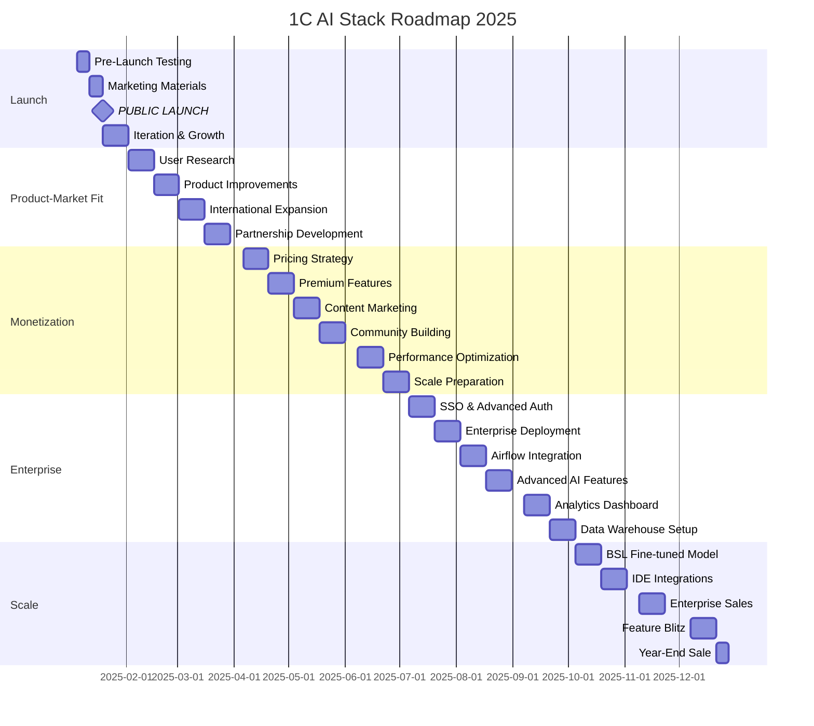
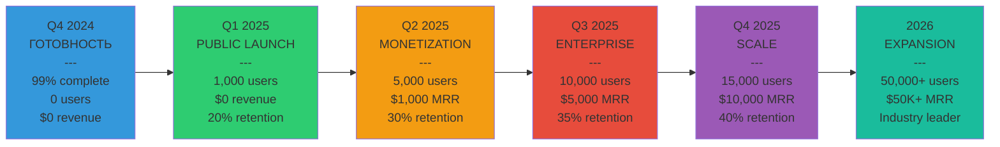
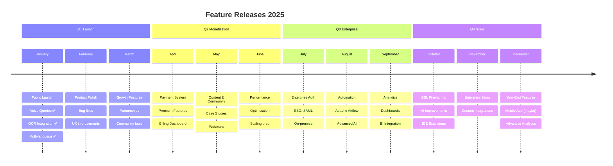
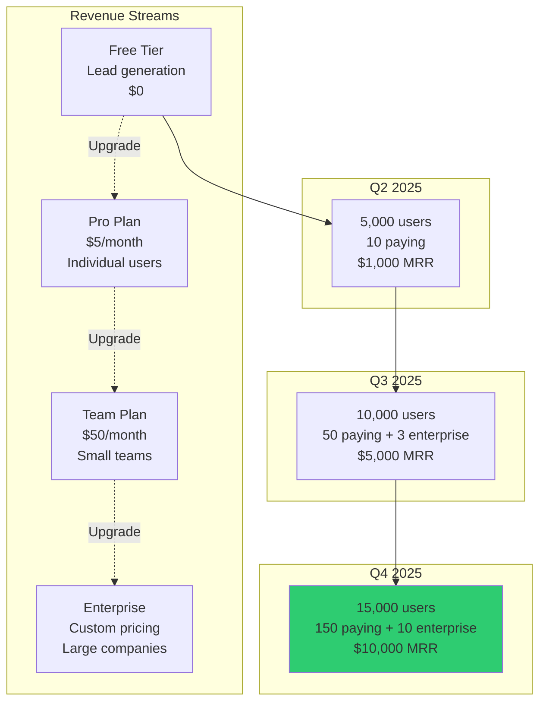
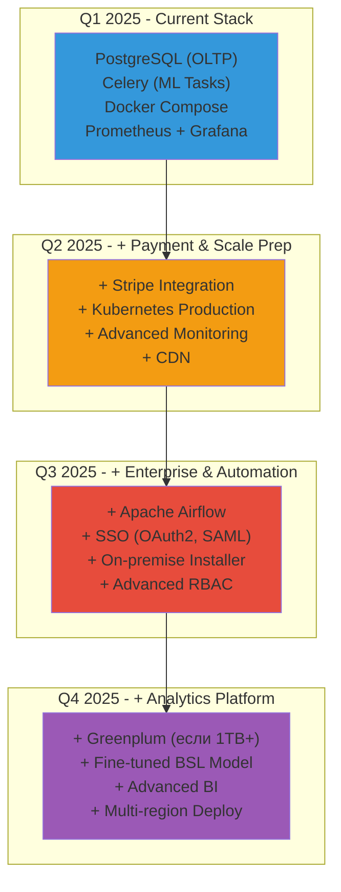
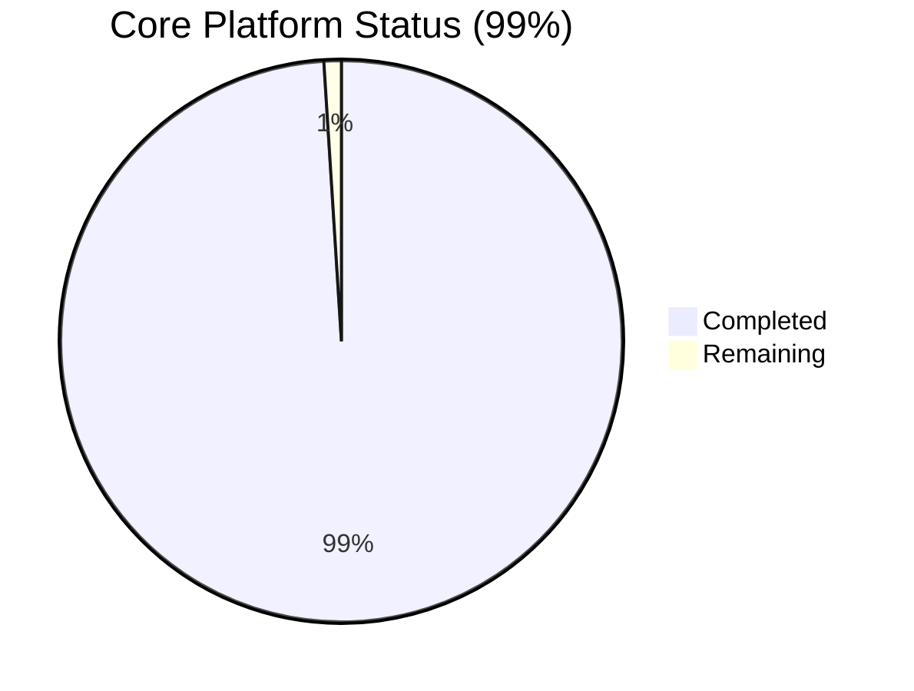
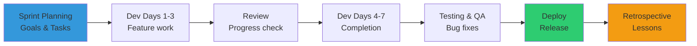
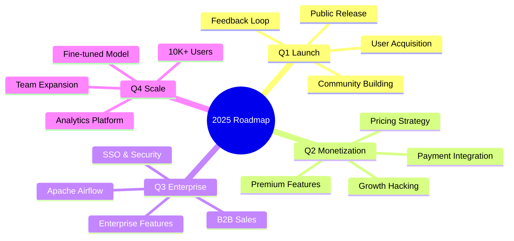

# 🗺️ 1C AI Stack - Visual Roadmap

**Визуальное представление плана развития на 2025 год**

---

## 📊 Timeline Overview



---

## 🎯 Quarterly Goals Progression



---

## 📈 User Growth Chart

```mermaid
graph TB
    subgraph "User Acquisition Funnel"
        AWARENESS[Awareness<br/>50,000 impressions]
        INTEREST[Interest<br/>5,000 website visits]
        TRIAL[Trial<br/>1,000 signups]
        ACTIVE[Active Users<br/>400 (40% activation)]
        PAYING[Paying Users<br/>40 (10% conversion)]
        
        AWARENESS --> INTEREST
        INTEREST --> TRIAL
        TRIAL --> ACTIVE
        ACTIVE --> PAYING
    end
    
    subgraph "Growth Channels"
        ORGANIC[Organic<br/>Habr, GitHub, Reddit<br/>60%]
        REFERRAL[Referral<br/>User invites<br/>25%]
        PAID[Paid Ads<br/>Google, VK<br/>10%]
        PARTNERSHIP[Partnerships<br/>BSL LS, OpenYellow<br/>5%]
        
        ORGANIC --> AWARENESS
        REFERRAL --> AWARENESS
        PAID --> AWARENESS
        PARTNERSHIP --> AWARENESS
    end

    style PAYING fill:#2ecc71
    style ORGANIC fill:#3498db
```

---

## 🏗️ Feature Development Timeline



---

## 💰 Revenue Growth Projection



---

## 🛠️ Technology Stack Evolution



---

## 📋 Feature Completion Status

### Core Platform



### Individual Features

| Feature | Status | Chart |
|---------|--------|-------|
| Telegram Bot | 100% | ████████████████████ |
| Voice Queries | 100% | ████████████████████ |
| OCR Integration | 90% | ██████████████████░░ |
| MCP Server | 100% | ████████████████████ |
| Multi-language | 100% | ████████████████████ |
| Marketplace | 100% | ████████████████████ |
| EDT Plugin | 95% | ███████████████████░ |
| BSL Dataset | 80% | ████████████████░░░░ |
| Web Portal | 70% | ██████████████░░░░░░ |
| Mobile App | 0% | ░░░░░░░░░░░░░░░░░░░░ |

---

## 🎯 Weekly Sprint Planning Template

### Sprint Structure (2-week sprints)

```
Week N (Sprint Planning):
├─ Monday: Planning & Estimation
├─ Tuesday-Thursday: Development
├─ Friday: Review & Retrospective
└─ Weekend: Buffer/Personal time

Week N+1 (Execution):
├─ Monday-Thursday: Development
├─ Friday: Testing & QA
└─ Weekend: Deploy & Monitor
```

### Example Sprint (Q1 Launch Sprint):



---

## 🌟 Milestone Celebrations

**January 2025:**
🎉 **PUBLIC LAUNCH!** - первые пользователи

**February 2025:**
🎊 **500 USERS** - early traction

**March 2025:**
🏆 **1,000 USERS** - Q1 goal achieved!

**April 2025:**
💰 **FIRST REVENUE** - первый платящий клиент

**June 2025:**
📈 **5,000 USERS** - significant growth

**September 2025:**
🏢 **FIRST ENTERPRISE** - крупный клиент

**December 2025:**
🚀 **10,000+ USERS** - major milestone!

---

## 🎯 Focus Areas by Quarter



---

## ✅ Completion Checklist (Master)

### Pre-Launch (Q4 2024):
- [x] Core Platform (99%)
- [x] Telegram Bot (100%)
- [x] Voice Queries (100%)
- [x] OCR Integration (90%)
- [x] Multi-language (100%)
- [x] Marketplace API (100%)
- [x] MCP Server (100%)
- [x] Documentation (100%)
- [x] Legal Compliance (100%)
- [x] GitHub Published (100%)

### Q1 2025 (Launch):
- [ ] Production Deployment
- [ ] Public Launch
- [ ] 1,000 Users
- [ ] Habr Article
- [ ] Community Started
- [ ] User Feedback Loop

### Q2 2025 (Monetization):
- [ ] Payment System
- [ ] Premium Features
- [ ] First Revenue
- [ ] 5,000 Users
- [ ] Product-Market Fit

### Q3 2025 (Enterprise):
- [ ] Enterprise Features
- [ ] Apache Airflow
- [ ] Enterprise Clients (3+)
- [ ] 10,000 Users
- [ ] $5,000 MRR

### Q4 2025 (Scale):
- [ ] Fine-tuned Model
- [ ] Advanced Analytics
- [ ] 15,000 Users
- [ ] $10,000 MRR
- [ ] Team of 5

---

**Last updated:** 2024-11-05  
**Status:** ✅ Visual Guide Complete

