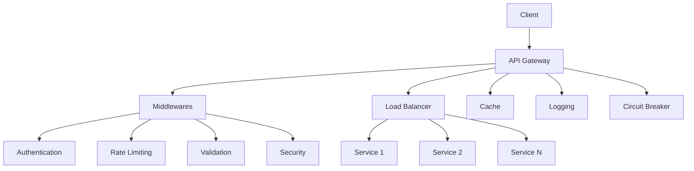

# API Gateway

Центральная точка входа для микросервисной архитектуры с поддержкой маршрутизации, балансировки нагрузки, аутентификации, rate limiting и мониторинга.

## 🚀 Быстрый старт

### Развертывание

```bash
# Развертывание в Supabase
supabase functions deploy api-gateway

# Локальная разработка
supabase functions serve api-gateway --env-file .env.local
```

### Базовые запросы

```bash
# Health check
curl https://your-project.supabase.co/functions/v1/api-gateway/health

# Запрос к сервису с аутентификацией
curl -H "Authorization: Bearer your-jwt-token" \
  https://your-project.supabase.co/functions/v1/api-gateway/v1/architect/data
```

## 📋 Содержимое проекта

```
api-gateway/
├── index.ts              # Основной файл API Gateway
├── config.ts             # Конфигурация сервисов и роутинга
├── middleware/           # Middleware компоненты
│   ├── cors.ts          # CORS обработка
│   ├── validation.ts    # Валидация запросов
│   ├── logging.ts       # Логирование и метрики
│   └── security.ts      # Security headers
├── utils/               # Утилиты
│   ├── auth.ts          # Аутентификация
│   ├── rateLimit.ts     # Rate limiting
│   ├── cache.ts         # Кэширование
│   └── circuitBreaker.ts # Circuit breaker
├── examples.ts          # Примеры использования
└── README.md           # Данный файл
```

## ⚡ Основные возможности

### 🎯 Маршрутизация
- Автоматическое направление запросов к сервисам
- API versioning (`/v1/service-name/`)
- Гибкие правила маршрутизации

### ⚖️ Балансировка нагрузки
- Weighted Round-Robin алгоритм
- Health checking инстансов
- Автоматическое переключение на healthy серверы

### 🔐 Аутентификация
- Bearer токены (JWT)
- API Key аутентификация
- Service-to-service аутентификация
- RBAC (Role-Based Access Control)

### 🚫 Rate Limiting
- Настраиваемые лимиты на сервис
- Sliding window алгоритм
- Burst handling

### 💾 Кэширование
- In-memory кэширование
- LRU стратегия
- Настраиваемый TTL

### 🛡️ Безопасность
- CORS обработка
- Security headers
- Request validation
- Input sanitization

### 📊 Мониторинг
- Детальное логирование
- Метрики производительности
- Health checks
- Error tracking

### 🔄 Circuit Breaker
- Защита от каскадных сбоев
- Автоматическое восстановление
- Fallback механизмы

## 🏗️ Архитектура



## 🔧 Конфигурация

### Настройка сервисов

В файле `config.ts` настройте ваши сервисы:

```typescript
export const serviceConfigs = {
  'v1/my-service': {
    name: 'my-service',
    version: 'v1',
    instances: [
      {
        url: 'https://my-service.supabase.co/functions/v1/my-service',
        weight: 2,
        healthy: true,
        lastCheck: Date.now()
      }
    ],
    timeout: 5000,
    retryCount: 3,
    rateLimit: {
      requestsPerMinute: 100,
      burstSize: 20
    }
  }
};
```

### Правила маршрутизации

```typescript
export const routingRules = [
  {
    pattern: '/v1/my-service/*',
    service: 'my-service',
    version: 'v1',
    methods: ['GET', 'POST'],
    auth: {
      required: true,
      scopes: ['read:data']
    }
  }
];
```

## 🧪 Тестирование

### Локальное тестирование

```bash
# Запуск примеров
deno run --allow-net examples.ts

# Отдельные тесты
curl -X GET "http://localhost:54321/functions/v1/api-gateway/health"
```

### Тестовые сценарии

```typescript
import { examples } from './examples.ts';

// Запуск конкретного примера
await examples.caching();

// Запуск всех примеров
await examples.fullWorkflow();
```

## 📈 Мониторинг

### Получение метрик

```bash
curl https://your-project.supabase.co/functions/v1/api-gateway/metrics
```

### Просмотр логов

```bash
curl https://your-project.supabase.co/functions/v1/api-gateway/logs
```

### Статус circuit breaker

```bash
curl https://your-project.supabase.co/functions/v1/api-gateway/circuit-breaker/status
```

## 🔍 Доступные сервисы

| Сервис | Путь | Методы | Лимит | Cache TTL |
|--------|------|--------|--------|-----------|
| Architect | `/v1/architect/` | GET, POST, PUT, DELETE, PATCH | 100/мин | 5 мин |
| BA | `/v1/ba/` | GET, POST | 50/мин | 10 мин |
| Developer | `/v1/developer/` | GET, POST, PUT, DELETE, PATCH | 200/мин | 3 мин |
| PM | `/v1/pm/` | GET, POST, PUT | 150/мин | 4 мин |
| Tester | `/v1/tester/` | GET, POST, PUT | 75/мин | 3 мин |

## 🛠️ Разработка

### Добавление нового middleware

```typescript
// middleware/custom.ts
export function customMiddleware(req: Request, next: () => Promise<Response>) {
  // Ваша логика
  return next();
}
```

### Создание кастомного validator

```typescript
// utils/customValidation.ts
export function validateCustom(req: Request): ValidationResult {
  // Логика валидации
  return { valid: true, errors: [] };
}
```

### Добавление нового сервиса

1. Добавить конфигурацию в `config.ts`
2. Добавить правило роутинга
3. Протестировать интеграцию

## 🚨 Обработка ошибок

### Стандартные коды ошибок

- `400` - Bad Request
- `401` - Unauthorized
- `403` - Forbidden  
- `404` - Not Found
- `429` - Rate Limit Exceeded
- `500` - Internal Error
- `502` - Bad Gateway
- `503` - Service Unavailable

### Пример ошибки

```json
{
  "error": {
    "code": "RATE_LIMIT_EXCEEDED",
    "message": "Rate limit exceeded. Too many requests.",
    "requestId": "uuid-here",
    "details": {
      "limit": 100,
      "remaining": 0,
      "resetTime": "2025-01-01T12:00:00Z"
    }
  }
}
```

## 🔧 Переменные окружения

```bash
# В Supabase Dashboard -> Settings -> Edge Functions
JWT_SECRET=your-jwt-secret
API_KEYS=key1,key2,key3
GATEWAY_ENV=production
LOG_LEVEL=info
```

## 📚 Документация

Полная документация доступна в [docs/api-gateway.md](../../docs/api-gateway.md)

## 🤝 Вклад в проект

1. Fork репозитория
2. Создайте feature branch
3. Внесите изменения
4. Добавьте тесты
5. Создайте Pull Request

## 📄 Лицензия

MIT License - см. файл LICENSE для деталей.

## 📞 Поддержка

- 📧 Email: support@example.com
- 🐛 Issues: [GitHub Issues](https://github.com/example/api-gateway/issues)
- 📖 Документация: [API Gateway Docs](../../docs/api-gateway.md)

---

**Версия**: 1.0.0  
**Последнее обновление**: 2025-01-01