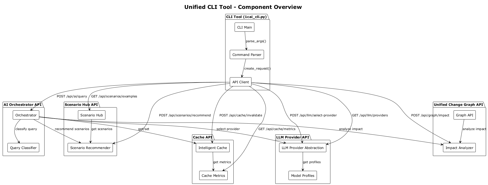
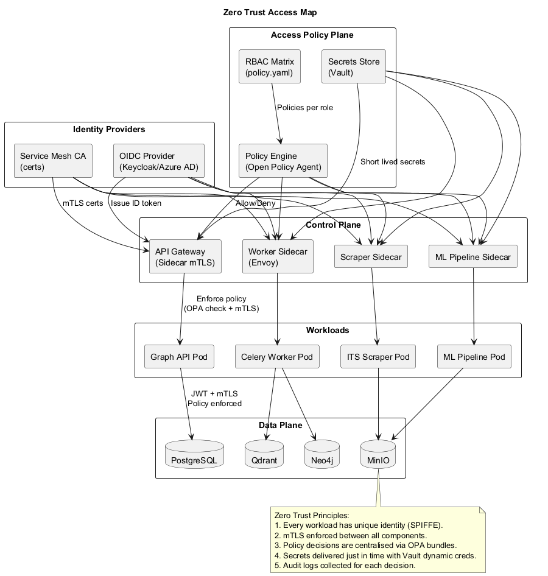

# 1C AI Stack — High Level Design (HLD)

> Обновлено: 2025-11-17  
> Ответственный: Архитектурная группа (контакт: architecture@1cai.dev)

Документ описывает архитектуру 1C AI Stack для технических специалистов. Здесь приведены цели продукта, ключевые компоненты, потоки данных, требования к инфраструктуре и схемы взаимодействия. Все диаграммы представлены в формате PlantUML и располагаются в `docs/architecture/uml/`.

---

## 1. Цели и принципы

### 1.1 Бизнес-цели
- Автоматизация разработки, тестирования и сопровождения проектов на платформе «1С:Предприятие».
- Сокращение времени вывода изменений в продакшн (DevOps-подход для 1С).
- Снижение технического долга за счет статического анализа и рекомендаций AI.
- Централизация знаний и лучшая поддержка команд заказчика.

### 1.2 Архитектурные принципы
- **Modular-first** — чёткое разделение по сервисам (API, воркеры, интеграции).
- **AI Augmentation** — AI подсистемы усиливают разработчиков, но не заменяют процессы контроля.
- **Observability by Design** — в систему встроены метрики, трассировки и алерты.
- **Security & Compliance** — RBAC, аудит, защита данных (интеграции, токены, приватные репозитории).
- **Scalability** — горизонтальное масштабирование API и фоновых воркеров; очереди и кластеры БД.

---

## 2. Системный контекст

Источник: `docs/architecture/uml/c4/context.puml`

**Внешние участники:**
1. **1C Developers / Analysts** — работают в EDT, используют плагин и AI ассистентов.
2. **Ops / DevOps** — управляют деплойментом, мониторингом.
3. **1C IT Staff** — взаимодействуют через UI/Telegram/n8n.
4. **ITS Portal** — источник официальной документации.
5. **Внешние AI сервисы** — модели OpenAI/Qwen, если требуется.

**Система** включает API, воркеры, ML-пайплайны, интеграции (n8n, EDT-плагин, ITS Scraper), базы данных, веторные и графовые хранилища, мониторинг и CI/CD.

---

## 3. Подсистемы и C4 представления

### 3.1 Обзор подсистем
- **API слой** (`src/api/*`): Graph API, Auth, Admin, Test Generation, Marketplace. Интерфейсы — REST/OAS3, GraphQL, WebSocket, MCP.
- **AI Orchestrator** (`src/ai/orchestrator.py`): интеллектуальная маршрутизация запросов к AI-сервисам, классификация запросов, кэширование, fallback-механизмы. Интегрирован с Scenario Hub, Unified Change Graph, LLM Provider Abstraction и Intelligent Cache.
- **Scenario Hub** (`src/ai/scenario_hub.py`, `src/ai/scenario_recommender.py`): протокол-независимый слой для определения и выполнения сценариев (BA→Dev→QA, Code Review, DR Rehearsal) с автоматическими рекомендациями на основе Unified Change Graph.
- **Unified Change Graph** (`src/ai/code_graph*.py`): централизованный граф знаний для всех артефактов проекта (код, тесты, документация, инциденты). Автоматическое построение графа из кода 1С через `OneCCodeGraphBuilder`.
- **LLM Provider Abstraction** (`src/ai/llm_provider_abstraction.py`): унифицированный уровень абстракции для работы с разными LLM провайдерами (Kimi, Qwen, GigaChat, YandexGPT) с автоматическим выбором на основе типа запроса, рисков, стоимости и compliance требований.
- **Intelligent Cache** (`src/ai/intelligent_cache.py`): интеллектуальное кэширование с TTL на основе типа запроса, инвалидацией по тегам и типу запроса, LRU eviction и метриками производительности.
- **Unified CLI Tool** (`scripts/cli/1cai_cli.py`): командная строка для работы с платформой (Orchestrator, Scenario Hub, Unified Change Graph, LLM провайдеры, кэш).
- **Фоновые воркеры** (`src/workers`, `scripts/analysis/*`, `scripts/audit/*`): анализ конфигураций, архитектурный аудит, обновление графа зависимостей, генерация метрик.
- **ML/AI сервисы** (`src/ml/*`, `scripts/ml/*`): подготовка датасетов, тренировка, оценка, публикация моделей, управление конфигурациями через `config/ml_datasets.json` и `Makefile`.
- **Интеграции** (EDT Plugin, ITS Scraper, n8n, Telegram Bot, Marketplace): разные точки входа для команд разработки и поддержки.
- **Хранилища** (PostgreSQL, Neo4j, Qdrant, MinIO/S3, Redis, ClickHouse): обеспечивают долговечность, поиск и кеширование.
- **Observability/Operations** (Prometheus, Grafana, Alertmanager, Loki/Tempo, GitHub Actions): телеметрия, инцидент-менеджмент, CI/CD, IaC.

### 3.2 Контейнерный ландшафт

Источник: `docs/architecture/uml/c4/container-overview.puml`

Диаграмма показывает контейнеры платформы, основные взаимодействия и классы хранилищ. Контейнеры сгруппированы по доменам (Core, Integration, Store, Ops), выделены внешние потребители и инструменты публикации.

### 3.3 Компонентные представления

| Подсистема | Диаграмма | Ключевые элементы |
|------------|-----------|-------------------|
| Graph API / анализ |  | Роутеры, GraphQL resolvers, Rate Limiter, Audit Service, клиенты Neo4j/Qdrant, метрики, **AI Orchestrator, Scenario Recommender, Impact Analyzer, LLM Provider Abstraction, Intelligent Cache, Unified CLI Tool** |
| ML Platform |  | Оркестратор, preprocessing, feature store, тренер, регистратор, публикация, алертинг |
| Integrations Hub |  | EDT actions, n8n node, Telegram bot, Marketplace publisher, ITS writer SDK |
| Observability & Ops |  | Prometheus/Agent, Grafana, Alertmanager, CI/CD, IaC, Notification fanout |

Каждый компонент описывает внутреннюю структуру контейнера и связи с провайдерами данных/метрик. Диаграммы синхронизируются с `workspace.dsl`.

### 3.4 Bounded Context Map

Источник: `docs/architecture/uml/c4/bounded-context.puml`

Карта показывает домены DDD (Knowledge Ingestion, Analysis, AI Assist, Integrations, Operations) и потоки между ними. Каждому домену сопоставлена команда и набор артефактов (кодовые базы, пайплайны, политики). Используется для планирования roadmap и командной ответственности.

---

## 4. Потоки данных и жизненный цикл

### 4.1 Основные платформенные сценарии

Источник: `docs/architecture/uml/dynamics/core-data-flow.puml`

- **Analysis Request** — IDE инициирует анализ; результаты возвращаются через Graph API и стриминг.
- **Knowledge Search** — ITS Scraper и MinIO формируют корпус знаний, Qdrant обеспечивает семантический поиск.
- **AI Assisted Development** — API взаимодействует с моделями, сохраняет разговоры и метрики.

### 4.1.1 AI Orchestrator и новые компоненты

Источник: `docs/architecture/uml/dynamics/scenario-recommender-flow.puml`

- **Scenario Recommendation** — AI Orchestrator использует Scenario Recommender для автоматического предложения релевантных сценариев на основе запроса пользователя и узлов Unified Change Graph.
- **Impact Analysis** — Impact Analyzer анализирует влияние изменений через граф, определяя затронутые компоненты, тесты и генерируя рекомендации.

Источник: `docs/architecture/uml/dynamics/llm-provider-selection.puml`

- **LLM Provider Selection** — LLM Provider Abstraction автоматически выбирает оптимального провайдера на основе типа запроса, стоимости, compliance требований и рисков.

Источник: `docs/architecture/uml/dynamics/intelligent-cache-flow.puml`

- **Intelligent Caching** — Intelligent Cache обеспечивает контекстно-зависимое кэширование с TTL на основе типа запроса, автоматической инвалидацией и LRU eviction.

Источник: `docs/architecture/uml/integrations/cli-tool-overview.puml`

- **Unified CLI Tool** — единая командная строка для работы со всеми компонентами платформы через REST API.

### 4.2 Ingestion: ITS Scraper

- Асинхронная очередь с адаптивным rate-limit.
- Состояние (state.json) сохраняет очередь и метаданные.
- Писатели (writters) отправляют данные в локальное хранилище, S3/MinIO, Postgres, Qdrant.

### 4.3 Жизненный цикл данных

Источник: `docs/architecture/uml/data/lifecycle.puml`

Диаграмма показывает путь от источников (ITS, вебхуки, ручные загрузки) до потребителей (IDE, n8n, AI ассистенты) и контроль качества (каталог датасетов, метрики, retention, политики доступа).

- `make export-context` → `scripts/context/export_platform_context.py` вызывает [alkoleft/platform-context-exporter](https://github.com/alkoleft/platform-context-exporter) (спасибо @alkoleft) и сохраняет экспорт платформенного контекста в `output/context/`. Эти данные включаются в RAG, документацию и MCP-инструменты.
- `make generate-docs` → `scripts/context/generate_docs.py` вызывает [alkoleft/ones_doc_gen](https://github.com/alkoleft/ones_doc_gen) и формирует ReST/Markdown документацию в `output/docs/generated/`. Благодарим @alkoleft за генератор.
- Инструкция по сборке tree-sitter грамматики размещена в `docs/research/alkoleft_inventory.md`; бинарник `tree-sitter-bsl.*` помещается в `tools/`.

### 4.4 Model Lineage

- Bronze → Silver → Gold слои для данных и фич.
- Автоматическое логирование экспериментов и публикация моделей.
- Monitoring → Registry фидбек по дрейфу и деградации.

---

## 5. Доставка и эксплуатационные процессы

### 5.1 CI/CD Pipeline

- PR пайплайн: тесты, аудиты, статусы.
- Main пайплайн: сборка артефактов, деплой, синтетические проверки, канареечная валидация.
- Rollback при нарушении SLO.

### 5.2 User Journey и релизы

- Показывает последовательность действий разработчика и платформы.
- Бизнес-ценность: быстрый фидбек, минимизация контекста.

- Интеграция разработчиков, лидов, CI/CD и Ops.
- Параллельность потоков: ревью, автоматизация, мониторинг.

### 5.3 Инциденты и runbook-и

- Runbook-автоматизация через GitHub Actions и IaC.
- Постмортемы и backlog задач оформляются автоматически.

---

## 6. Безопасность и Zero Trust

Политики:
- OAuth2/OIDC для внешних пользователей, SPIFFE + mTLS для сервисов.
- OPA принимает решения на основе RBAC матрицы, секреты выдаёт Vault.
- Security Agent Framework сканирует Graph API, воркеры и пайплайны (STRIDE покрытие).
- Rate limiting и WAF на периметре, аудит действий в Postgres и объектном хранилище.

---

## 7. Observability и производительность

- Prometheus Agent собирает метрики со всех workloads, Tempo/Loki обеспечивают трассировку и логи.
- Latency budget фиксирует p95 цели для каждого сегмента запроса Quick Analysis.
- Capacity reports строятся на основе `SLO Calculator` и weekly обзоров.

---

## 8. Интеграции и продуктовые каналы

- Таблица каналов с целями, аутентификацией, статусом.
- Используется для планирования roadmap, покрытия команд и SLA.
- В HLD каждый канал ссылается на подробную документацию: `docs/03-integrations/*`, `docs/SUPPORT.md`, `docs/CASE_STUDIES.md`.
- MCP инструменты: `bsl_platform_context` и `bsl_test_runner` проксируют внешние MCP-сервисы ([alkoleft/mcp-bsl-platform-context](https://github.com/alkoleft/mcp-bsl-platform-context), [alkoleft/mcp-onec-test-runner](https://github.com/alkoleft/mcp-onec-test-runner)) через наш сервер (`/mcp`). Настройки задаются переменными окружения `MCP_BSL_CONTEXT_*`, `MCP_BSL_TEST_RUNNER_*`. Благодарим @alkoleft за открытые инструменты.

---

## 9. Аналитика кода и AST

- `scripts/analysis/tree_sitter_adapter.py` подключает [tree-sitter-bsl](https://github.com/alkoleft/tree-sitter-bsl); при наличии библиотеки (`tools/tree-sitter-bsl.so`) анализаторы строят AST.
- `analyze_dependencies.py` добавляет ребра `"type": "call"` с весами (количество вызовов), `analyze_architecture.py` считает суммарные и уникальные вызовы. Если tree-sitter недоступен, скрипты возвращаются к прежнему regex-анализу.
- Благодарим @alkoleft за открытый парсер и инструкции по интеграции.

---

## 10. Эксплуатация и поддержка

- `docs/MONITORING_GUIDE.md` — описание Grafana dashboard (system, business, celery, scraper, ML, observability).
- `Makefile` — единая точка входа (install/test/lint/train/render-uml/adr-new/scrape-its/test-bsl).
- `run_full_audit.py` — комплексные проверки перед релизом (структура, лицензии, архитектура, качество, git safety).
- `make test-bsl` → `scripts/tests/run_bsl_tests.py` — единый запуск BSL тестов (YAxUnit/Vanessa), результаты попадают в CI и отчёты.
- CI/CD: `comprehensive-testing.yml` содержит job `bsl-tests` (Windows runner) — прогоняет манифест `tests/bsl/testplan.json`, публикует отчёты (лог, JUnit, покрытия). Благодарность: [alkoleft/yaxunit](https://github.com/alkoleft/yaxunit) и @alkoleft за предоставленный фреймворк и примеры интеграции.
- Incident Response — Alertmanager → Telegram/Email, runbook automation, постмортемы в ADR.
- Публикации: GitHub Actions синхронизирует `origin/main` ↔ `public/main`, рендерит диаграммы и артефакты.

---

## 11. Процедуры обновления документации

1. **Функциональные изменения** — обновите релевантные разделы HLD, диаграммы, README и CHANGELOG.
2. **Structurizr DSL** — при изменении контейнеров/компонентов сначала обновите `c4/workspace.dsl`, затем пересоберите PlantUML (`make render-uml`).
3. **Диаграммы** — все `.puml` располагаются в соответствующих подпапках; используйте `make render-uml` или `python scripts/docs/render_uml.py --fail-on-missing` для генерации PNG/SVG и хэшей.
4. **Верификация CI** — workflow `uml-render-check` должен проходить без диффов; запускайте локально перед пушем.
5. **ADR** — фиксируйте архитектурные решения (`make adr-new SLUG=...`), обновляйте ссылки в документации.
6. **Мониторинг** — при добавлении дашборда или метрик обновляйте `docs/MONITORING_GUIDE.md` и соответствующие диаграммы наблюдаемости.
7. **Публикация** — после мержа убедитесь, что изменения доставлены в `origin/main` и `public/main`, а секция «Что нового» описывает новые артефакты.

---

## 12. План дальнейшего развития

- Автоматизировать генерацию Structurizr → PlantUML → PNG в CI (Nightly build + GitHub Pages).
- Добавить `to-be` версии диаграмм для мульти-регионального деплоя и on-prem сценариев.
- Расширить Threat Model (LINDDUN, Data privacy) и добавить диаграммы DFD для внутренних API.
- Сгенерировать class/sequence диаграммы автоматически из кода (pylint AST / javaparser) и связать с ADR.
- Подготовить интерактивный портал (MkDocs/GitHub Pages) с SVG, фильтрами и связью с runbooks.

---

## 13. Ссылки

- [docs/03-integrations/ITS_SCRAPER.md](../03-integrations/ITS_SCRAPER.md)
- [docs/MONITORING_GUIDE.md](../MONITORING_GUIDE.md)
- [docs/CASE_STUDIES.md](../CASE_STUDIES.md)
- [docs/SUPPORT.md](../SUPPORT.md)
- [README.md](../../README.md)

