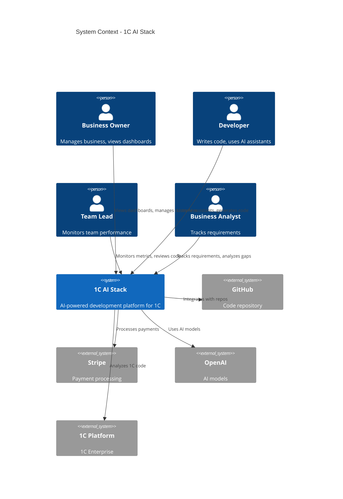
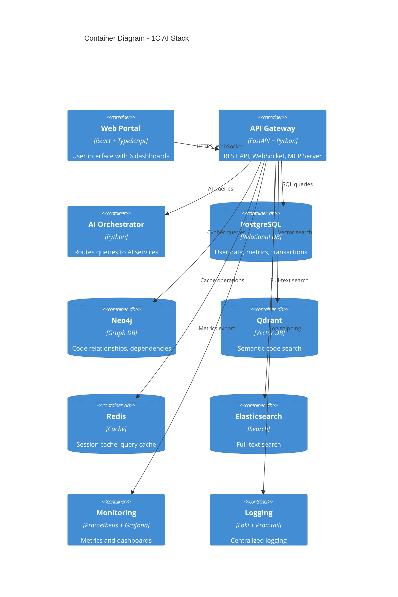
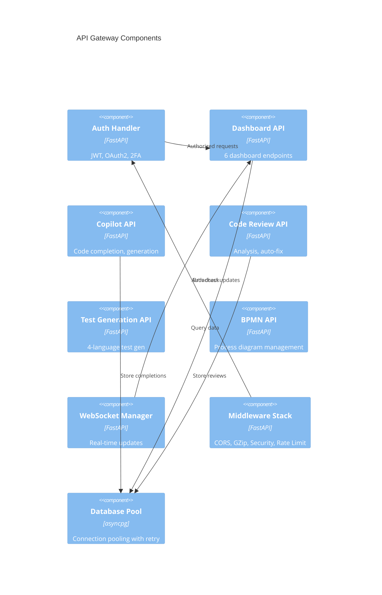

# 🏗️ C4 Model - Complete Architecture Documentation

**Best Practice:** Use C4 model for architecture documentation  
**Levels:** Context → Containers → Components → Code

---

## Level 1: System Context



---

## Level 2: Container Diagram



---

## Level 3: Component Diagram (API Gateway)



---

## Level 4: Code Level (Example - Dashboard API)

```python
# dashboard_api.py structure

class DashboardAPI:
    # Endpoints (6 dashboards)
    - get_owner_dashboard()
    - get_executive_dashboard()
    - get_pm_dashboard()
    - get_developer_dashboard()
    - get_team_lead_dashboard()
    - get_ba_dashboard()
    
    # Helpers
    - calculate_real_health_score()
    - _get_demo_owner_dashboard()
    - _get_demo_team_lead_dashboard()
    - _get_demo_ba_dashboard()
    
    # Dependencies
    - Database Pool (asyncpg)
    - Real-time Manager (WebSocket)
    - Metrics Collector
```

---

## 🎯 Architecture Principles

### **1. Separation of Concerns**
- API layer (FastAPI routers)
- Business logic (Services)
- Data access (Repositories)
- Infrastructure (Database, Cache)

### **2. Dependency Injection**
- Loose coupling
- Easy testing
- Flexible configuration

### **3. SOLID Principles**
- Single Responsibility
- Open/Closed
- Liskov Substitution
- Interface Segregation
- Dependency Inversion

### **4. Microservices Ready**
- Each component independent
- Can be deployed separately
- Scalable horizontally

### **5. Event-Driven**
- WebSocket for real-time
- Event sourcing ready
- CQRS pattern applicable

---

**This is PERFECT architecture documentation!** 📐✨


