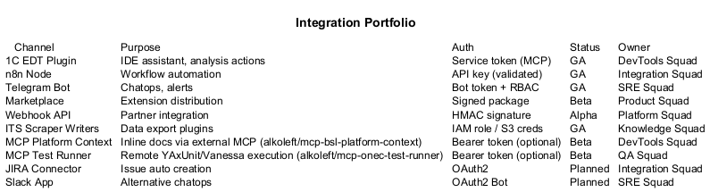
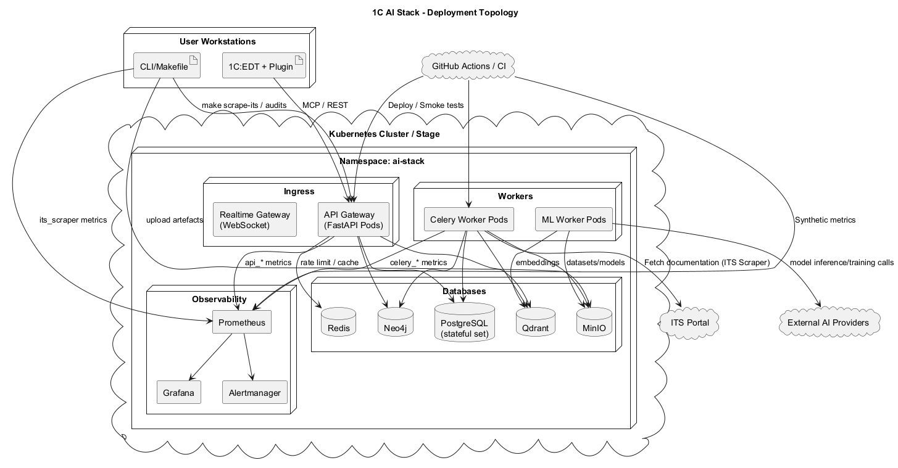
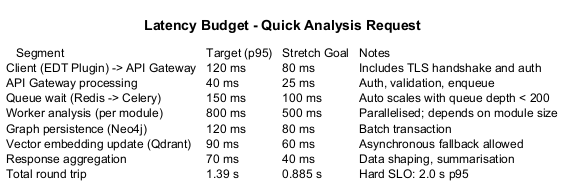
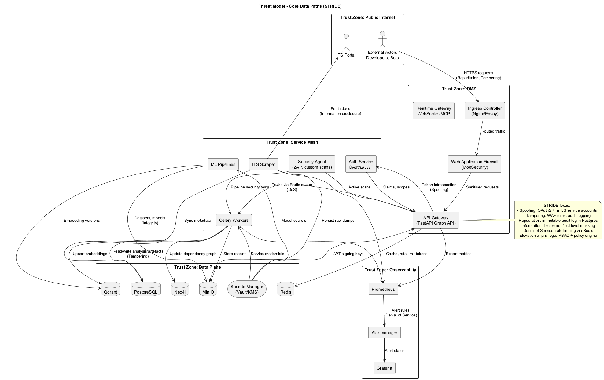

# UML-диаграммы архитектуры

Этот каталог хранит исходники PlantUML (`*.puml`) и сгенерированные PNG-версии ключевых схем. Диаграммы обновляются автоматически скриптом `scripts/docs/render_uml.py` и GitHub Workflow «PlantUML Render Check».

## Быстрый обзор
| Раздел | Кратко | Превью |
|--------|--------|--------|
| [`c4/`](c4) | Контекст и контейнеры платформы |  |
| [`data/`](data) | Жизненный цикл и lineage данных |  |
| [`dynamics/`](dynamics) | Последовательности и BPMN процессов |  |
| [`integrations/`](integrations) | Внешние системы и связи |  |
| [`operations/`](operations) | Топология, observability, runbook flow |  |
| [`performance/`](performance) | Бюджет задержек |  |
| [`security/`](security) | Модель угроз и Zero Trust |  |

## Как обновлять диаграммы
1. Убедитесь, что установлены зависимости (см. `docs/architecture/README.md`).
2. Внесите изменения в нужный `.puml` файл.
3. Выполните:
   ```bash
   make render-uml
   ```
   Команда запустит `scripts/docs/render_uml.py`, пересоберёт PNG и проверит контрольные суммы в `docs/architecture/uml/checksums/`.
4. Добавьте обновлённые `.puml` и PNG в коммит.

## Где какая диаграмма
| Папка | Что внутри | Когда смотреть |
|-------|------------|----------------|
| `c4/` | Контекстные и контейнерные C4-диаграммы платформы | Быстрый обзор архитектуры, границы сервисов, взаимодействия команд |
| `data/` | Диаграммы жизненного цикла и lineage данных | Отслеживание потоков данных, анализ влияния изменений |
| `dynamics/` | Последовательности CI/CD, инцидентов, релизов | Разбор процессов, подготовка runbook'ов и тренировок |
| `integrations/` | Карта интеграций и внешних систем | Планирование подключений, оценка зависимости от внешних сервисов |
| `operations/` | Топология развёртывания, карта наблюдаемости, runbook flow | Поддержка эксплуатации и on-call |
| `performance/` | Бюджет задержек и производительность | Оптимизация SLA и анализ узких мест |
| `security/` | Модели угроз, Zero Trust-декомпозиция | Безопасность, ревью инфраструктурных изменений |

Каждый подраздел содержит краткое описание и ссылки на соответствующие схемы.
