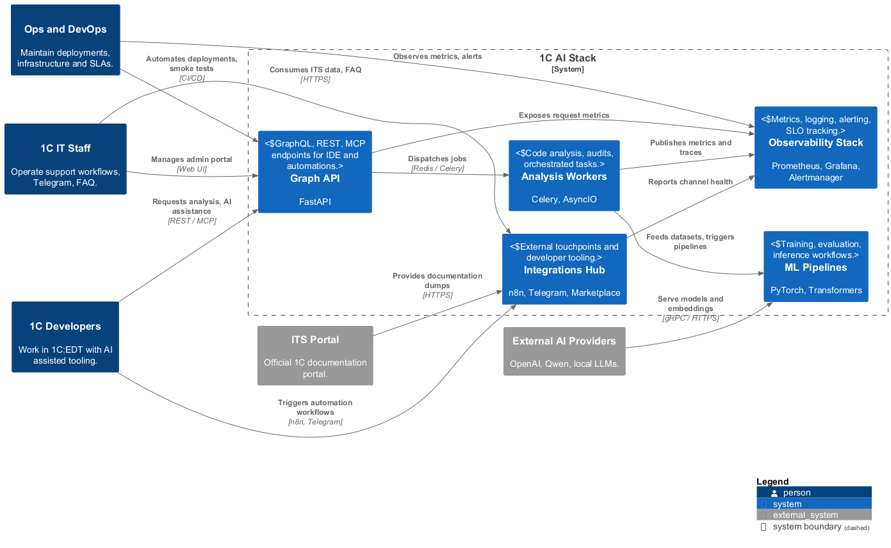
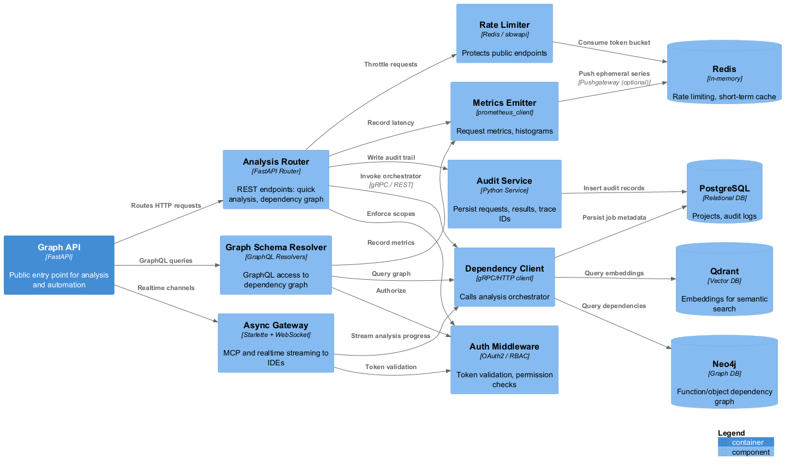
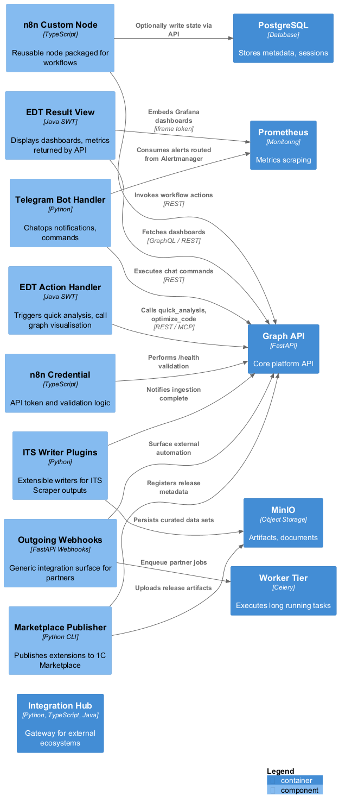
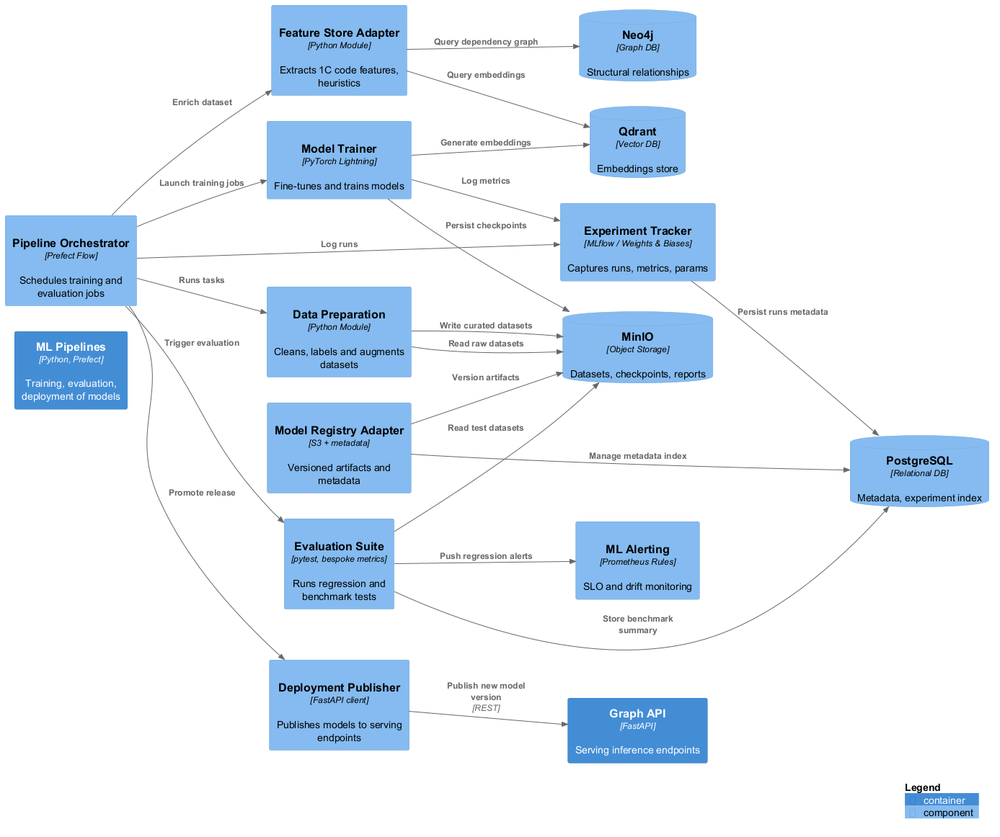
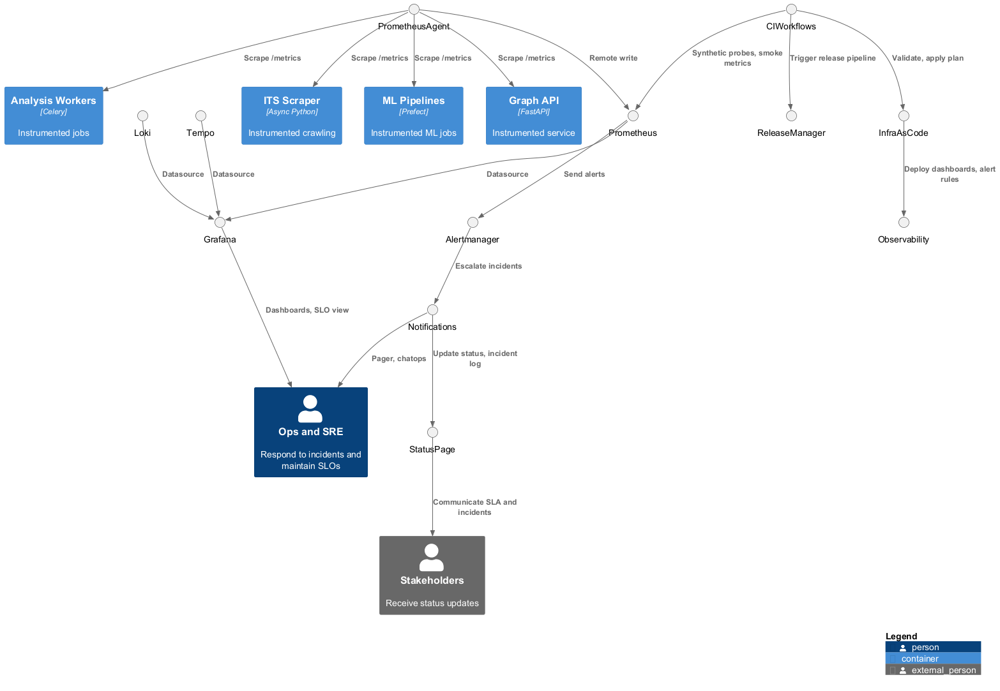
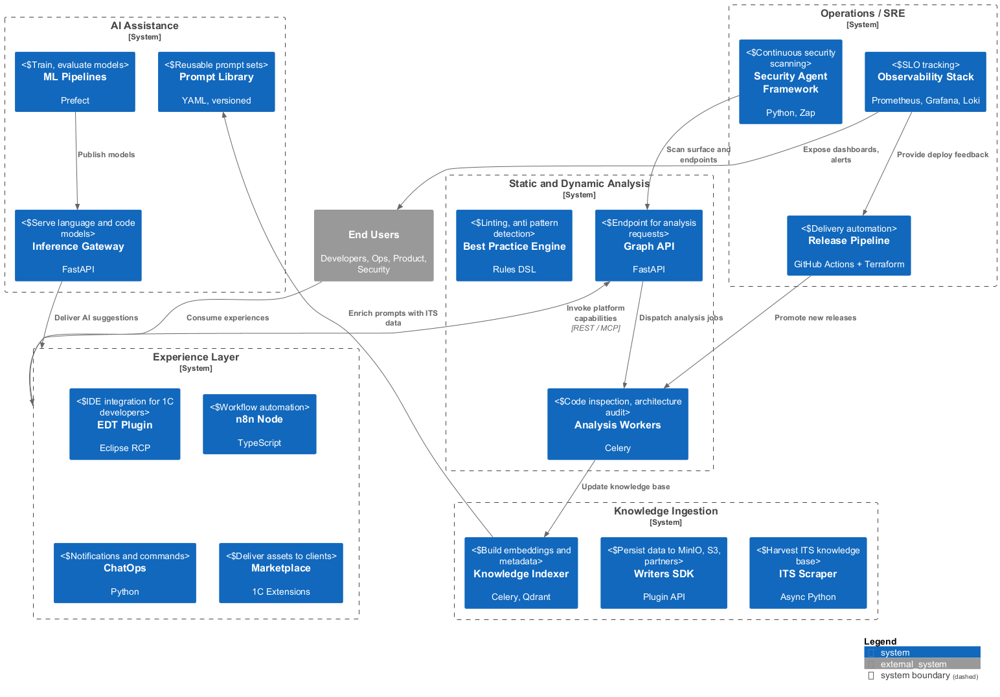

# C4-диаграммы

| Файл | PNG | Описание |
|------|-----|----------|
| `context.puml` |  | Контекстная диаграмма: внешние акторы, 1C AI Stack и ключевые взаимодействия. |
| `container-overview.puml` |  | Контейнерный уровень: сервисы платформы, их ответственность и протоколы связи. |
| `component-analysis.puml` |  | Компоненты, отвечающие за анализ конфигураций и метаданных. |
| `component-integrations.puml` |  | Взаимодействие со сторонними MCP/интеграциями и источниками данных. |
| `component-ml.puml` |  | ML/AI подсистема: генерация датасетов, модели, сценарии использования. |
| `component-ops.puml` |  | Операционные сервисы: GitOps, наблюдаемость, финансы. |
| `bounded-context.puml` |  | Bounded Context карта доменов внутри платформы и их границ. |

## Как обновлять
- Редактируйте соответствующий `.puml` файл.
- Выполните `make render-uml`.
- Проверьте, что PNG в `png/` обновились и отражают изменения.
