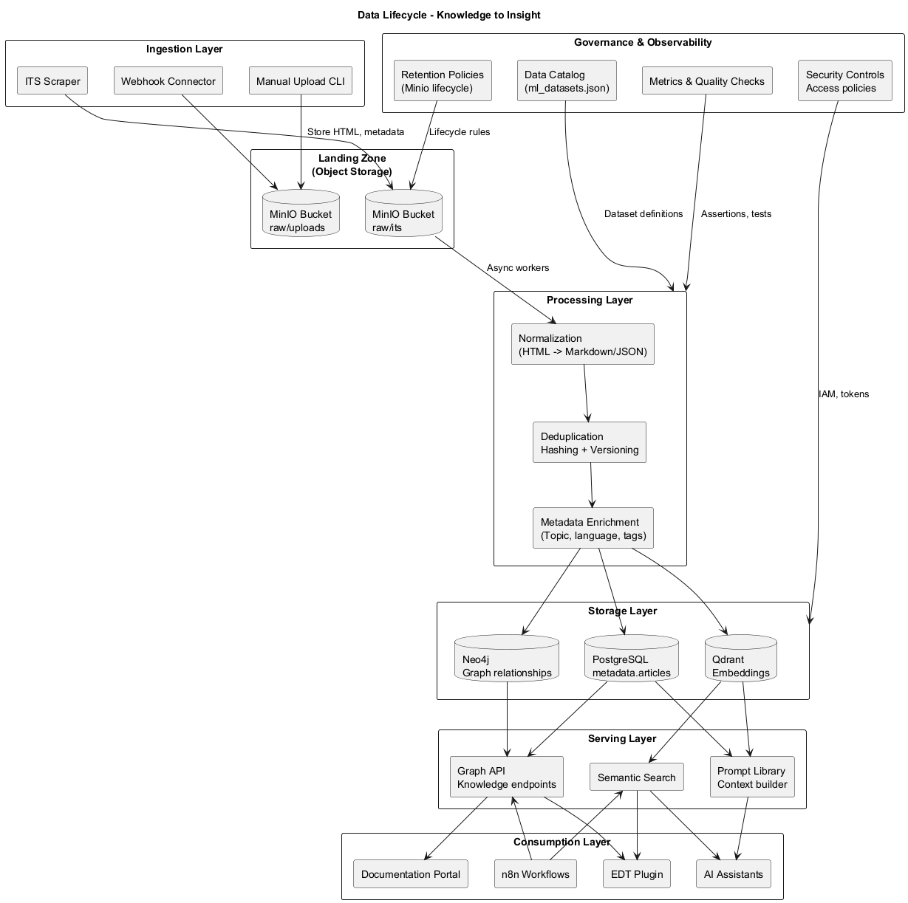
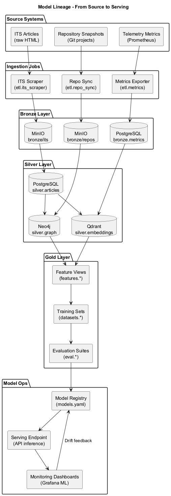

# Диаграммы данных

| Файл | PNG | Что показывает |
|------|-----|----------------|
| `lifecycle.puml` |  | Жизненный цикл данных: сбор, обогащение, хранение, использование и архивирование. |
| `lineage.puml` |  | Data lineage: от источников 1С и внешних сервисов до витрин и ML пайплайнов. |

## Применение
- Используйте `lifecycle` при описании SLA и обязанностей команд по сопровождению данных.
- Диаграмма `lineage` помогает при расследовании инцидентов и оценке влияния изменений.

Обновление — по стандартной схеме: правка `.puml`, `make render-uml`, проверка PNG.
