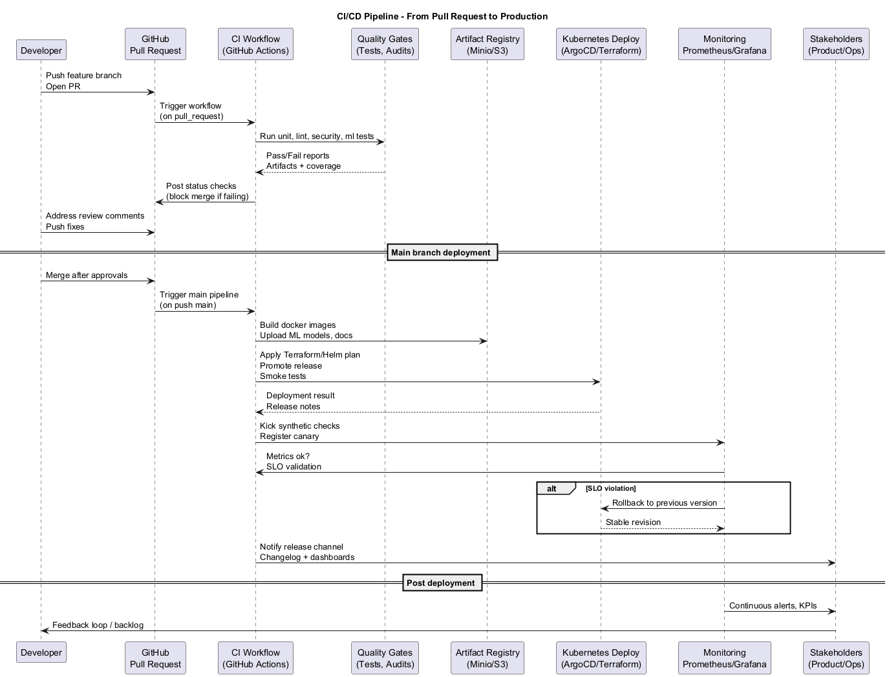
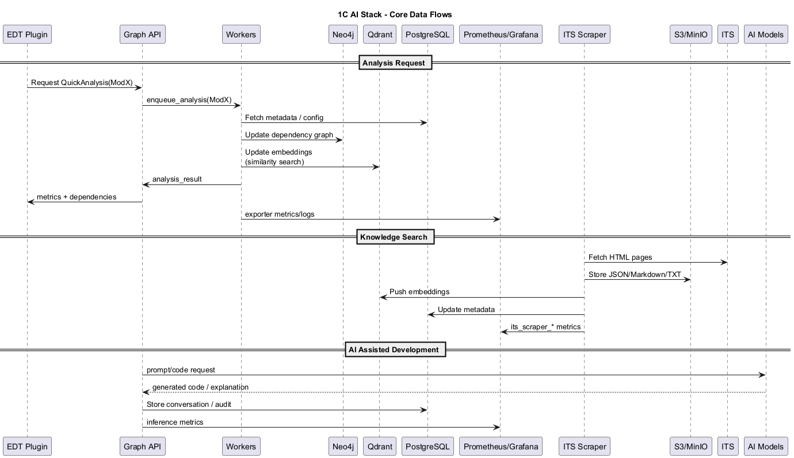
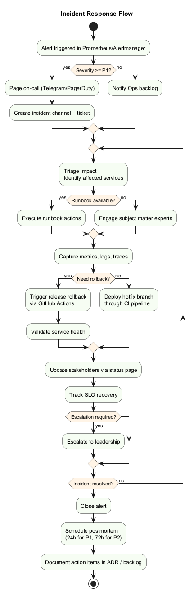
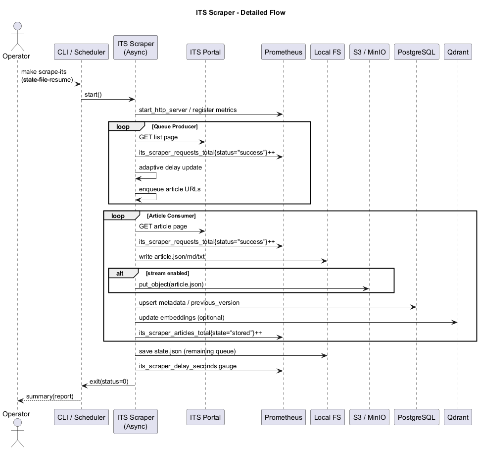
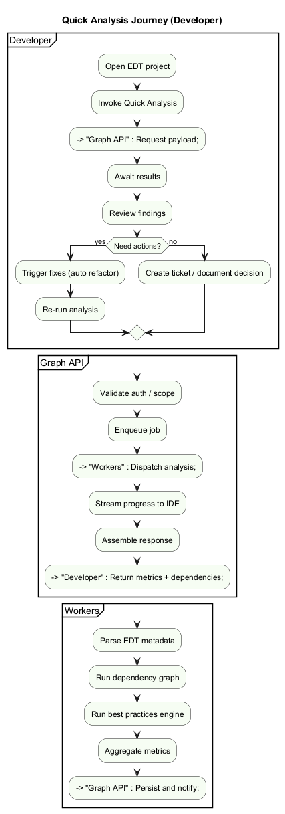
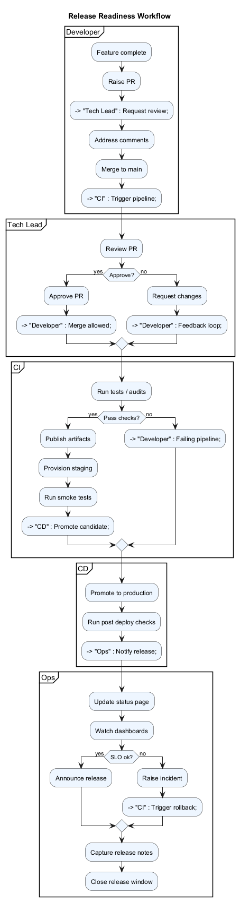
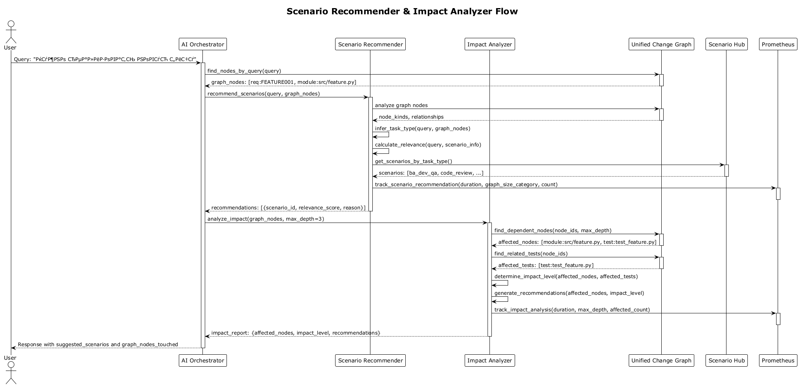
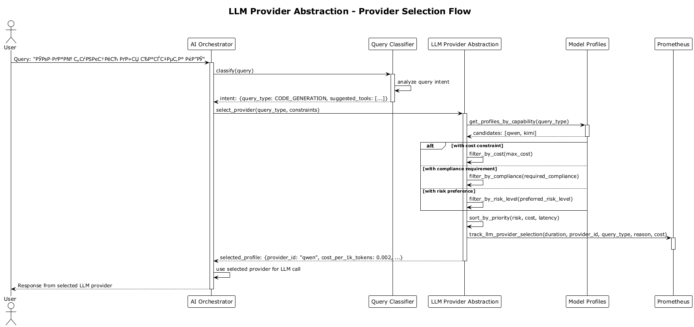
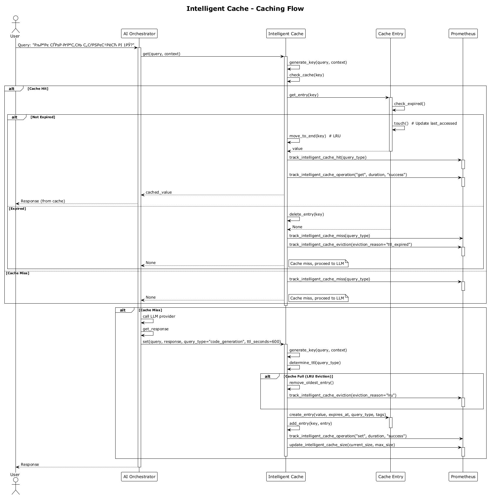

# Динамика процессов

| Файл | PNG | Сценарий |
|------|-----|----------|
| `ci-cd-sequence.puml` |  | Последовательность CI/CD: от Git push до деплоя и проверок. |
| `core-data-flow.puml` |  | Главный поток данных между сервисами платформы. |
| `incident-response-activity.puml` |  | Действия команды при инциденте и связь с runbook'ами. |
| `its-scraper-sequence.puml` |  | Как работает ITS Scraper: очереди, парсеры, хранилища. |
| `quick-analysis-bpmn.puml` |  | BPMN-диаграмма быстрого анализа конфигурации. |
| `release-bpmn.puml` |  | BPMN-процесс релиза с контрольными точками. |
| `scenario-recommender-flow.puml` |  | Полный цикл работы Scenario Recommender и Impact Analyzer с Unified Change Graph: от запроса пользователя до рекомендаций сценариев и анализа влияния изменений. |
| `llm-provider-selection.puml` |  | Процесс выбора LLM провайдера через LLM Provider Abstraction на основе типа запроса, стоимости, compliance и рисков. |
| `intelligent-cache-flow.puml` |  | Процесс кэширования с hit/miss/eviction, TTL на основе типа запроса, LRU eviction и автоматической отправкой метрик в Prometheus. |

Диаграммы полезны для подготовки тренингов, уточнения регламентов и постмортемов. Обновление — правка `.puml` → `make render-uml`.
