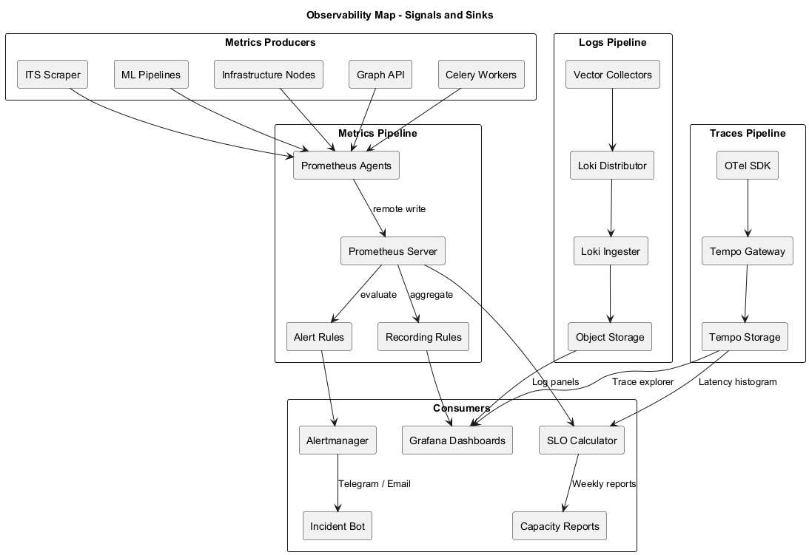
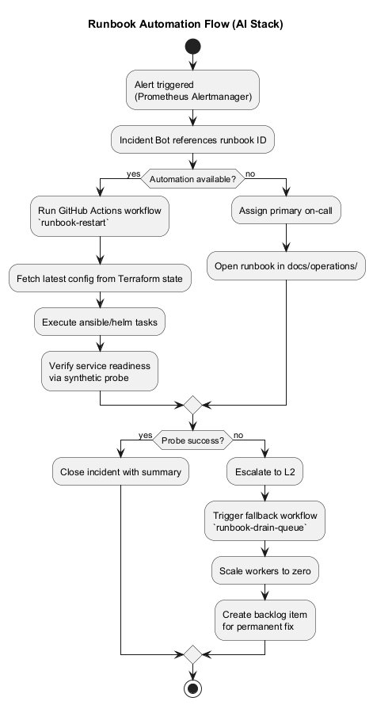

# Операции и эксплуатация

| Файл | PNG | Назначение |
|------|-----|------------|
| `deployment-topology.puml` |  | Топология развёртывания: кластеры, namespace'ы, ingress, внешние сервисы. |
| `observability-map.puml` |  | Карта наблюдаемости: источники метрик, алерты, интеграции с Grafana/Alertmanager. |
| `runbook-flow.puml` |  | Поток действий on-call инженера: от алерта до постмортема и обновления runbook'ов. |

Диаграммы используют команды по эксплуатации и SRE для согласования инфраструктурных изменений и подготовки тренировок.
